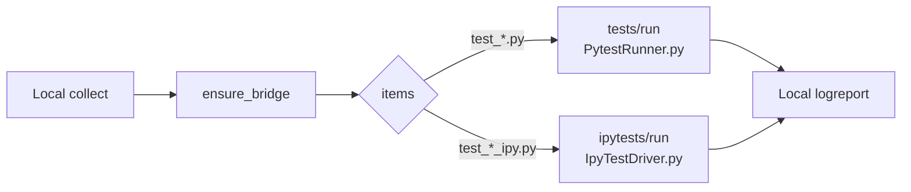
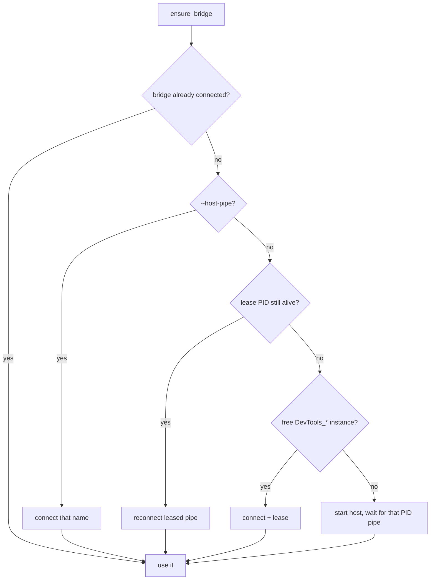
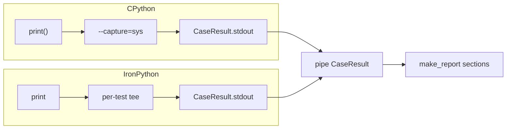

# Plugin Internals

Collect locally, execute on the host, report locally. Pipe is `DevTools_{Host}_{Version}_{PID}` — not `DevToolsMcp_*`.

## Session

`test_*_ipy.py` is pytest routing only. Host unittest does not care about that name.

| Local | Host |
|-------|------|
| `plugin.py` hooks | `DevToolsPipeServer` |
| `connection.py` + `discovery.py` | `PytestRequestHandler` / `IpyTestRequestHandler` |
| `bridge.py` RPC | `PytestRunner.py` (CPython) / `IpyTestDriver.py` (IPy) |
| `reporting.py` | PEP 723 only on `tests/run` |
| `suite_lock.py` + `suite_leasing.py` | same PID per host+version+workspace |

## Connect

First match wins. `--force-launch` skips reuse / explicit pipe / discover and always launches.

`SuiteMutex` is the same key as the lease (one pytest process at a time). CPython and IronPython trees in one workspace reuse the PID; one invocation still cannot mix two `conftest.py` trees.

## Capture

Per-test stdout only. No session StringIO. `make_report` always attaches `Captured stdout` / `Captured stderr`.

CLI streams `notifications/tests/progress` into live `logreport`. IDE (`vscode_pytest` or `TEST_RUN_PIPE`) waits for the batch `RunResponse`. IPy is always batch.

## Wire

Frame: `[4-byte LE length][UTF-8 JSON]`. Same request shape for both run methods.

| Method | Host | Notes |
|--------|------|-------|
| `tests/run` | `PytestRunner.py` `pytest.main` | PEP 723 prepare first |
| `ipytests/run` | `IpyTestDriver.py` unittest | no pixi; response may set `engine` |

`CaseResult`: `nodeid`, `outcome` (`passed`/`failed`/`skipped`/`error`/`xfailed`/`xpassed`), `phase`, `duration_ms`, `stdout`, `stderr`, `message`, `traceback`.

## Dialogs

On launch, `StartupDialogResolver` clicks "Always Load" / "Load Once". It does not click "Do Not Load", "Cancel", or "No".

## Troubleshooting

**Could not connect** — host running with add-in; `ls //./pipe/` matches `DevTools_Revit_…`; `--host-pipe=DevTools_Revit_2025_<pid>`; `--host-version` matches the instance.

**Suite already running** — another pytest holds the mutex. Kill it or wait.

**Timeout** — `uv run pytest --per-test-timeout=120`

**PEP 723 packages missing** — `# /// script` on CPython `conftest.py` / `test_*.py`, not on `test_*_ipy.py`.
