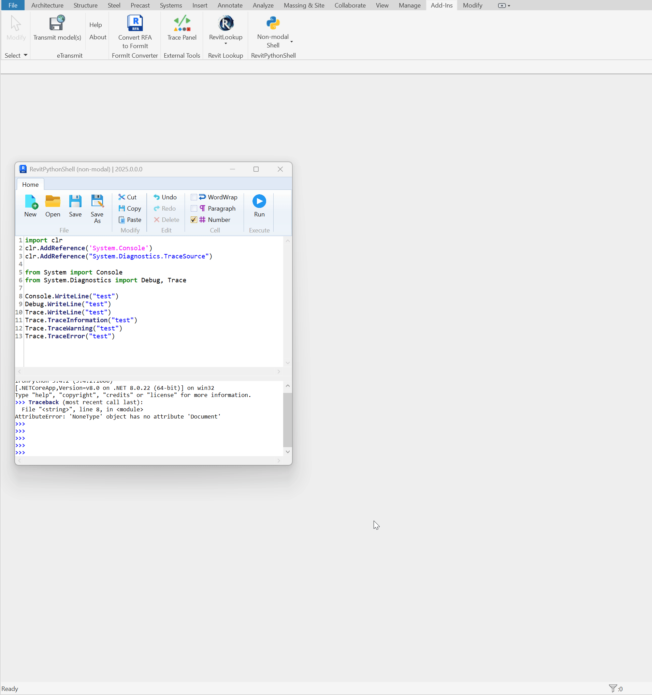
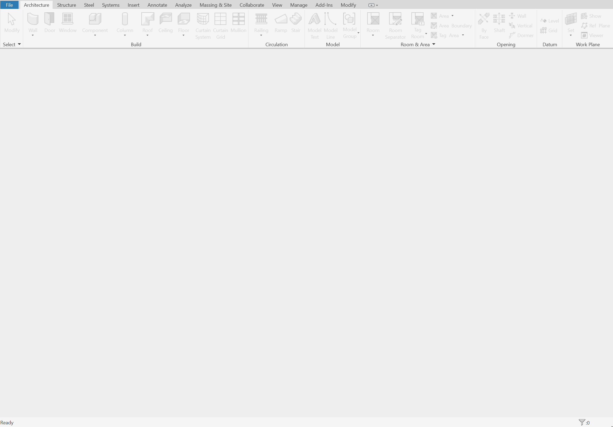

# RevitDevTool

Autodesk Revit plugin project organized into multiple solution files that target versions 2021 - 2026.

## Table of content

<!-- TOC -->
* [RevitDevTool](#revitdevtool)
  * [Table of content](#table-of-content)
  * [Overview](#overview)
    * [📊 Real-Time Trace Logging](#-real-time-trace-logging)
    * [🎨 3D Geometry Visualization](#-3d-geometry-visualization)
    * [📁 External File Logging](#-external-file-logging)
    * [🚀 Auto-Open Floating Window](#-auto-open-floating-window)
  * [Usage](#usage)
    * [🎯 Getting Started](#-getting-started)
    * [📊 Trace Log](#-trace-log)
      * [Features](#features)
      * [How to Use](#how-to-use)
      * [For Python/IronPython Users](#for-pythonironpython-users)
      * [Colored Log Output with Keywords](#colored-log-output-with-keywords)
      * [Pretty JSON Output](#pretty-json-output)
    * [🎨 Trace Geometry - Beautiful 3D Visualization](#-trace-geometry---beautiful-3d-visualization)
      * [Supported Geometry Types](#supported-geometry-types)
      * [Key Features](#key-features)
      * [How to Use Geometry Visualization](#how-to-use-geometry-visualization)
      * [Python/IronPython Geometry Visualization](#pythonironpython-geometry-visualization)
    * [🛠️ Advanced Usage Examples](#-advanced-usage-examples)
      * [Example 1: Debugging Element Geometry](#example-1-debugging-element-geometry)
      * [Example 2: Visualizing Analysis Results](#example-2-visualizing-analysis-results)
      * [Example 3: Python Script Integration](#example-3-python-script-integration)
    * [🐍 Python Stack Trace with pyRevit](#-python-stack-trace-with-pyrevit)
      * [Setup](#setup)
      * [Usage](#usage-1)
      * [Output Example](#output-example)
      * [How It Works](#how-it-works)
      * [Configuration](#configuration)
    * [🎛️ User Interface Features](#-user-interface-features)
    * [🔧 Language Support](#-language-support)
    * [💡 Best Practices](#-best-practices)
    * [🔍 Troubleshooting](#-troubleshooting)
  * [Acknowledgments](#acknowledgments)
<!-- TOC -->

## Overview

RevitDevTool is a comprehensive debugging and visualization toolkit for Autodesk Revit that helps developers and users trace, visualize, and debug their Revit applications. The tool provides two main capabilities: **Trace Logging** and **Geometry Visualization** with beautiful canvas rendering.

### 📊 Real-Time Trace Logging
Capture and view all trace output with color-coded log levels directly in Revit


Watch as all `Trace.TraceInfomation()`, `Trace.TraceWarning()`, and `Trace.TraceError` calls appear in real-time with color-coded severity levels.

### 🎨 3D Geometry Visualization
Visualize any Revit geometry (curves, faces, solids, meshes) in real-time


Simply call `Trace.Write(geometry)` to visualize any Revit geometry object - curves, faces, solids, meshes, and bounding boxes rendered directly in your 3D view.

### 📁 External File Logging
Export logs to plain text (.log) or JSON (.json)


This use full when you need to keep persistent logs for auditing or debugging outside of Revit, within AI-assisted development workflows to keep track of application behavior over time. 
Configure file logging options in the settings panel.

### 🚀 Auto-Open Floating Window
Automatically shows trace window when events occur with no document open


The trace window automatically opens when trace events occur and no document is open, helping you catch startup issues and initialization problems.

---

## Usage

### 🎯 Getting Started

1. **Install RevitDevTool**: Use the MSI installer or place the Autodesk bundle in your Revit add-ins folder
2. **Launch Revit**: The tool will automatically register and appear in the **External Tools** panel
3. **Open Trace Panel**: Click the **"Trace Panel"** button in the ribbon to show/hide the dockable panel

### 📊 Trace Log

The Trace Log provides a real-time, color-coded logging interface directly within Revit, similar to Visual Studio's output window.

#### Features

- **Real-time logging** with configurable log levels (Debug, Information, Warning, Error, Fatal)
- **Color-coded output** for easy identification of different log types
- **Console redirection** - captures `Console.WriteLine()` output
- **Auto-start listening** on Revit startup
- **Cascadia Mono font** for better readability
- **Clear function** to reset the log output

#### How to Use

1. **Enable Logging**: Open the `Trace Log` DockablePanel and ensure the logger is `enabled`
2. **Configure Log Level**: Select your desired minimum log level settings
3. **Start Logging**: Use any of the following methods in your C# code:

```csharp
// Information logging
Trace.TraceInformation("Application started successfully");
Trace.TraceInformation("Processed {0} items in {1}ms", items.Count, stopwatch.ElapsedMilliseconds); // Supports string formatting

// Warning logging  
Trace.TraceWarning("Element not found, using default values");

// Error logging
Trace.TraceError("Failed to process element: " + exception.Message);
Trace.TraceError("Error processing element {0}: {1}", element.Id, exception.Message); // Supports string formatting

// Debug logging
Debug.WriteLine("Debug information: " + debugInfo);

// Console output (automatically captured)
Console.WriteLine("This will appear in the trace log");
```

> [!IMPORTANT]
> To utilize **Trace Geometry** or **Pretty JSON**, you must use `Trace` methods that accept `object` parameters directly (not string formatting).
> 
> **Supported both [Trace Geometry](#-trace-geometry---beautiful-3d-visualization) or [PrettyJson](#pretty-json-output)**
> - `Trace.Write(object value)`
> - `Trace.WriteLine(object value)`
> - `Trace.WriteIf(bool condition, object value)`
> - `Trace.WriteLineIf(bool condition, object value)`
> 
> **Supported [PrettyJson](#pretty-json-output)**
> - `Trace.Write(object value, string category)`
> - `Trace.WriteLine(object value, string category)`
> - `Trace.WriteIf(bool condition, object value, string category)`
> - `Trace.WriteLineIf(bool condition, object value, string category)`
> - `Trace.TraceInformation(string format, params object[] args)`
> - `Trace.TraceWarning(string format, params object[] args)`
> - `Trace.TraceError(string format, params object[] args)`
> 
> Methods from `Console` and `Debug` will convert objects to strings using `.ToString()` before reaching the tool, effectively disabling these visualization features.

#### For Python/IronPython Users

```python
import clr
# For Revit 2025 onward, use these references:
clr.AddReference("System.Diagnostics.TraceSource")
clr.AddReference("System.Console")
from System.Diagnostics import Trace
from System import Console

# Use the same Trace methods
Trace.TraceInformation("Python script executed")
Trace.TraceWarning("Warning from Python")
Trace.TraceError("Error in Python script")

# Console output is also captured
print("This will not appear in the python console instead trace log")
Console.WriteLine("Direct console output from Python")
```

#### Colored Log Output with Keywords

RevitDevTool automatically detects log levels from message content using configurable keywords:

**Prefix Detection (Highest Priority)**
```csharp
Trace.WriteLine("[INFO] This will be Information level (blue)");
Trace.WriteLine("[WARN] This will be Warning level (yellow)");
Trace.WriteLine("[ERROR] This will be Error level (red)");
Trace.WriteLine("[FATAL] This will be Critical level (dark red)");
Trace.WriteLine("[DEBUG] This will be Debug level (gray)");
Console.WriteLine("[INFO] Console output as Information level");
Debug.WriteLine("[DEBUG] Debug output as Debug level");
```

**Keyword Detection (Fallback)**
```csharp
Trace.WriteLine("Operation completed successfully");  // "completed" → Info
Trace.WriteLine("Warning: Memory usage is high");     // "warning" → Warning
Trace.WriteLine("Error occurred during processing");  // "error" → Error
Trace.WriteLine("Fatal crash detected in system");    // "fatal" → Critical
Console.WriteLine("Task succeeded without issues"); // "succeeded" → Info
Debug.WriteLine("This is just a debug message");    // "debug" → Debug
```

**Default Keywords (Customizable in Settings)**

| Level       | Default Keywords               |
|-------------|--------------------------------|
| Information | `info`, `success`, `completed` |
| Warning     | `warning`, `warn`, `caution`   |
| Error       | `error`, `failed`, `exception` |
| Critical    | `fatal`, `critical`, `crash`   |

#### Pretty JSON Output

Enable **Pretty JSON** in settings to automatically format complex objects as indented JSON:

```csharp
// Log complex objects with automatic JSON formatting
var auditLog = new
{
    EventId = Guid.NewGuid(),
    Timestamp = DateTime.UtcNow,
    User = new { Id = "user456", Role = "Administrator" },
    Changes = new[]
    {
        new { Property = "MaxConnections", OldValue = 100, NewValue = 200 }
    }
};

Trace.WriteLine(auditLog);  // Outputs formatted JSON when Pretty JSON is enabled
```

**Output with Pretty JSON enabled:**
```json
{
  "EventId": "a1b2c3d4-...",
  "Timestamp": "2026-01-18T10:30:00Z",
  "User": {
    "Id": "user456",
    "Role": "Administrator"
  },
  "Changes": [
    { "Property": "MaxConnections", "OldValue": 100, "NewValue": 200 }
  ]
}
```

### 🎨 Trace Geometry - Beautiful 3D Visualization

The Geometry Visualization system allows you to display transient geometry directly in the Revit 3D view, similar to Dynamo's preview functionality but integrated into your development workflow.

#### Supported Geometry Types

- **Faces** - Surface geometry from Revit elements
- **Curves** - Lines, arcs, splines, and complex curve geometry  
- **Solids** - 3D solid geometry with volume
- **Meshes** - Triangulated mesh geometry
- **Points (XYZ)** - Individual points or point collections
- **Bounding Boxes** - Element bounding box visualization
- **Collections** - Multiple geometry objects at once

#### Key Features

- **Transient Display** - use Revit's DirectContext3D for rendering which inspired by RevitLookup
- **Manual Control** - Use `ClearGeometry` to remove geometry on demand, `Clear Log` to clear log messages
- **Performance Optimized** - Efficient rendering/Disposal of geometry
- **Supports Mixed Geometry Types** - Trace collections of different geometry types in one call
- **Number of Objects Displayed** - shows in realtime the count of geometry objects displayed in the `ClearGeometry` button

#### How to Use Geometry Visualization

1. **Enable Geometry Tracing**: Ensure the logger is started (geometry tracing is automatically enabled)

2. **Trace Single Geometry Objects**:

```csharp
// Trace a face
Face face = GetSomeFace();
Trace.Write(face);

// Trace a curve
Curve curve = GetSomeCurve();
Trace.Write(curve);

// Trace a solid
Solid solid = GetSomeSolid();
Trace.Write(solid);

// Trace a mesh
Mesh mesh = GetSomeMesh();
Trace.Write(mesh);

// Trace a point
XYZ point = new XYZ(10, 20, 30);
Trace.Write(point);

// Trace a bounding box
BoundingBoxXYZ bbox = element.get_BoundingBox(null);
Trace.Write(bbox);
```

3. **Trace Multiple Geometry Objects**:

```csharp
// Trace multiple faces
var faces = new List<Face> { face1, face2, face3 };
Trace.Write(faces);

// Trace multiple curves
var curves = selectedElements.SelectMany(e => GetCurvesFromElement(e));
Trace.Write(curves);

// Trace multiple solids
var solids = elements.SelectMany(e => e.GetSolids());
Trace.Write(solids);

// Mixed geometry types
var geometries = new List<GeometryObject> { face, curve, solid };
Trace.Write(geometries);
```

#### Python/IronPython Geometry Visualization

```python
import clr
clr.AddReference("RevitAPI")
# For Revit 2025 onward, use these references:
clr.AddReference("System.Diagnostics.TraceSource")
clr.AddReference("System.Console")

from Autodesk.Revit.DB import *
from System.Diagnostics import Trace
from System.Collections.Generic import List

# Trace individual geometry
face = GetSomeFace()  # Your method to get a face
Trace.Write(face)

# Trace collections
curves = List[Curve]()
curves.Add(curve1)
curves.Add(curve2)
Trace.Write(curves)

# Trace points
point = XYZ(10, 20, 30)
Trace.Write(point)
```

### 🛠️ Advanced Usage Examples

#### Example 1: Debugging Element Geometry

```csharp
foreach (Element element in selectedElements)
{
    Trace.TraceInformation($"Processing element: {element.Id}");
    
    var solids = element.GetSolids();
    if (solids.Any())
    {
        Trace.Write(solids);
        Trace.TraceInformation($"Found {solids.Count} solids");
    }
    else
    {
        Trace.TraceWarning($"No solids found for element {element.Id}");
    }
}
```

#### Example 2: Visualizing Analysis Results

```csharp
// Visualize structural analysis results
var analysisPoints = CalculateStressPoints(beam);
Trace.Write(analysisPoints);

// Show critical areas
var criticalFaces = GetCriticalFaces(beam);
Trace.Write(criticalFaces);

Trace.TraceInformation($"Analysis complete: {analysisPoints.Count} points analyzed");
```

#### Example 3: Python Script Integration

```python
# Python script for geometry analysis
import clr
clr.AddReference("RevitAPI")
# For Revit 2025 onward, use these references:
clr.AddReference("System.Diagnostics.TraceSource")
clr.AddReference("System.Console")
from Autodesk.Revit.DB import *
from System.Diagnostics import Trace

def analyze_walls(walls):
    Trace.TraceInformation("Starting wall analysis...")
    
    for wall in walls:
        # Get wall geometry
        geometry = wall.get_Geometry(Options())
        
        for geo_obj in geometry:
            if isinstance(geo_obj, Solid) and geo_obj.Volume > 0:
                # Visualize the solid
                Trace.Write(geo_obj)
                
                # Log information
                Trace.TraceInformation(f"Wall {wall.Id}: Volume = {geo_obj.Volume}")

# Usage
selected_walls = [doc.GetElement(id) for id in uidoc.Selection.GetElementIds()]
analyze_walls(selected_walls)
```

### 🐍 Python Stack Trace with pyRevit

RevitDevTool provides enhanced Python logging with full stack trace support for pyRevit scripts. This feature captures the Python call stack and displays it alongside your log messages.

> **Note**: This feature currently supports **pyRevit** only. Support for RevitPythonShell and standalone IronPython can be added by modifying the `trace.py` helper.

#### Setup

1. Copy [`trace.py`](source/RevitDevTool/Logging/Python/trace.py) from RevitDevTool to your pyRevit extension folder or script directory
2. Import the `trace` function in your script

#### Usage

```python
 # if trace.py be in the same folder if your pyRevit script, the import works directly like this
from trace import trace

# if trace.py be in a module named your_module
from your_module.trace import trace

def process_elements(elements):
    trace("Starting element processing")
    
    for element in elements:
        trace("Processing element: {}".format(element.Id))
        # Your processing logic here
        
    trace("Completed processing {} elements".format(len(elements)))

def main():
    trace("Script started")
    elements = get_selected_elements()
    process_elements(elements)
    trace("Script finished")

main()
```

#### Output Example

When stack trace is enabled in settings, the output includes the Python call chain:

```
Script started
Traceback (Last call first):
  File "C:\Users\...\MyScript.pushbutton\script.py", in main
  File "C:\Users\...\MyScript.pushbutton\script.py", in <module>
```

#### How It Works

The `trace.py` helper:
1. Captures the Python traceback using `traceback.extract_stack()`
2. Formats the stack frames with file paths and function names
3. Sends the message and traceback to `PyTrace.Write()` if RevitDevTool is loaded
4. Falls back to standard `Trace.Write()` if RevitDevTool is not available

#### Configuration

Stack trace behavior is controlled by settings:
- **Include Stack Trace**: Enable/disable stack trace in output
- **Stack Trace Depth**: Number of stack frames to display (default: 3)

### 🎛️ User Interface Features

- **Dockable Panel**: Integrated seamlessly with Revit's interface
- **Responsive Design**: Works with Revit's light and dark themes (2024+)
- **Keyboard Shortcuts**: Standard copy/paste functionality in the log view
- **Auto-scroll**: Automatically scrolls to show new log entries
- **Log Level Filtering**: Real-time filtering of log messages

### 🔧 Language Support

RevitDevTool works with multiple programming languages and scripting environments:

- **C#** - Full support through .NET Trace API
- **Python/IronPython** - Full support via pyRevit, RevitPythonShell, or IronPython scripts
- **Any .NET Language** - Works with any language that can access System.Diagnostics

### 💡 Best Practices

1. **Use Appropriate Log Levels**: Use Information for general status, Warning for non-critical issues, Error for problems
2. **Clear Geometry Regularly**: Use the Clear Geometry button to avoid cluttering the view
3. **Meaningful Messages**: Include element IDs, counts, and relevant context in log messages  
4. **Performance Considerations**: Large geometry collections may impact performance
5. **Document Workflow**: Use logging to document your script's progress and results

### 🔍 Troubleshooting

- **No Geometry Visible**: Ensure the logger is enabled and you can reset by toggling the `Start/Stop Listener`
- **Geometry Persists**: Use "Clear Geometry" button
- **Missing Logs**: Check that the log level is set appropriately for your trace calls
- **Performance Issues**: Reduce the number of geometry objects traced simultaneously

## Acknowledgments

Special thanks to:

- [**RevitLookup**](https://github.com/lookup-foundation/RevitLookup) - For the beautiful DirectContext3D implementation that powers our geometry visualization
- [**RevitDevTool (Original)**](https://github.com/Zhuangkh/RevitDevTool) - For the original idea and inspiration for this project
