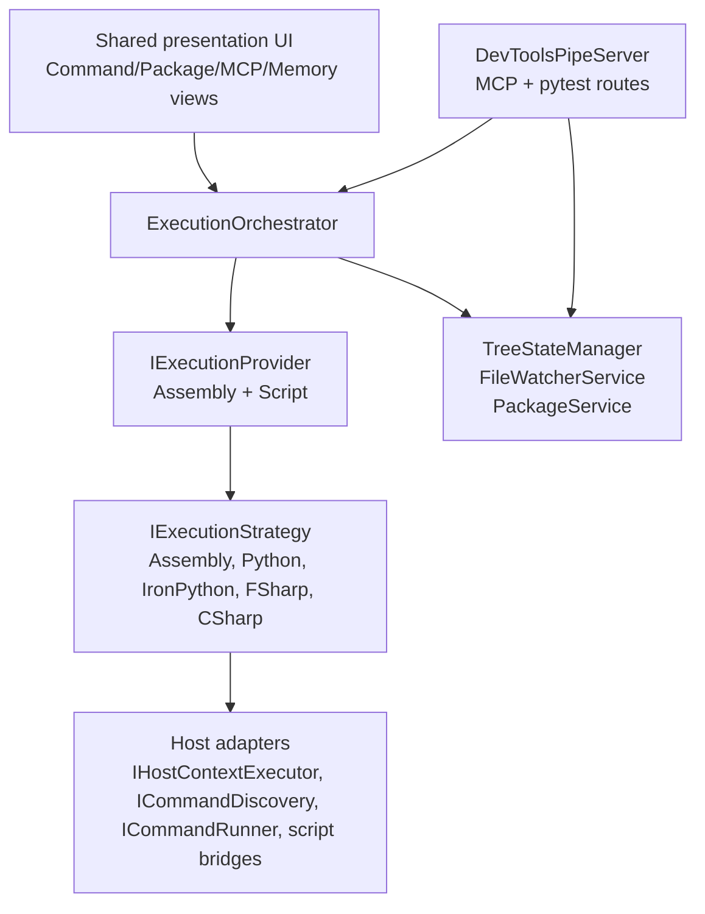
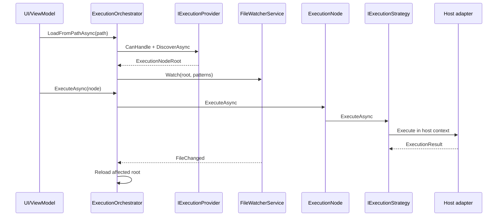

# Execution System Architecture

The execution system is the shared runtime in `source/DevTools.Execution/`. It discovers user code, builds the execution tree, watches roots for changes, resolves script dependencies, and dispatches work through host adapters.

The platform is not Revit-only. Revit and AutoCAD currently provide host adapters; future .NET-capable hosts should plug in through the same abstractions.

Last updated: 2026-05-31

---

## Source Map

| Area | Path |
|------|------|
| Shared registrations | `source/DevTools.Execution/ExecutionExtensions.cs` |
| Orchestrator | `source/DevTools.Execution/Services/ExecutionOrchestrator.cs` |
| Providers | `source/DevTools.Execution/Providers/` |
| External pipe server | `source/DevTools.Execution/External/DevToolsPipeServer.cs` |
| MCP runtime | `source/DevTools.Execution/External/Mcp/` |
| Pytest bridge | `source/DevTools.Execution/External/Testing/` |
| Embedded scripts | `source/DevTools.Execution/Resources/scripts/` |
| Revit adapters | `source/RevitDevTool/HostAdapters/`, `source/RevitDevTool/Hosting/` |
| AutoCAD adapters | `source/AcadDevTool/HostAdapters/`, `source/AcadDevTool/Hosting/` |

---

## Architecture



`DevTools.Execution` owns orchestration and contracts. Host projects own API-thread dispatch, command discovery, command invocation, script builtins, and host-specific context.

---

## Execution Enums

Two enums in `source/DevTools.Execution.Abstractions/` separate container organisation from execution backend:

```csharp
// ContainerMode.cs — how code is organised / discovered
public enum ContainerMode { Script, Assembly }

// ExecutionMode.cs — how code is executed
public enum ExecutionMode { Python, IronPython, FSharp, CSharp, Dotnet, Unsupported }
```

### ContainerMode

| Mode | Provider | Notes |
|------|----------|-------|
| `Script` | `ScriptExecutionProvider` | Folder scan for `*script.py`, `*script.fsx`, `*script.csx`. |
| `Assembly` | `AssemblyExecutionProvider` | `.dll` reflection. Host-specific `ICommandDiscovery`. |

### ExecutionMode

| Mode | Strategy | Notes |
|------|----------|-------|
| `Python` | `PythonExecutionStrategy` | CPython via pythonnet. Pixi first, pip/pyRevit fallback. |
| `IronPython` | `IronPythonExecutionStrategy` | Host bridge injects host API builtins and references. |
| `FSharp` | `FSharpExecutionStrategy` | Compiles into a host command; NuGet resolution under app data. |
| `CSharp` | `CSharpExecutionStrategy` | Roslyn compile with content-hash caching. |
| `Dotnet` | `AssemblyExecutionStrategy` | Load IL from .dll, invoke method. Also used as MCP source kind for .NET assembly tools. |

`ScriptExecutionProvider` skips folders such as `docs`, `resources`, `bin`, `obj`, `packages`, `node_modules`, `output`, caches, virtualenvs, and agent/tool folders.

---

## Host Boundary

Shared execution depends on interfaces:

| Interface | Purpose |
|-----------|---------|
| `IHostContextExecutor` | Marshal work to the host-safe context/API thread. |
| `ICommandDiscovery` | Parse host commands from an assembly. |
| `ICommandRunner` | Invoke discovered or compiled commands. |
| `ICompiledScriptBridge` | Provide references and host-specific compile context. |
| `IPythonBridge` | Configure CPython builtins/scope for the host. |
| `IIronPythonBridge` | Configure IronPython runtime and search paths for the host. |
| `IDebuggerBridge` | Open debugger/runtime hooks from shared UI. |
| `IHostIdlingBridge` | Run UI/log updates on host idling when needed. |
| `IDocumentBridge` | Open, close, and save documents in the host context (`source/DevTools.Execution/Interfaces/IDocumentBridge.cs`). |

Revit wiring lives in `RevitHostingExtensions`. AutoCAD wiring lives in `AcadHostingExtensions`. New hosts should add their own adapter project or host project rather than leaking host APIs into `DevTools.Execution`.

Document bridge implementations:

- Revit: `RevitDocumentBridge` — `UIApplication.OpenAndActivateDocument`
- AutoCAD: `AcadDocumentBridge` — `DocumentCollectionExtension.Open`

---

## Orchestrator Flow



`TreeStateManager` captures and restores expansion/selection/last-executed state during reloads.

---

## Script Runtimes

### Python

- `PythonInitializer` chooses Pixi first, then pip-backed pyRevit CPython if Pixi cannot run.
- `PythonEmbedded` extracts `Parser.py`, `ToolParser.py`, `PytestRunner.py`, setup scripts, and `pixi.toml`.
- `PythonDepsManager` parses PEP 723 dependencies through `Parser.py`.
- Pixi uses conda-forge first and PyPI fallback.
- Pip fallback depends on `pyrevit.exe attached` to locate `bin/cengines/CPY*/python.exe`.

### IronPython

- `IronPythonExecutionStrategy` executes `*_ipy_script.py`.
- Host bridges configure builtins, references, and search paths.
- Revit has additional pyRevit path helpers under `source/RevitDevTool/Execution/PyRevit/`.

### FSharp

- `FSharpExecutionStrategy` compiles `.fsx` through `FSharpCompilationCache`.
- `FSharpDependencyResolver` handles `#r "nuget: ..."` directives.
- `NugetManager` restores packages under `%APPDATA%\RevitDevTool\nuget`.
- Compilation has a hard timeout.

### CSharp

- `CSharpExecutionStrategy` compiles `.csx` through `CSharpCompilationCache`.
- `CSharpDirectiveParser` handles references and package directives.
- Compiled script outputs are loaded through `ScriptLoadContext`.
- Compilation has a hard timeout.

---

## External Runtime

`DevToolsPipeServer` is registered as an `IHostedService` by `ExecutionExtensions.AddExecutionServices()`.

It exposes framed named-pipe routes for:

- MCP: `tools/list`, `tools/call`, `prompts/list`, `prompts/get`, `resources/list`, `resources/templates/list`, `resources/read`
- Instance info: `instance/info`
- Pytest bridge: `tests/discover`, `tests/run`

In-host built-in MCP tools registered in `ExecutionExtensions`: `CSharpCodeTool` (`execute_csharp_code`) and `OpenDocumentTool` (`open_document`), the latter delegating to `IDocumentBridge`.

The pipe name is built from `IHostAppInfo`: `DevTools_{Host}_{VersionNumber}_{ProcessId}`. This makes the same bridge model usable by multiple host processes.

---

## Package Service

`PackageService` gives the UI a unified package surface:

- Pixi/conda-forge packages
- Pixi PyPI packages
- pip fallback packages
- FSharp/NuGet packages

Package operations include list, remove, remove all, update latest, and repair.

---

## Verification Reality

Current tests are useful but shallow. They cover parser contracts, telemetry helpers, and some environment behavior, but they are not deep assurance for live host integration, threading, startup, package installation, or named-pipe runtime behavior.

When changing execution behavior:

- Build the most relevant host/year with `scripts/agent/build-host.ps1`.
- Add a focused test for pure shared logic when practical.
- Document live-host verification gaps explicitly.

---

## Related Docs

- `docs/ai/execution-system.md`
- `docs/ai/host-boundaries.md`
- `docs/MCP/README.md`
- `docs/PyTest/README.md`
- `docs/Logging/README.md`
