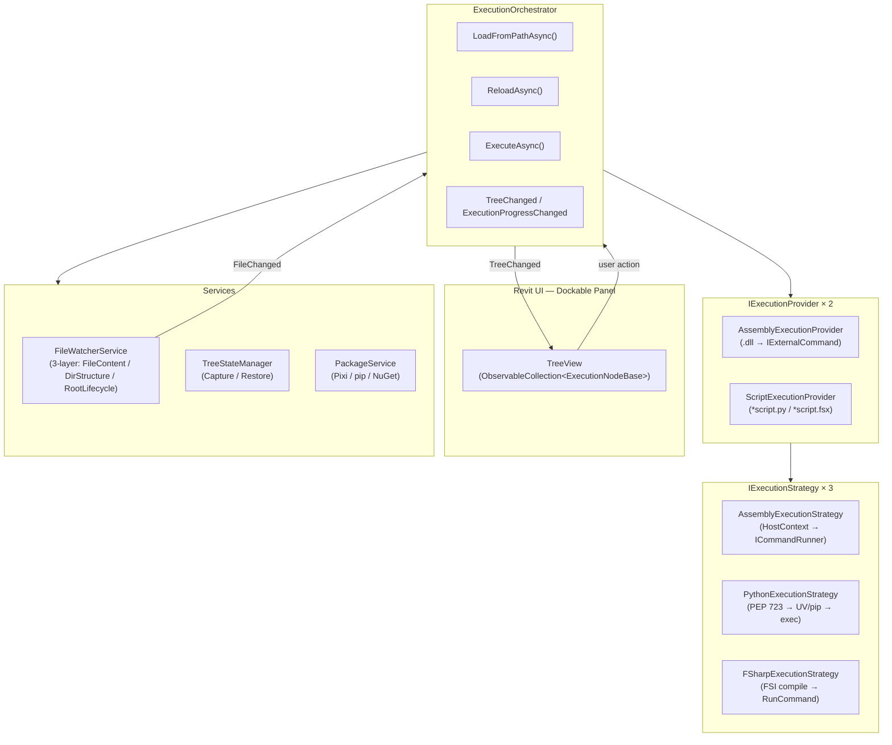
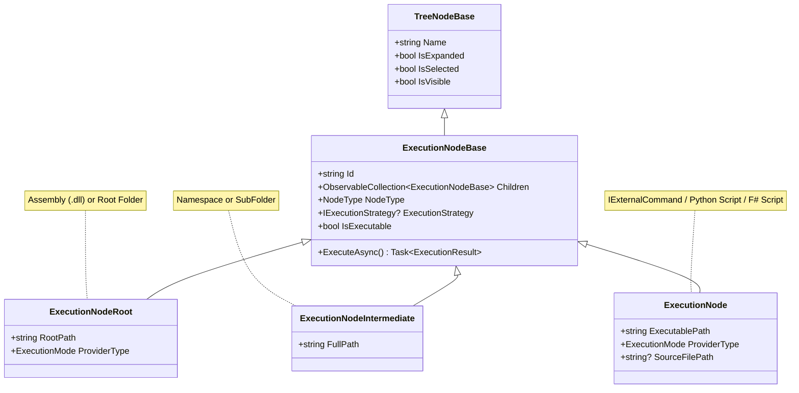
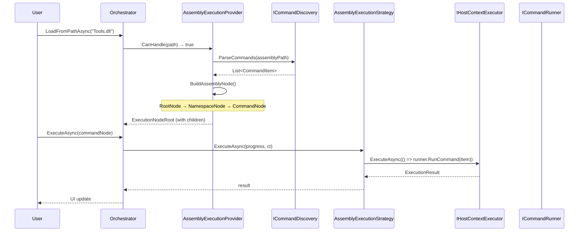
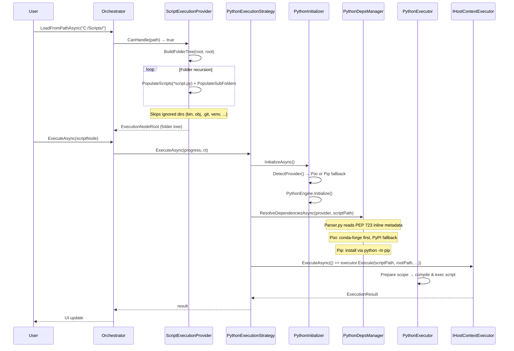
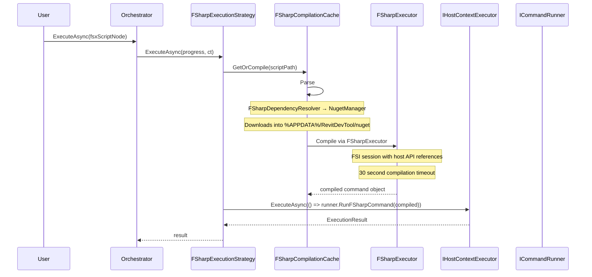
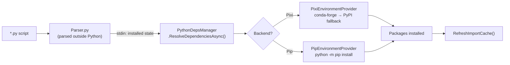
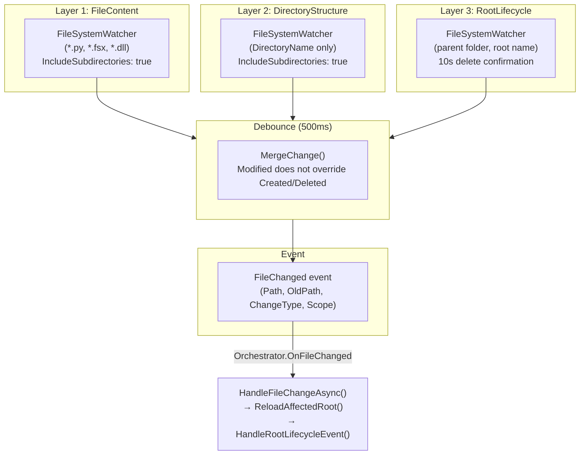
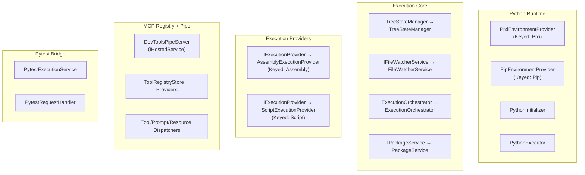
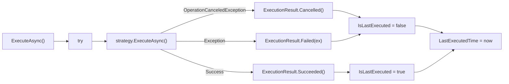

# Execution System Architecture

The Execution system is the core engine of RevitDevTool — a multi-language code execution framework that discovers, loads, and runs code inside the Revit process. It supports three execution modes: .NET assemblies, Python scripts, and F# scripts, all unified through a tree-view UI.

**Source:** `source/DevTools.Execution/`

---

## High-Level Architecture



---

## Core Interfaces

### `IExecutionProvider` — Detection & Discovery

```csharp
public interface IExecutionProvider
{
    string Name { get; }                        // "DotNet", "Script"
    int Priority { get; }                       // Higher = checked first
    bool CanHandle(string path);                // .dll → true, folder → true
    Task<IEnumerable<ExecutionNodeBase>> DiscoverAsync(string path, ...);
    IEnumerable<string> GetWatchPatterns();     // "*.dll", "*.py", "*.fsx"
    bool ValidatePath(string path);
}
```

| Provider | `Name` | `Priority` | `CanHandle` | Discover |
|----------|--------|-----------|-------------|----------|
| `AssemblyExecutionProvider` | `"DotNet"` | `100` | `.dll` files | Parses `IExternalCommand` from assembly |
| `ScriptExecutionProvider` | `"Script"` | `-100` | Directories | Recurses folder tree, finds `*script.py` and `*script.fsx` |

### `IExecutionStrategy` — Execution

```csharp
public interface IExecutionStrategy
{
    Task<ExecutionResult> ExecuteAsync(
        IProgress<string>? progress = null,
        CancellationToken cancellationToken = default);
}
```

Each node in the tree carries its own `IExecutionStrategy` instance. Execution is dispatched via `IHostContextExecutor` which marshals the call onto the Revit API thread (via `ExternalEvent`).

---

## Node Tree Model



### `ExecutionMode` Enum

```csharp
public enum ExecutionMode
{
    Assembly,   // .dll assemblies
    Script,     // Directory-based (Python + F#)
    Python,     // Individual Python scripts
    FSharp      // Individual F# scripts
}
```

### Node ID Scheme

| Type | Pattern | Example |
|------|---------|---------|
| .NET Assembly | `dotnet://{path}` | `dotnet://C:/Plugins/Tools.dll` |
| .NET Namespace | `dotnet://{path}\|{ns}` | `dotnet://C:/Plugins/Tools.dll\|MyCompany.Commands` |
| .NET Command | `dotnet://{path}\|{class}` | `dotnet://C:/Plugins/Tools.dll\|MyCompany.Commands.PurgeCommand` |
| Python Script | `python://{path}` | `python://C:/Scripts/data_analysis_script.py` |
| F# Script | `fsharp://{path}` | `fsharp://C:/Scripts/excel_export_script.fsx` |

---

## Execution Flows

### 1. .NET Assembly Execution (`ExecutionMode.Assembly`)



**Key points:**
- `.dll` files discovered via `ICommandDiscovery.ParseCommands()` (host-specific: Revit scans `IExternalCommand`, AutoCAD scans `CommandMethodAttribute`)
- Namespace grouping: commands organized by namespace → UI subtree
- Execution: `IHostContextExecutor` dispatches to API thread, `ICommandRunner.RunCommand()` invokes the command

### 2. Python Script Execution (`ExecutionMode.Script`)



**Key points:**
- Entry scripts: only files matching `*script.py` are discovered
- Ignored folders: `.git`, `bin`, `obj`, `docs`, `venv`, `node_modules`, `.pytest_cache`, etc.
- PEP 723: inline `# /// script` / `# //+` block parsed by `Parser.py`
- Dual backend: Pixi (preferred, conda-forge + PyPI) → Pip fallback (pyRevit CPython)
- `PythonInitializer.DetectProvider()`: tries Pixi first, falls back to Pip if unavailable
- Execution scope: isolated per-run via `PyModule.NewScope()`, module cache reset after each run

### 3. F# Script Execution (`ExecutionMode.Script`)



**Key points:**
- `FSharpCompilationCache`: graph-level caching — parent scripts cache compiled outputs that child scripts reuse
- NuGet resolution: `#r "nuget: Some.Package"` directives parsed, packages downloaded via `NugetInstaller` into `%APPDATA%/RevitDevTool/nuget`
- 30-second compile timeout
- `FSharpDependencyResolver`: resolves NuGet package closure via `nuget.org` API
- Host API refs: `IFSharpHostSupport.GetSessionReferences()` provides RevitAPI.dll etc. to the FSI session

---

## Dependency Resolution

### Python — PEP 723 + Pixi/Pip



**PEP 723 format:**
```python
# /// script
# dependencies = ["pandas==1.5.3", "numpy>=1.24"]
# ///
```

**Required packages** (always pre-installed):
| Package | Spec |
|---------|------|
| `mcp` | `>=1.27,<2` |
| `pytest` | `>=9.0.3,<10` |
| `debugpy` | `>=1.8,<2` |
| `packaging` | `>=26.0,<27` |

### FSharp — `#r "nuget:"` Directives

```
#r "nuget: Newtonsoft.Json, 13.0.3"
#r "nuget: ClosedXML"
```

- Parsed by `FSharpDependencyResolver`
- Downloaded to `%APPDATA%\RevitDevTool\nuget\{package}\{version}\`
- Closure resolution handled by `NugetManager`

### Package Manager UI

The `PackageService` provides a unified package management interface:
- `ListInstalledPackagesAsync()` — Pixi + Pip + NuGet
- `RemovePackageAsync()` — per-marketplace removal
- `UpdateLatestAsync()` — update to latest
- `RepairAsync()` — remove + reinstall
- `RemoveAllAsync(Marketplace)` — bulk cleanup

---

## FileWatcherService

Three-layer file watching with 500ms debounce:



| Scope | Detects | Debounce |
|-------|---------|----------|
| `FileContent` | File created/modified/deleted/renamed | 500ms |
| `DirectoryStructure` | Subdirectory created/deleted/renamed | 500ms |
| `RootLifecycle` | Root folder deleted (10s cooldown), renamed | Immediate (rename), 10s delayed (delete) |

---

## TreeStateManager

State persistence for UI tree view between reloads:

```csharp
public interface ITreeStateManager
{
    TreeState CaptureState(IEnumerable<ExecutionNodeBase> nodes);
    void RestoreState(IEnumerable<ExecutionNodeBase> nodes, TreeState state,
                      bool autoExpandNew = false);
}
```

**State tracked:** Expanded nodes, selected node, highlight ranges, last-executed marker.

---

## DI Registration (`AddExecutionServices()`)



Full registration in `ExecutionExtensions.AddExecutionServices()` (`source/DevTools.Execution/ExecutionExtensions.cs`).

---

## ExecutionOrchestrator — Full API

```csharp
public interface IExecutionOrchestrator
{
    IEnumerable<ExecutionNodeBase> TreeRoot { get; }

    event EventHandler? TreeChanged;
    event EventHandler<RootRemovedEventArgs>? RootRemoved;
    event EventHandler<ExecutionProgressEventArgs>? ExecutionProgressChanged;

    Task LoadFromPathAsync(string path, CancellationToken ct = default);
    Task<IReadOnlyList<string>> LoadSavedPathsAsync(IEnumerable<string> paths, ...);
    Task ReloadAsync(CancellationToken ct = default);
    ExecutionNodeBase? RemoveNode(ExecutionNodeBase node);
    void ClearAll();
    Task<ExecutionResult> ExecuteAsync(ExecutionNodeBase node, ...);
}
```

**Orchestration flow:**
1. `LoadFromPathAsync` → auto-detects provider via `CanHandle()` sorted by `Priority`
2. On file change → `FileWatcher.FileChanged` → `HandleFileChangeAsync()` → `ReloadAffectedRootAsync()` or `HandleRootLifecycleEventAsync()`
3. Root rename/delete → parent watcher fires → auto-reloads or cleans up
4. Execution → `node.ExecuteAsync()` → strategy → host context → Revit API thread

---

## Error Handling



---

## Architecture Patterns

| Pattern | Application |
|---------|------------|
| **Provider** | `IExecutionProvider` — auto-detect execution mode from file path |
| **Strategy** | `IExecutionStrategy` — polymorphic execution per mode |
| **Composite** | `ExecutionNodeBase` tree — `Children: ObservableCollection<ExecutionNodeBase>` |
| **Observer** | `FileWatcherService` → `IExecutionOrchestrator.TreeChanged` |
| **State** | `TreeStateManager.CaptureState()` / `RestoreState()` |
| **Template Method** | `PyEnvironmentProvider` — abstract base for Pixi/Pip backends |
| **Chain of Responsibility** | Provider selection: highest priority first, fallback to lower |

---

## Related Documentation

- **[MCP Architecture](../MCP/README.md)** — MCP registry and pipe server
- **[PyTest Architecture](../PyTest/README.md)** — pytest bridge between RevitDevTool and `revitdevtool_pytest`
- **[Logging Architecture](../Logging/README.md)** — Trace capture and visualization routing
- **[Visualization Architecture](../Visualization/README.md)** — DirectContext3D rendering

**Source Code:**
- `source/DevTools.Execution/` — Execution engine
- `source/DevTools.Execution/Services/ExecutionOrchestrator.cs` — Main orchestrator
- `source/DevTools.Execution/Providers/` — All three providers + strategies
- `source/DevTools.Execution/External/` — Named pipe server, MCP bridge, pytest bridge

---

_Last updated: 2026-05-03_
