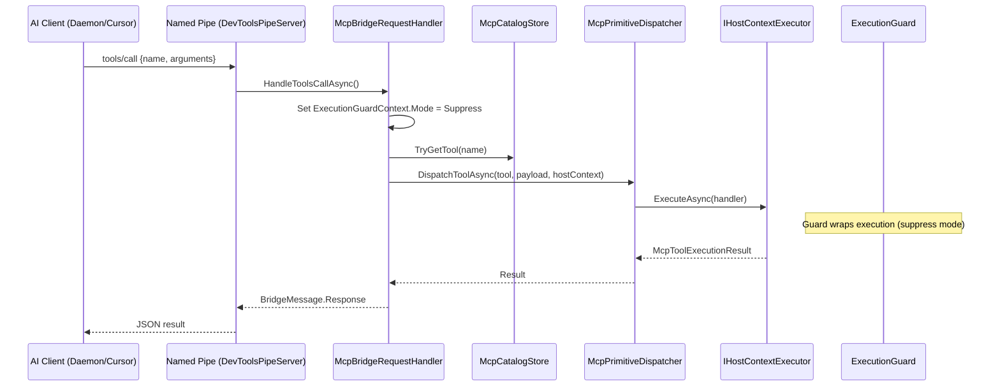

# MCP Dispatch: In-Host Primitive Execution

## Overview

MCP (Model Context Protocol) tools, prompts, and resources execute inside the host process via `McpBridgeRequestHandler`. The handler routes JSON-RPC requests from the Named Pipe to the appropriate catalog entry and dispatches execution on the host thread.

---

## Source Map

| File | Role |
|------|------|
| `source/DevTools.Mcp/Handlers/McpBridgeRequestHandler.cs` | Bridge request handler (tools, prompts, resources) |
| `source/DevTools.Mcp/Dispatch/IMcpPrimitiveDispatcher.cs` | Dispatch interface (tool/prompt/resource) |
| `source/DevTools.Mcp/Dispatch/IMcpExecutionTracker.cs` | Execution state tracking interface |
| `source/DevTools.Mcp/Registry/McpCatalogStore.cs` | Tool/prompt/resource registry |
| `source/DevTools.Execution/External/Mcp/Dispatchers/McpPrimitiveDispatcher.cs` | Dispatch implementation |
| `source/DevTools.Execution/External/Mcp/BuiltIn/CSharpCodeTool.cs` | Built-in: `execute_csharp_code` |
| `source/DevTools.Execution/External/Mcp/BuiltIn/OpenDocumentTool.cs` | Built-in: `open_document` |
| `source/DevTools.Agents.Revit/Tools/NavigateHistoryTool.cs` | Built-in: `navigate_history` (host-thread dispatch) |
| `source/DevTools.Agents.Acad/Tools/NavigateHistoryTool.cs` | Built-in: `navigate_history` (async queue) |
| `source/DevTools.Agents.Revit/Resources/` | Revit resources (context, warnings, version, cheatsheet, screenshot) |
| `source/DevTools.Agents.Revit/Prompts/RevitCodePrompt.cs` | Prompt: `revit_code` |

---

## Execution Flow



---

## Supported Routes

| Method | Handler | Notes |
|--------|---------|-------|
| `tools/list` | `HandleToolsListAsync` | Returns all registered tools |
| `tools/call` | `HandleToolsCallAsync` | Executes tool with guard suppression |
| `prompts/list` | `HandlePromptsListAsync` | Returns all prompts |
| `prompts/get` | `HandlePromptsGetAsync` | Executes prompt with guard suppression |
| `resources/list` | `HandleResourcesListAsync` | Returns direct resources |
| `resources/templates/list` | `HandleResourceTemplatesListAsync` | Returns resource templates |
| `resources/read` | `HandleResourcesReadAsync` | Reads resource with guard suppression |

---

## Tool Source Kinds

See [`docs/MCP/tools.md`](../MCP/tools.md) for the full catalog of tools, resources, and prompts.

### Threading Model for Built-in Tools

`IBuiltInMcpTool.ExecuteAsync()` runs on a **background thread** (not the host main thread). Tools that need main-thread access (e.g., `navigate_history` on Revit which calls `QuickAccessToolBarService`) must internally dispatch via `IHostContextExecutor`:

```csharp
public sealed class NavigateHistoryTool(IHostContextExecutor hostContext) : IBuiltInMcpTool
{
    public async Task<McpToolExecutionResult> ExecuteAsync(string payload, CancellationToken ct)
    {
        var result = await hostContext.ExecuteAsync(() => {
            // Revit: synchronous undo via RevitTransactionService
            return GoBack(steps);
        }, ct);
    }
}
```

`CSharpCodeTool` handles this internally through `CSharpCodeExecutor` → `IHostContextExecutor`.

---

## Execution Guard Integration

All MCP dispatch paths set `ExecutionGuardContext.Mode = Suppress` before calling `hostContext.ExecuteAsync()`. This ensures:
- AI tool calls never hang on unexpected dialogs
- Transaction failures are auto-resolved or rolled back
- Rollback info is available via `ExecutionGuardContext.RollbackSummary`

---

## Pipe Server

`DevToolsPipeServer` is registered as `IHostedService` by `ExecutionExtensions.AddExecutionServices()`.

Pipe name format: `DevTools_{Host}_{VersionNumber}_{ProcessId}`

Examples:
- `DevTools_Revit_2025_12345`
- `DevTools_AutoCad_2026_7890`

---

## Timeout

All tool/prompt/resource calls have a 120-second timeout (`CallTimeout`). On timeout, the handler returns a structured error with code `tool_invoke_failed`.

---

## Related

- MCP protocol docs: `docs/MCP/README.md`
- Transport & daemon: `docs/MCP/transport.md`, `docs/MCP/daemon.md`
- Agent digest: `docs/agents/mcp-pytest-bridge.md`
