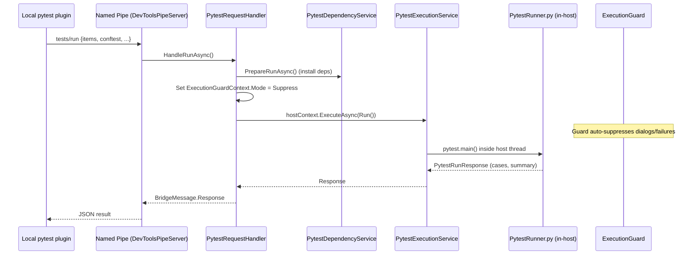

# Pytest Bridge: In-Host Test Execution

## Overview

The pytest bridge allows local pytest to collect tests normally while executing them inside a live host process (Revit, AutoCAD, etc.) via Named Pipe JSON-RPC.

---

## Source Map

| File | Role |
|------|------|
| `source/DevTools.Execution/External/Handlers/PytestRequestHandler.cs` | Pipe request handler |
| `source/DevTools.Execution/External/Testing/PytestExecutionService.cs` | Invokes `PytestRunner.py` inside host |
| `source/DevTools.Execution/External/Testing/PytestDependencyService.cs` | Installs PEP 723 deps before run |
| `source/DevTools.Execution/External/Testing/PytestContracts.cs` | Wire protocol models |
| `source/DevTools.Execution/Resources/scripts/PytestRunner.py` | Python entry point in host |
| `source/DevTools.Execution/Resources/scripts/SetupRevit.py` | Revit API refs + builtins for tests |
| `source/DevTools.Execution/Resources/scripts/SetupAcad.py` | AutoCAD API refs for tests |

---

## Execution Flow



---

## Key Behaviors

- **`--capture=sys`**: Required because fd-level capture (`os.dup2`) doesn't work in embedded Python.NET.
- **`--disable-plugin-autoload`**: Prevents third-party plugins from interfering with in-host execution.
- **`sys.__pytest_running__`**: Flag set by PytestRunner to prevent setup scripts from hijacking stdout/stderr.
- **Execution Guard**: Mode set to `Suppress` for the entire test session — tests run without dialog/failure interruption.
- **Progress notifications**: CLI gets real-time `tests/progress` notifications; IDE adapters get batch results.

---

## Wire Protocol

Request method: `tests/run`

```json
{
  "items": ["tests/test_foo.py::test_bar"],
  "conftest": "...",
  "args": ["--capture=sys"],
  "discover_only": false
}
```

Response:

```json
{
  "phase": "complete",
  "summary": { "passed": 5, "failed": 1, "errors": 0 },
  "cases": [
    { "nodeid": "test_foo.py::test_bar", "outcome": "passed", "stdout": "..." }
  ]
}
```

---

## Related

- Plugin source: `RevitDevTool.PyTest` repo (separate repo)
- Client plugin docs: `docs/PyTest/README.md`
- Agent digest: `docs/agents/mcp-pytest-bridge.md`
