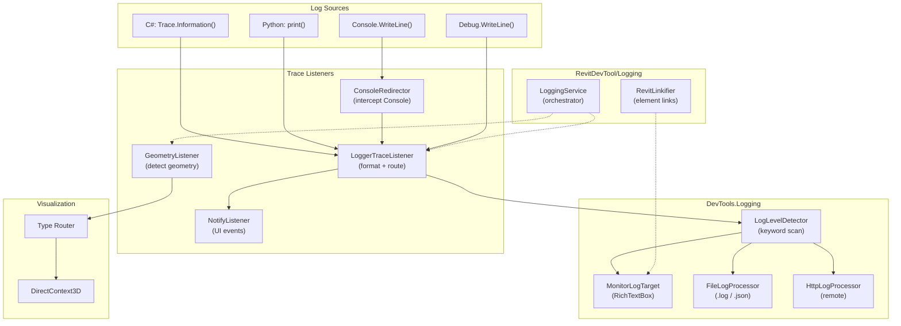
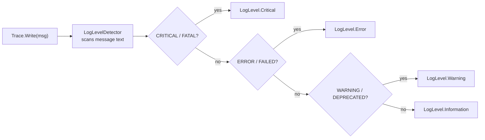
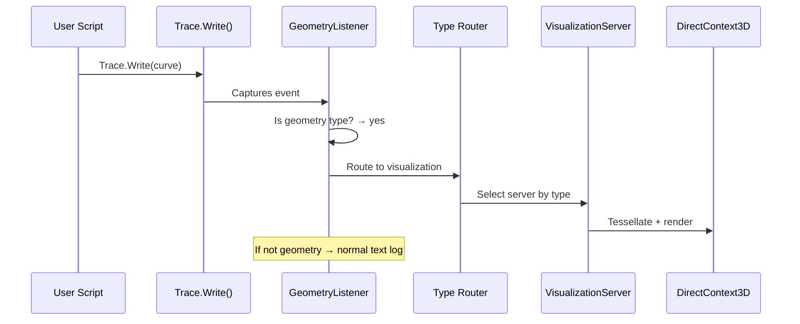
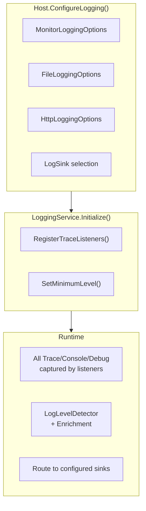

# Logging System Architecture

Unified logging infrastructure built on .NET `System.Diagnostics.Trace` with multi-sink output, keyword detection, and geometry interception.

**Source:** `source/DevTools.Logging/` (shared library) + `source/RevitDevTool/Logging/` (add-in host)

---

## Architecture Flow

---

## Core Components

| Component | Location | Role |
|-----------|----------|------|
| `LoggingService` | `RevitDevTool/Logging/` | Lifecycle orchestrator — init, restart, register listeners |
| `LoggerTraceListener` | `DevTools.Logging/Listeners/` | Captures all `.NET Trace` events, routes to sinks |
| `ConsoleRedirector` | `DevTools.Logging/Listeners/` | Intercepts `Console.WriteLine()` + Python `print()` |
| `GeometryListener` | `RevitDevTool/Logging/Listeners/` | Detects Revit geometry types in trace calls → routes to Visualization |
| `NotifyListener` | `DevTools.Logging/Listeners/` | Broadcasts UI update events |
| `LogLevelDetector` | `DevTools.Logging/` | Keyword-based severity detection |

---

## Log Level Detection

Keywords in message content determine severity level automatically:

| Category | Keywords | Level |
|----------|----------|-------|
| **Critical** | CRITICAL, FATAL, PANIC, SECURITY, UNAUTHORIZED | `Critical` |
| **Error** | ERROR, FAILED, EXCEPTION, TIMEOUT, INVALID, NOT FOUND | `Error` |
| **Warning** | WARNING, DEPRECATED, OBSOLETE, MEMORY, LEAK, RETRY | `Warning` |
| Default | Everything else | `Information` |

---

## Geometry Interception

Supported geometry types: `Curve`, `Face`, `Solid`, `Mesh`, `XYZ`, `BoundingBoxXYZ`. Each is routed to its dedicated `VisualizationServer<T>`.

---

## Output Targets

| Target | Implementation | Format | Use Case |
|--------|---------------|--------|----------|
| **Monitor** | `MonitorLogTarget` | Color-coded RichTextBox | Real-time UI display |
| **File (.log)** | `FileLogProcessor` | Plain text | Persistent logging |
| **File (.json)** | `FileLogProcessor` | Structured JSON | Machine-readable export |
| **HTTP** | `HttpLogProcessor` | JSON over HTTP | Remote logging (future) |

---

## Service Composition

DI registration via `Host.ConfigureLogging()` in `source/DevitDevTool/Host.cs`.

---

## Linkify — Revit Element References

`RevitLinkifier` (`source/RevitDevTool/Logging/Linkify/`) auto-detects Revit element IDs in log output and creates clickable links that select the element in Revit.

Pattern: `<ElementId (12345)>` in log messages is automatically converted to a navigable link.

---

## Related Modules

- **[Execution Architecture](../Execution/README.md)** — Script execution triggers logging
- **[Visualization Architecture](../Visualization/README.md)** — Geometry routing target

---

_Last updated: 2026-05-03_
