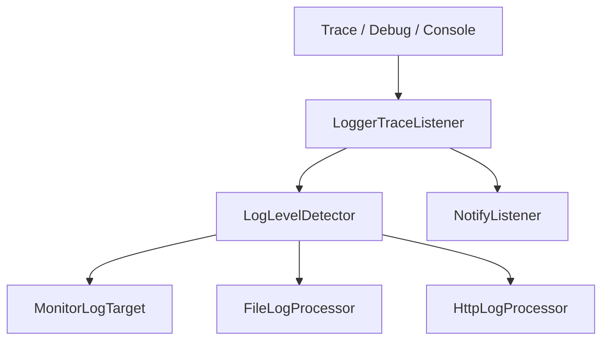
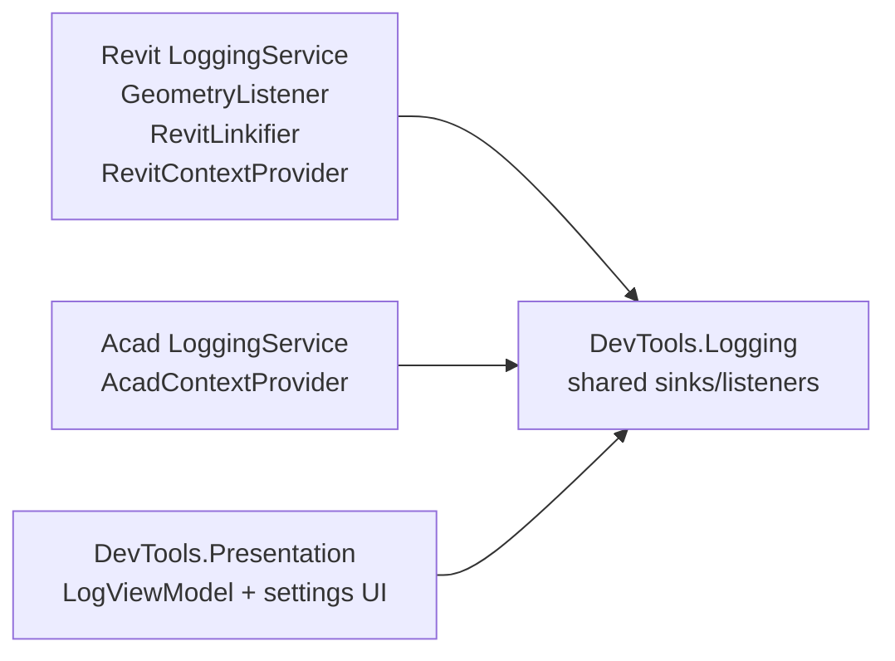

# Logging System Architecture

Logging is split between shared sink/listener infrastructure in `DevTools.Logging` and host-specific lifecycle/context services in each host project.

Last updated: 2026-05-29

---

## Source Map

| Area | Path |
|------|------|
| Shared logging library | `source/DevTools.Logging/` |
| Shared presentation contracts | `source/DevTools.Presentation/Interfaces/` |
| Revit logging lifecycle | `source/RevitDevTool/Logging/LoggingService.cs` |
| Revit enrichers/linkify/geometry listener | `source/RevitDevTool/Logging/` |
| AutoCAD logging lifecycle | `source/AcadDevTool/Logging/LoggingService.cs` |
| AutoCAD enrichers | `source/AcadDevTool/Logging/` |

---

## Shared Logging Layer

`DevTools.Logging` owns:

- `LoggerTraceListener`
- `ConsoleRedirector`
- `NotifyListener`
- `LogLevelDetector`
- monitor/file/http targets
- `LoggingExtensions.AddLoggingProvider()`
- sink options and save formats

Host projects own when listeners are registered, which enrichers are active, and any host-specific linkification or geometry routing.

---

## Host Composition

Revit registration is in `RevitHostingExtensions.AddLoggingServices()`. AutoCAD registration is in `AcadHostingExtensions.AddLoggingServices()`.

---

## Severity Detection

`LogLevelDetector` scans message content and maps known keywords to levels. This is deliberately lightweight and host-neutral.

| Level | Example keywords |
|-------|------------------|
| Critical | `CRITICAL`, `FATAL`, `PANIC`, `SECURITY` |
| Error | `ERROR`, `FAILED`, `EXCEPTION`, `TIMEOUT`, `INVALID` |
| Warning | `WARNING`, `DEPRECATED`, `OBSOLETE`, `MEMORY`, `RETRY` |
| Information | default |

---

## Revit-Specific Extensions

Revit adds behavior that must not leak into shared logging:

- `GeometryListener` intercepts Revit geometry objects written to `Trace`.
- `RevitLinkifier` detects Revit element references in monitor text and creates clickable selection links.
- `RevitContextProvider` enriches log records with selected Revit context fields.
- Visualization routing sends geometry to DirectContext3D servers under `source/RevitDevTool/Visualization/`.

AutoCAD has its own context provider/enricher path and does not share Revit geometry routing.

---

## Output Targets

| Target | Implementation | Notes |
|--------|----------------|-------|
| Monitor | `MonitorLogTarget` | UI monitor through Scintilla/ZLogger integration. |
| File | `FileLogProcessor` | Plain text or JSON based on settings. |
| HTTP | `HttpLogProcessor` | Remote sink path. |
| Notify | `NotifyListener` | UI update notifications. |

---

## Change Rules

- Keep shared logging host-neutral.
- Put host document/context/linkification/geometry behavior in host projects.
- If changing geometry routing, update `docs/Visualization/README.md` too.
- If changing sinks or shared options, update this doc and `docs/ai/host-boundaries.md` when the boundary changes.

---

## Related Docs

- `docs/Visualization/README.md`
- `docs/Execution/README.md`
- `docs/ai/host-boundaries.md`
