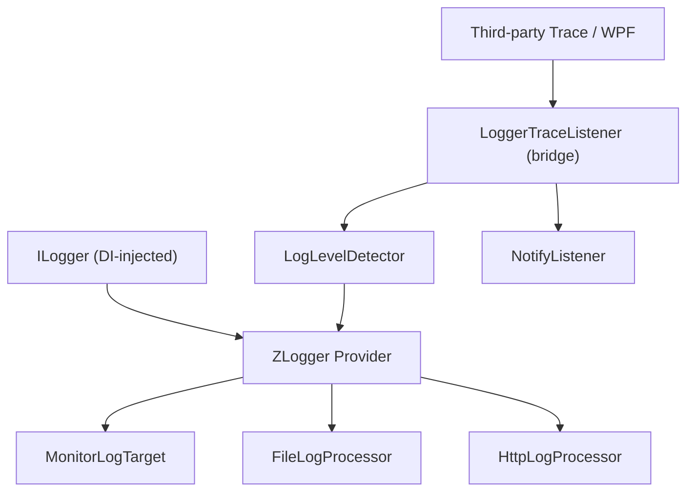
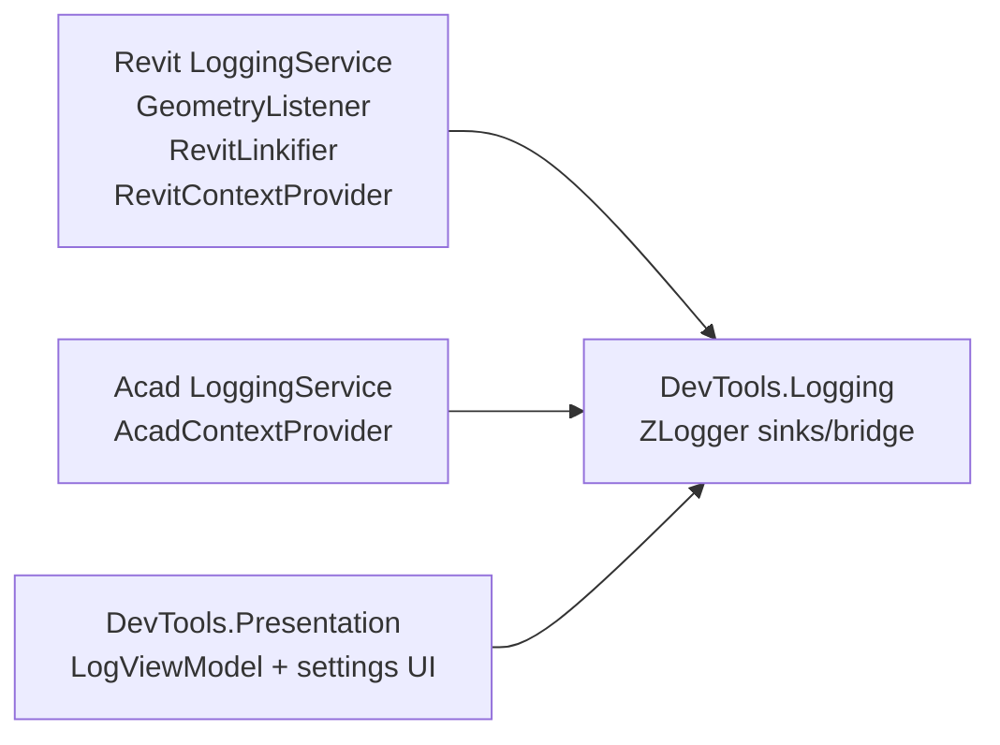

# Logging System Architecture

Logging uses `ILogger<T>` via Microsoft.Extensions.Logging (MEL) with ZLogger as the provider. All business code injects `ILogger<T>` through DI; a legacy `LoggerTraceListener` bridge remains for third-party/WPF trace sources only.

Last updated: 2026-06-28

---

## Source Map

| Area | Path |
|------|------|
| Shared logging library | `source/DevTools.Logging/` |
| Shared presentation contracts | `source/DevTools.Presentation/Interfaces/` |
| Revit logging lifecycle | `source/RevitDevTool/Logging/LoggingService.cs` |
| Revit enrichers/linkify/geometry listener | `source/RevitDevTool/Logging/` |
| AutoCAD logging lifecycle | `source/AcadDevTool/Logging/LoggingService.cs` |
| AutoCAD enrichers | `source/AcadDevTool/Logging/` |

---

## Logging Pattern (Standard)

All services, providers, and view models use DI-injected `ILogger<T>` with ZLogger extension methods:

```csharp
public sealed class MyService(ILogger<MyService> logger)
{
    public void DoWork()
    {
        logger.ZLogInformation($"Starting work...");
        logger.ZLogError($"Something failed: {ex.Message}");
    }
}
```

For static utility classes that cannot use DI, pass an optional `ILogger? logger = null` parameter:

```csharp
internal static class MyHelper
{
    public static void DoStatic(string input, ILogger? logger = null)
    {
        logger?.ZLogDebug($"Processing {input}");
    }
}
```

---

## Shared Logging Layer



`DevTools.Logging` owns:

- ZLogger provider registration (`LoggingExtensions.AddLoggingProvider()`)
- `LoggerTraceListener` (bridge for third-party Trace sources only)
- `ConsoleRedirector` (captures Console.Out → Trace for third-party libs)
- `NotifyListener`
- `LogLevelDetector` (keyword-based level for bridged Trace messages)
- Monitor/file/HTTP targets
- Sink options and save formats

Host projects own when listeners are registered, which enrichers are active, and any host-specific linkification or geometry routing.

---

## Host Composition



Revit registration is in `RevitHostingExtensions.AddLoggingServices()`. AutoCAD registration is in `AcadHostingExtensions.AddLoggingServices()`.

---

## Severity Detection

`LogLevelDetector` scans bridged Trace message content and maps known keywords to MEL levels. Only applies to the `LoggerTraceListener` bridge path — `ILogger<T>` calls already carry explicit levels.

| Level | Example keywords |
|-------|------------------|
| Critical | `CRITICAL`, `FATAL`, `PANIC`, `SECURITY` |
| Error | `ERROR`, `FAILED`, `EXCEPTION`, `TIMEOUT`, `INVALID` |
| Warning | `WARNING`, `DEPRECATED`, `OBSOLETE`, `MEMORY`, `RETRY` |
| Information | default |

---

## Revit-Specific Extensions

Revit adds behavior that must not leak into shared logging:

- `GeometryListener` intercepts Revit geometry objects written to `Trace`.
- `RevitLinkifier` detects Revit element references in monitor text and creates clickable selection links.
- `RevitContextProvider` enriches log records with selected Revit context fields.
- Visualization routing sends geometry to DirectContext3D servers under `source/RevitDevTool/Visualization/`.

AutoCAD has its own context provider/enricher path and does not share Revit geometry routing.

---

## Output Targets

| Target | Implementation | Notes |
|--------|----------------|-------|
| Monitor | `MonitorLogTarget` | UI monitor through Scintilla/ZLogger integration. |
| File | `FileLogProcessor` | Plain text or JSON based on settings. |
| HTTP | `HttpLogProcessor` | Remote sink path. |
| Notify | `NotifyListener` | UI update notifications (bridge path only). |

---

## Migration Notes

As of 2026-06-28, all project-owned code uses `ILogger<T>` + ZLogger. The `LoggerTraceListener` bridge remains active for:

- WPF `PresentationTraceSources` (data binding errors, etc.)
- Revit SDK internal traces
- Python runtime `Trace.Write` (stdout capture from embedded scripts)
- Any third-party library that writes to `System.Diagnostics.Trace`

Do **not** add new `Trace.TraceError/Warning/Information` or `Debug.WriteLine` calls in project-owned code. Use `ILogger<T>` injection instead.

---

## Change Rules

- Use `ILogger<T>` for all new logging in project-owned code.
- Keep `LoggerTraceListener` bridge for third-party/WPF trace sources.
- Keep shared logging host-neutral.
- Put host document/context/linkification/geometry behavior in host projects.
- If changing geometry routing, update `docs/Visualization/README.md` too.
- If changing sinks or shared options, update this doc and `docs/ai/host-boundaries.md` when the boundary changes.

---

## Related Docs

- `docs/Visualization/README.md`
- `docs/Execution/README.md`
- `docs/ai/host-boundaries.md`
