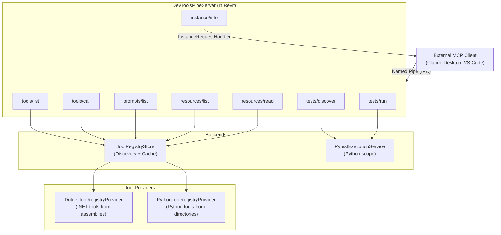
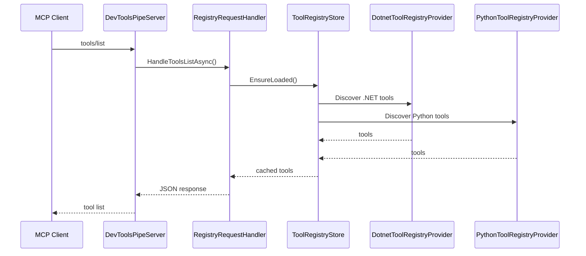
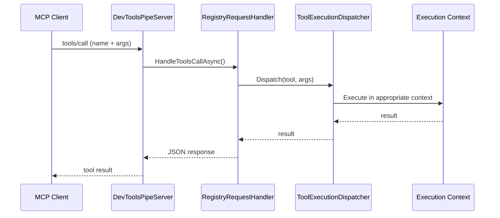

# MCP Integration Architecture

Model Context Protocol (MCP) integration enables external tools (Claude Desktop, VS Code extensions) to interact with Revit through a standardized protocol. Split across three source projects plus the add-in host.

---

## Architecture Overview



---

## Source Projects

### DevTools.McpParser (`source/DevTools.McpParser/`)

Message parsing library shared by both server and client:
- **Models/** — Bridge message types, pipe connection protocol
- **Dotnet/** — .NET tool parser (attribute-based discovery)
- **Python/** — Python tool parser (annotation-based discovery)
- **RequestContextFactory.cs** — Context factory for request handling

### DevTools.McpServer (`source/DevTools.McpServer/`)

Standalone MCP server process (publishable binary):
- **Program.cs** — Main entry point
- **RoutingMcpServerTool/Prompt/Resource** — MCP routing handlers
- **RevitBridgeClient.cs** — Client connecting back to Revit's pipe server
- **CatalogService.cs** — Tool catalog management
- **InstanceManager.cs** — Instance lifecycle
- **GatewayTunnelClient.cs** — Gateway tunnel support

### Add-in Host (`source/DevTools.Execution/External/Mcp/`)

```mermaid
flowchart LR
    subgraph Registry["Registry"]
        DotNetP["DotnetToolRegistryProvider"]
        PythonP["PythonToolRegistryProvider"]
        Catalog["ToolRegistryCatalogLoader"]
    end

    subgraph Dispatch["Dispatchers"]
        ToolD["ToolExecutionDispatcher"]
        PromptD["PromptExecutionDispatcher"]
        ResourceD["ResourceExecutionDispatcher"]
    end

    subgraph Store["Store"]
        Store["ToolRegistryStore\n(cache + change notif)"]
    end

    Registry --> Store
    Store --> Dispatch
```

---

## Key Flows

### Tool Discovery



### Tool Execution



---

## Related Documentation

- **[Execution Architecture](../Execution/README.md)** — Execution engine and pipe server
- **[PythonDemo Architecture](../PythonDemo/README.md)** — Python MCP toolset examples
- **Samples/McpToolsetDemo/** — Demo MCP toolset assembly
- **Samples/RevitMcpToolSet/** — Comprehensive MCP tool set

---

_Last updated: 2026-05-03_
