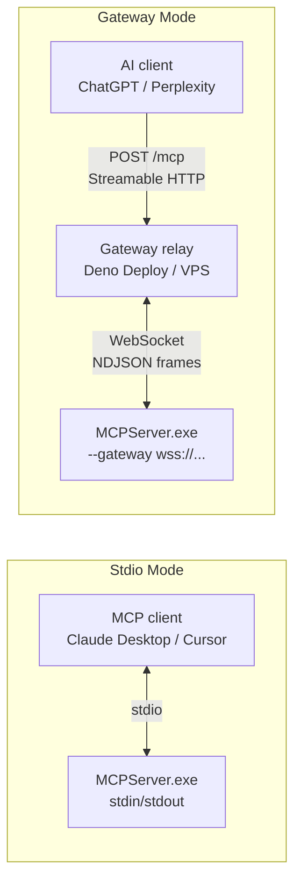
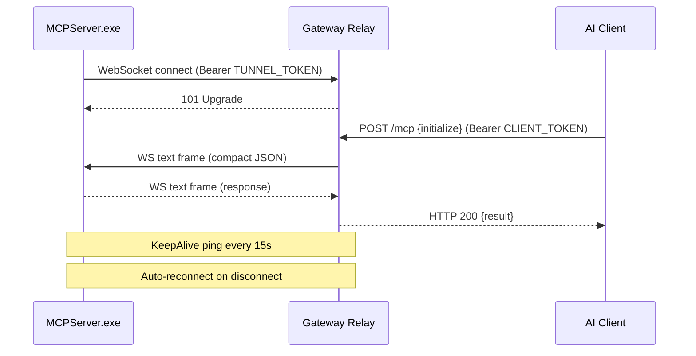
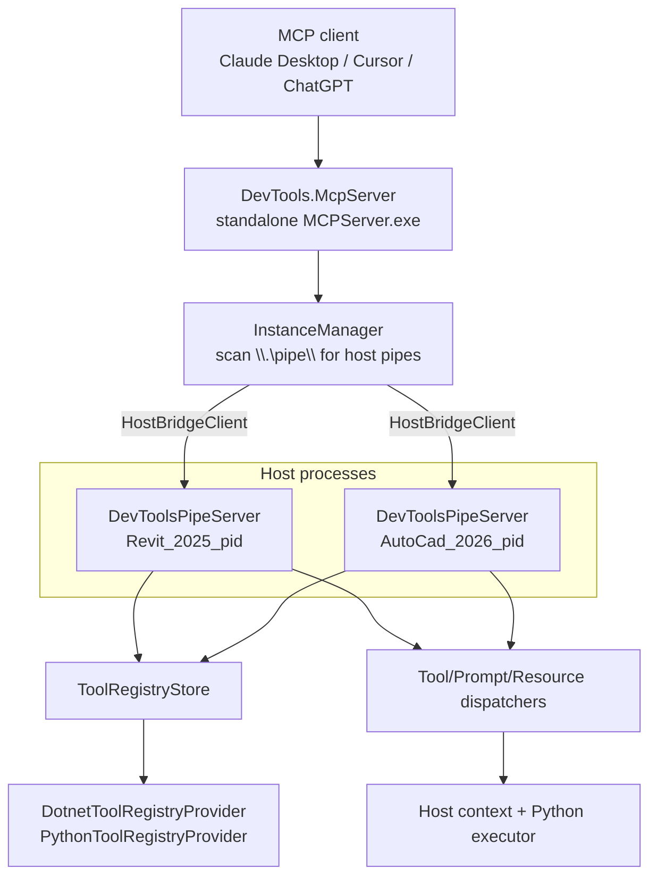
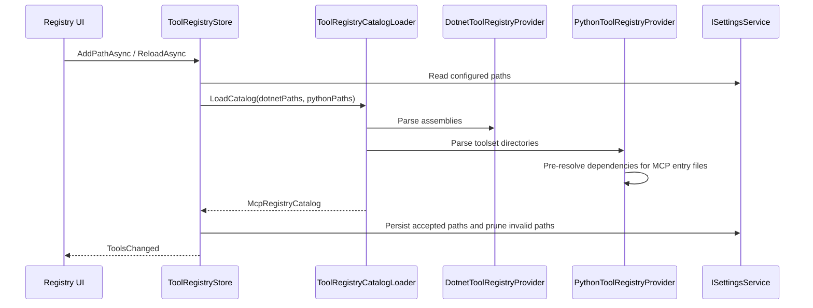

# MCP Integration Architecture

Model Context Protocol integration lets external AI clients (Claude Desktop, Cursor, ChatGPT, Perplexity, etc.) talk to running host applications through a standalone MCP server and the in-host named-pipe runtime.

The entire MCP stack is designed to be host-agnostic. The standalone `MCPServer.exe` discovers and connects to any host pipe (`Revit_*`, `AutoCad_*`, `Civil3D_*`, etc.) via generic `HostBridgeClient`. The in-host runtime in `DevTools.Execution` uses `IHostAppInfo` and host adapters. Built-in standalone tools now support both Revit and AutoCAD-family products (launch, file info, instance discovery).

Last updated: 2026-06-14

---

## Source Map

| Area | Path |
|------|------|
| Parser/contracts | `source/DevTools.McpParser/` |
| Standalone MCP server | `source/DevTools.McpServer/` |
| Hosting modes | `source/DevTools.McpServer/Hosting/` |
| Catalog service | `source/DevTools.McpServer/Catalog/` |
| Built-in tools | `source/DevTools.McpServer/Tools/` |
| In-host runtime | `source/DevTools.Execution/External/Mcp/` |
| Pipe server | `source/DevTools.Execution/External/DevToolsPipeServer.cs` |
| Registry UI | `source/DevTools.Presentation/ViewModels/McpRegistryViewModel.cs` |
| Python parser script | `source/DevTools.Execution/Resources/scripts/ToolParser.py` |
| Gateway relay (Deno) | `source/DevTools.McpGateway/` (separate repo) |

---

## Transport Modes

MCPServer.exe supports two transport modes, selected by CLI args:



| Mode | Trigger | Transport | Use case |
|------|---------|-----------|----------|
| **Stdio** | No `--gateway` arg | stdin/stdout | Local MCP clients (Claude Desktop, Cursor, VS Code) |
| **Gateway** | `--gateway <url> --token <secret>` | Outbound WebSocket to relay | Remote AI clients (ChatGPT, Perplexity) |

### Stdio Mode (`StdioMode.cs`)

Standard MCP transport. Uses `Microsoft.Extensions.Hosting` + `WithStdioServerTransport()`. Lifecycle managed by `IHostApplicationLifetime`.

### Gateway Mode (`GatewayMode.cs` + `GatewayTunnelClient.cs`)

Outbound WebSocket connection to a remote gateway relay:

1. `GatewayTunnelClient` connects to `wss://<gateway>/tunnel` with Bearer token
2. Wraps WebSocket frames as NDJSON streams via custom `WebSocketReadStream` / `WebSocketWriteStream`
3. Creates a `StreamServerTransport` fed by those streams
4. Runs full MCP server over that transport
5. Auto-reconnects with exponential backoff (1s → 15s max) on failure



---

## Runtime Shape



The standalone MCP server owns MCP protocol routing and host instance selection. `InstanceManager` scans `\\.\pipe\` for pipes matching `{HostApp}_{Version}_{PID}` and connects via generic `HostBridgeClient`. The host process owns actual execution, registry loading, and host-safe invocation.

---

## Parser Library

`source/DevTools.McpParser/` contains shared bridge and registry contracts:

- `Models/BridgeMessage.cs`, `BridgeMethods.cs`, `BridgePipeConnection.cs`
- `Models/Constants.cs` — canonical bridge payload, MCP argument, content, and JSON Schema property names, JSON Schema type and MCP content type values
- `Models/McpRegisteredTool.cs`, `McpRegisteredPrompt.cs`, `McpRegisteredResource.cs`
- `Models/McpRegistryCatalog.cs`
- `Dotnet/DotnetMcpAssemblyParser.cs`
- `Python/PythonToolsetParser.cs`
- `RequestContextFactory.cs`

This library is shared by the standalone MCP server, in-host runtime, and tests.
Wire-format property names shared by host and server belong in `McpPropertyNames`; do not duplicate them in
`DevTools.Execution` or `DevTools.McpServer`.
Shared C# MCP tool arguments use camelCase consistently; for example, document-opening tools use `filePath`.

---

## Registry Flow



`.NET` catalogs are parsed from assemblies. Python catalogs are parsed from directories through `ToolParser.py` and in-process Python execution.

---

## Dispatch Flow

`RegistryRequestHandler` handles pipe methods:

- `tools/list`
- `tools/call`
- `prompts/list`
- `prompts/get`
- `resources/list`
- `resources/templates/list`
- `resources/read`

Dispatchers split by primitive:

| Dispatcher | .NET path | Python path |
|------------|-----------|-------------|
| `ToolExecutionDispatcher` | `DotnetMcpServerFactory` creates/caches `McpServerTool` wrappers | `PythonExecutor` invokes the Python binding |
| `PromptExecutionDispatcher` | `McpServerPrompt` wrapper | Python prompt binding |
| `ResourceExecutionDispatcher` | `McpServerResource` wrapper | Python resource binding |

`McpPrimitiveBinding.CreatePrimitiveId()` normalizes IDs for stable lookup and duplicate handling.

---

## Standalone Server

`source/DevTools.McpServer/` contains:

| File/Folder | Role |
|-------------|------|
| `Program.cs` | Entry point — bootstrap, arg parsing, mode dispatch |
| `Hosting/StdioMode.cs` | Stdio transport mode via `Microsoft.Extensions.Hosting` |
| `Hosting/GatewayMode.cs` | Gateway transport mode — CatalogService + tunnel |
| `Hosting/GatewayTunnelClient.cs` | WebSocket tunnel with auto-reconnect, custom stream adapters |
| `Hosting/GracefulShutdown.cs` | Ctrl+C → CancellationToken for Gateway mode |
| `Catalog/CatalogService.cs` | Aggregates tools/prompts/resources from all host instances |
| `Catalog/DynamicToolCatalog.cs` | Per-instance dynamic tool registry + snapshot |
| `InstanceManager.cs` | Discovers host pipes, manages `HostBridgeClient` connections |
| `HostBridgeClient.cs` | Generic named-pipe client |
| `ToolHelpers.cs` | Shared utilities (error result, client resolution, options config) |
| `RoutingMcpServerTool/Prompt/Resource` | Routing wrappers that dispatch to correct host instance |
| `Tools/` | Built-in tool implementations |

The standalone server advertises `listChanged` capabilities for tools, prompts, and resources. When host discovery or
registry changes rebuild the dynamic catalog, the MCP SDK emits the corresponding list-changed notifications so clients
can refresh cached primitives.

Dynamic registrations are tracked per host instance using the `InstanceInfo` returned by that instance. A tool registered
in one Revit process is not assumed to exist in another Revit process, and tools with the same name can coexist across
Revit, AutoCAD-family, and future hosts. Host application identity belongs to the instance registration rather than the
individual tool definition.

### Built-in Standalone Tools

Registered in `source/DevTools.McpServer/Program.cs`:

| Tool | Host Support | Description |
|------|-------------|-------------|
| `list_host_instances` | All hosts | Lists connected instances + discovered pipes |
| `launch_host` | Revit + AutoCAD family | Launches host with optional file path; supports AutoCad, Civil3D, Plant3D, etc. |
| `read_file_info` | Revit (RVT/RFA) + AutoCAD (DWG) | Offline metadata reader via compound-file and ACadSharp |
| `open_model` | Multi-host | Extension-based host detection; on a connected instance routes `open_document` via pipe; on cold start launches host with file as CLI arg |
| `list_dynamic_tools` | All hosts | Lists dynamic tools and every host instance currently providing each tool |
| `call_dynamic_tool` | All hosts | Calls a dynamic tool only on an instance that registered it |
| `refresh_dynamic_catalog` | All hosts | Queries connected instances again and returns the refreshed per-instance catalog |

### Built-in In-Host Tools

Registered in `source/DevTools.Execution/External/Mcp/BuiltIn/`:

| Tool | Host Support | Description |
|------|-------------|-------------|
| `execute_csharp_code` | Revit + AutoCAD | Compiles and runs C# code with host API context |
| `open_document` | Revit + AutoCAD | Opens a model file via `IDocumentBridge` (`RevitDocumentBridge` / `AcadDocumentBridge`) |

### Host-Specific Gaps

- No shipped AutoCAD MCP toolset equivalent to `Samples/RevitMcpToolSet/`
- Navisworks listed in enums but launch returns "not yet supported"

---

## CLI Usage

```bash
# Stdio mode (default) — for local MCP clients
MCPServer.exe

# Gateway mode — connects to remote relay for ChatGPT/Perplexity
MCPServer.exe --gateway wss://mcpgateway.example.com/tunnel --token <TUNNEL_TOKEN>
```

---

## Pytest Routes

`DevToolsPipeServer` also routes `tests/discover` and `tests/run` to the pytest bridge. Those routes are documented in `docs/PyTest/README.md`.

---

## Verification Reality

Current MCP tests mostly cover parser and contract shapes. They do not deeply prove live named-pipe dispatch, host threading, or end-to-end MCP client behavior.

When changing MCP behavior:

- Add focused parser/contract tests for schema or identity changes.
- Build the host that owns the changed runtime.
- State live-host or named-pipe verification gaps when they cannot be run.

---

## Related Docs

- `docs/ai/mcp-pytest-bridge.md`
- `docs/Execution/README.md`
- `docs/PyTest/README.md`
- `Samples/McpToolsetDemo/`
- `Samples/PythonDemo/mcp_toolset/`
- `Samples/RevitMcpToolSet/`
