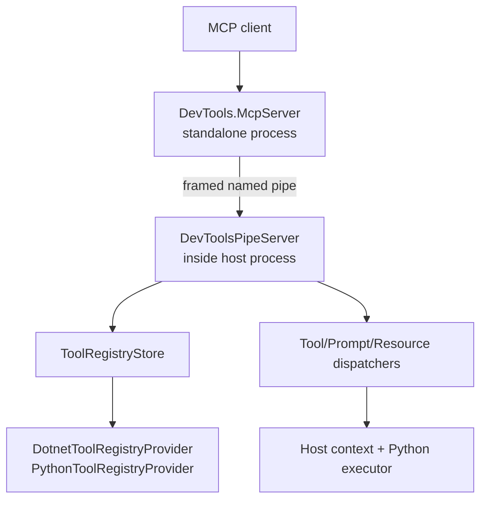
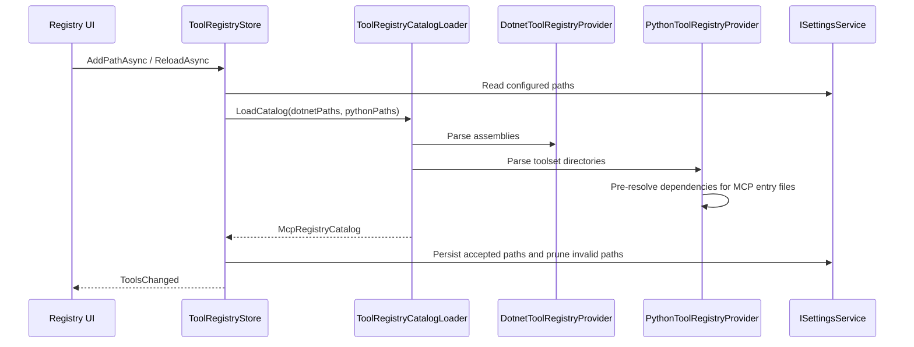

# MCP Integration Architecture

Model Context Protocol integration lets external clients talk to a running host through a standalone MCP server and the in-host named-pipe runtime.

Current server tooling is still Revit-oriented in naming and built-in tools, but the runtime path in `DevTools.Execution` is host-agnostic and uses `IHostAppInfo` plus host adapters.

Last updated: 2026-05-29

---

## Source Map

| Area | Path |
|------|------|
| Parser/contracts | `source/DevTools.McpParser/` |
| Standalone MCP server | `source/DevTools.McpServer/` |
| In-host runtime | `source/DevTools.Execution/External/Mcp/` |
| Pipe server | `source/DevTools.Execution/External/DevToolsPipeServer.cs` |
| Registry UI | `source/DevTools.Presentation/ViewModels/McpRegistryViewModel.cs` |
| Python parser script | `source/DevTools.Execution/Resources/scripts/ToolParser.py` |

---

## Runtime Shape

The standalone MCP server owns MCP protocol routing and host instance selection. The host process owns actual execution, registry loading, and host-safe invocation.

---

## Parser Library

`source/DevTools.McpParser/` contains shared bridge and registry contracts:

- `Models/BridgeMessage.cs`, `BridgeMethods.cs`, `BridgePipeConnection.cs`
- `Models/McpRegisteredTool.cs`, `McpRegisteredPrompt.cs`, `McpRegisteredResource.cs`
- `Models/McpRegistryCatalog.cs`
- `Dotnet/DotnetMcpAssemblyParser.cs`
- `Python/PythonToolsetParser.cs`
- `RequestContextFactory.cs`

This library is shared by the standalone MCP server, in-host runtime, and tests.

---

## Registry Flow

`.NET` catalogs are parsed from assemblies. Python catalogs are parsed from directories through `ToolParser.py` and in-process Python execution.

---

## Dispatch Flow

`RegistryRequestHandler` handles pipe methods:

- `tools/list`
- `tools/call`
- `prompts/list`
- `prompts/get`
- `resources/list`
- `resources/templates/list`
- `resources/read`

Dispatchers split by primitive:

| Dispatcher | .NET path | Python path |
|------------|-----------|-------------|
| `ToolExecutionDispatcher` | `DotnetMcpServerFactory` creates/caches `McpServerTool` wrappers | `PythonExecutor` invokes the Python binding |
| `PromptExecutionDispatcher` | `McpServerPrompt` wrapper | Python prompt binding |
| `ResourceExecutionDispatcher` | `McpServerResource` wrapper | Python resource binding |

`McpPrimitiveBinding.CreatePrimitiveId()` normalizes IDs for stable lookup and duplicate handling.

---

## Standalone Server

`source/DevTools.McpServer/` contains:

- `Program.cs`
- `CatalogService.cs`
- `InstanceManager.cs`
- `RevitBridgeClient.cs`
- routing primitives: `RoutingMcpServerTool`, `RoutingMcpServerPrompt`, `RoutingMcpServerResource`
- built-in Revit file/launch tools under `Tools/` and `RevitFileInfo/`

The built-in standalone tools are currently Revit-specific. Keep that distinction clear: the in-host MCP runtime is shared, while the current standalone helper tools target Revit workflows.

---

## Pytest Routes

`DevToolsPipeServer` also routes `tests/discover` and `tests/run` to the pytest bridge. Those routes are documented in `docs/PyTest/README.md`.

---

## Verification Reality

Current MCP tests mostly cover parser and contract shapes. They do not deeply prove live named-pipe dispatch, host threading, or end-to-end MCP client behavior.

When changing MCP behavior:

- Add focused parser/contract tests for schema or identity changes.
- Build the host that owns the changed runtime.
- State live-host or named-pipe verification gaps when they cannot be run.

---

## Related Docs

- `docs/ai/mcp-pytest-bridge.md`
- `docs/Execution/README.md`
- `docs/PyTest/README.md`
- `Samples/McpToolsetDemo/`
- `Samples/PythonDemo/mcp_toolset/`
- `Samples/RevitMcpToolSet/`
