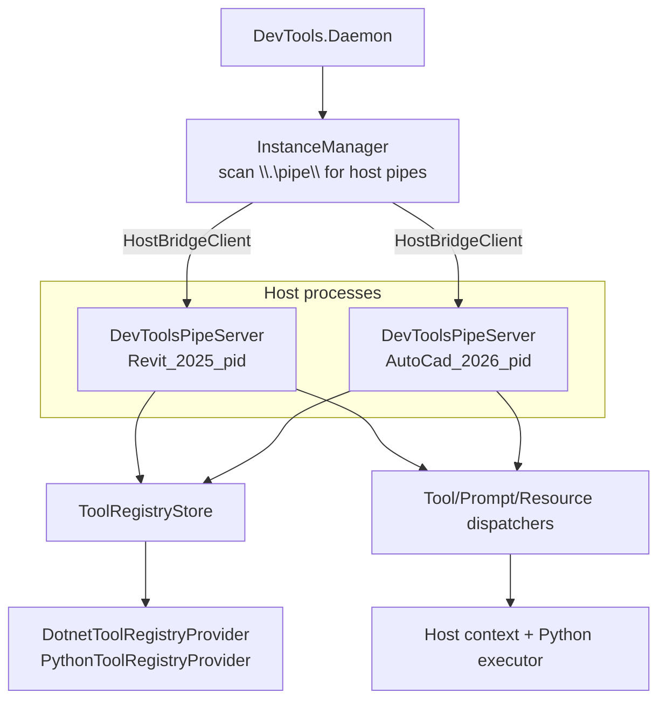
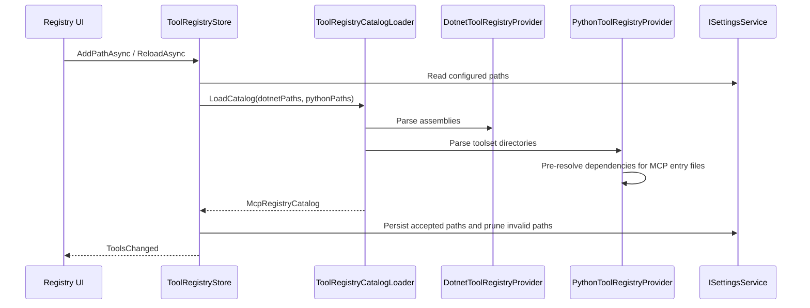

# In-Host MCP Runtime

The in-host runtime runs inside Revit/AutoCAD and handles actual tool execution.

## Runtime Shape

The Daemon owns MCP protocol routing and host instance selection. `InstanceManager` scans `\\.\pipe\` for pipes matching `{HostApp}_{Version}_{PID}` and connects via generic `HostBridgeClient`. The host process owns actual execution, registry loading, and host-safe invocation.

## Registry Flow

## Dispatch Flow

`RegistryRequestHandler` handles pipe methods:

- `tools/list`, `tools/call`
- `prompts/list`, `prompts/get`
- `resources/list`, `resources/templates/list`, `resources/read`

Dispatchers split by primitive:

| Dispatcher | .NET path | Python path |
|------------|-----------|-------------|
| `ToolExecutionDispatcher` | `DotnetMcpServerFactory` creates/caches `McpServerTool` wrappers | `PythonExecutor` invokes the Python binding |
| `PromptExecutionDispatcher` | `McpServerPrompt` wrapper | Python prompt binding |
| `ResourceExecutionDispatcher` | `McpServerResource` wrapper | Python resource binding |

`McpPrimitiveBinding.CreatePrimitiveId()` normalizes IDs for stable lookup and duplicate handling.

## Parser Library

`source/DevTools.McpParser/` contains shared bridge and registry contracts:

- `Models/BridgeMessage.cs`, `BridgeMethods.cs`, `BridgePipeConnection.cs`
- `Models/Constants.cs` — canonical property names and type values
- `Models/McpRegisteredTool.cs`, `McpRegisteredPrompt.cs`, `McpRegisteredResource.cs`
- `Models/McpRegistryCatalog.cs`
- `Dotnet/DotnetMcpAssemblyParser.cs`
- `Python/PythonToolsetParser.cs`
- `RequestContextFactory.cs`

Wire-format property names belong in `McpPropertyNames`; do not duplicate in other projects.
