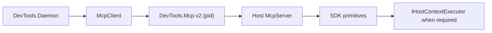

# In-Host MCP Runtime

Each host exposes a standard MCP server on `DevTools.Mcp.v2.{pid}`. This is a separate endpoint from the direct pytest pipe.

`HostMcpServerHostedService` owns the named-pipe accept loop and creates a ModelContextProtocol SDK `McpServer` for every session. `HostSessionManager` discovers V2 pipe names, opens `HostMcpSession` SDK clients, reconnects with backoff after transient failure, and raises catalog changes to the daemon coordinator.

## Primitive registration and execution

`HostMcpServerOptionsFactory` provides SDK tool, prompt, resource, and resource-template collections with list-changed capability. Built-in, .NET, and Python registrations produce SDK primitives directly; MCP DTOs, request handling, errors, progress, and notifications use SDK types and semantics.

Dynamic registry loads retain configured .NET/Python paths and prune invalid paths. Built-in names are reserved. Duplicate dynamic names and resource URIs are rejected with diagnostics, rather than overwriting an existing entry.

When a primitive requires a host API context, its host-safe execution adapter uses `IHostContextExecutor` with `ExecutionGuardMode.Suppress`. Host API threading, transactions, document context, and rendering remain host responsibilities; the shared registry and MCP transport contain no Revit/AutoCAD API dependency.

## Daemon catalog behavior

The daemon obtains tool, prompt, resource, and template lists through the SDK client and builds cached host snapshots. Searches use the snapshot without a host roundtrip. Failed refreshes retain the last successful snapshot while that host remains connected; disconnect removes it. In default Broker mode the snapshot feeds `devtools_search` and `devtools_invoke`; Native mode additionally projects host primitives as namespaced SDK proxies for notification-aware clients.

## Direct pytest is not this runtime

`DevTools.Ipc` retains `BridgeMessage`, four-byte framing, and host pipe naming for the independent pytest lane only. Pytest uses `DevTools_{Host}_{Version}_{PID}` and `tests/run`; it does not connect to `DevTools.Mcp.v2.{pid}`, initialize MCP, or go through the daemon.
