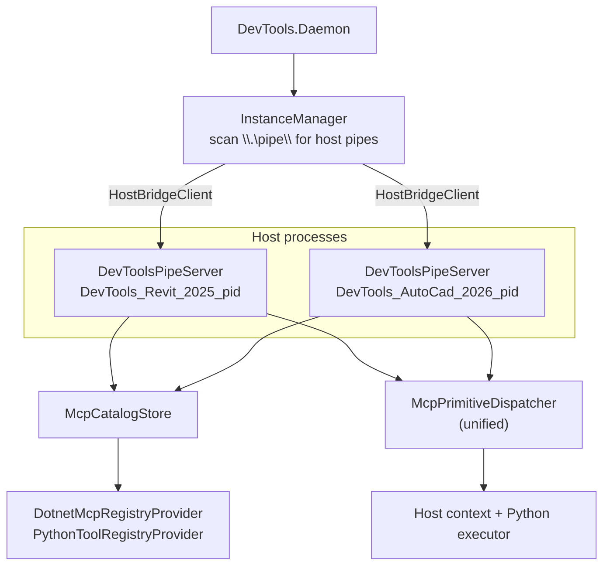
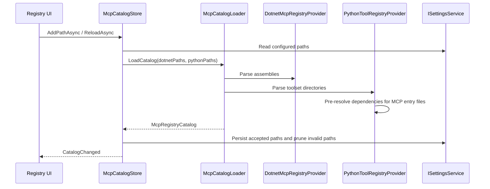

# In-Host MCP Runtime

The in-host runtime runs inside Revit/AutoCAD and handles actual tool execution.

## Runtime Shape

The Daemon owns MCP protocol routing and host instance selection. `InstanceManager` scans `\\.\pipe\` for pipes matching `DevTools_{HostApp}_{Version}_{PID}` and connects via generic `HostBridgeClient`. The host process owns actual execution, registry loading, and host-safe invocation.

## Registry Flow

## Dispatch Flow

`McpBridgeRequestHandler` (in `DevTools.Mcp/Handlers/`) handles pipe methods:

- `tools/list`, `tools/call`
- `prompts/list`, `prompts/get`
- `resources/list`, `resources/templates/list`, `resources/read`

A single `McpPrimitiveDispatcher` (in `DevTools.Execution/External/Mcp/Dispatchers/`) implements `IMcpPrimitiveDispatcher` and routes all primitives:

| Primitive | .NET path | Python path |
|-----------|-----------|-------------|
| Tool call | `DotnetMcpServerFactory` creates/caches `McpServerTool` wrappers | `PythonExecutor` invokes the Python binding |
| Prompt get | `McpServerPrompt` wrapper | Python prompt binding |
| Resource read | `McpServerResource` wrapper | Python resource binding |

`McpPrimitiveBinding.CreatePrimitiveId()` normalizes IDs for stable lookup and duplicate handling.

## Standard SDK Primitive Execution

The standard in-host SDK server receives concrete .NET, Python, and temporary built-in `McpServerTool`, `McpServerPrompt`, and `McpServerResource` instances from `McpCatalogStore`. Direct .NET and Python primitives are decorated through `IMcpHostExecution`; `HostContextMcpExecution` sets `ExecutionGuardContext.Mode` to `Suppress` and delegates to the host-provided `IHostContextExecutor`. Because that executor owns a synchronous host callback, direct primitives must complete before the callback exits; incomplete `ValueTask` results are rejected rather than being awaited outside the host context. Temporary built-in adapters instead establish `Suppress` for their complete async workflow, including compilation, dependency, and document preparation, and let the built-in's existing `IHostContextExecutor` or host-safe adapter marshal only its actual host API callback. This keeps the registry host-neutral while preserving Revit/AutoCAD API-thread safety, cancellation, and exception propagation for direct SDK calls. The registry UI exposes catalog diagnostics after every `CatalogChanged` event so rejected or failed registrations remain operator-visible.

## Parser Library

`source/DevTools.Mcp/` and `source/DevTools.Ipc/` contain shared bridge and registry contracts:

- `BridgeMessage.cs`, `BridgeError.cs` — length-prefixed JSON envelope with structured error detail
- `McpBridgeMethods.cs` — canonical bridge method names
- `BridgePipeConnection.cs` — framed pipe I/O
- `Models/McpRegisteredTool.cs`, `McpRegisteredPrompt.cs`, `McpRegisteredResource.cs`
- `Models/McpRegistryCatalog.cs`
- `Discovery/DotnetMcpAssemblyParser.cs`
- `Discovery/PythonToolsetParser.cs`
- `Dispatch/IMcpPrimitiveDispatcher.cs`, `IMcpExecutionTracker.cs`
- `Handlers/McpBridgeRequestHandler.cs`
- `RequestContextFactory.cs`

Wire-format property names belong in `McpPropertyNames`; do not duplicate in other projects.
