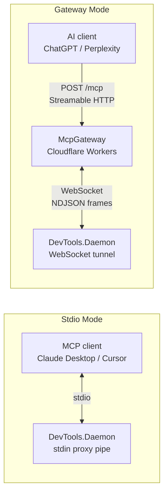
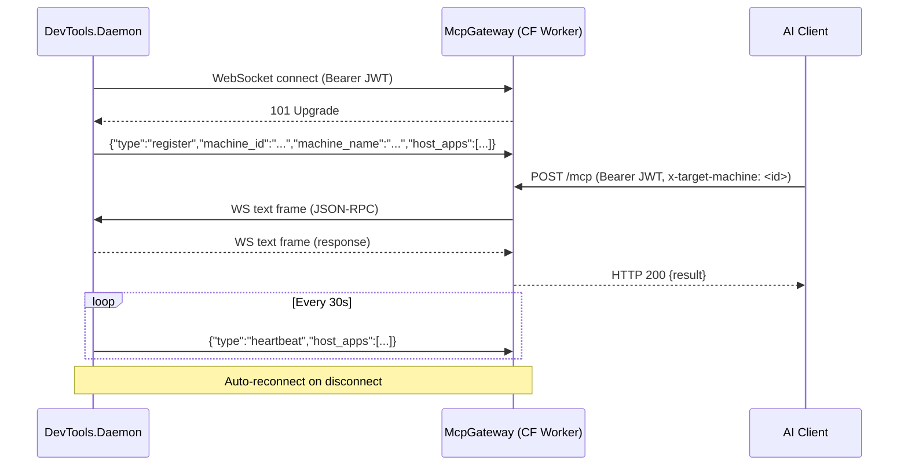

# Transport Modes

The Daemon runs both transport modes simultaneously when authenticated.

| Mode | Trigger | Transport | Use case |
|------|---------|-----------|----------|
| **Stdio** | Secondary process launch | Named pipe (`DevToolsDaemon_Stdio`) to single instance | Local MCP clients (Claude Desktop, Cursor, VS Code) |
| **Gateway** | Auto on sign-in | Outbound WebSocket to Cloudflare relay | Remote AI clients (ChatGPT, Perplexity) |

## Stdio Mode

When an AI client launches `DevTools.Daemon.exe`, the global Mutex detects a running instance. The secondary process becomes a stdio proxy: it relays stdin/stdout to the primary instance via the `DevToolsDaemon_Stdio` named pipe.

## Gateway Mode

Outbound WebSocket connection to the McpGateway (Cloudflare Workers + Durable Objects):

1. `GatewayTunnelClient` connects to `wss://<gateway>/tunnel` with Bearer token
2. Sends `register` frame with `machine_id`, `machine_name`, `host_apps`
3. Wraps WebSocket frames as NDJSON streams via custom adapters
4. Runs full MCP server over that transport
5. Auto-reconnects with exponential backoff (1s → 15s max) on failure
6. Sends periodic `heartbeat` frames with updated `host_apps`

## Multi-Machine Routing

One user can have Daemons on multiple machines connected to the same Gateway. The Gateway's Durable Object maintains a `Map<machine_id, WebSocket>`:

- **Single machine** → AI requests auto-route (no header needed)
- **Multiple machines** → AI must include `x-target-machine: <machine_id>` header
- **Discovery** → `GET /machines` or `list_machines` MCP tool lists connected machines
