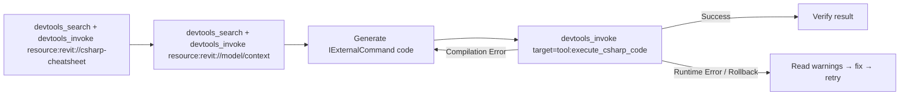
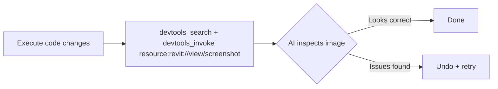
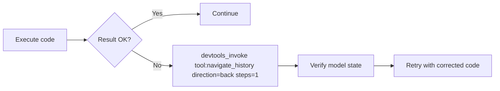
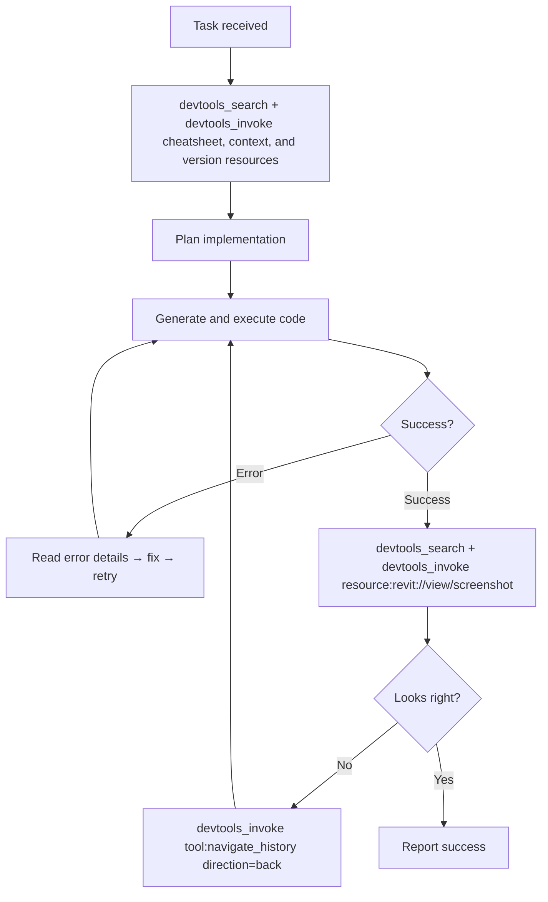

# MCP Workflow Patterns

Practical patterns for AI agents using RevitDevTool MCP tools.

---

## Broker-mode convention

These workflows use the default `Broker` surface. Discover an unfamiliar host
tool, resource, or prompt with `devtools_search`, then call it through
`devtools_invoke` using the returned `tool:<name>`, `resource:<uri>`, or
`prompt:<name>` target. A known target that resolves to one host can be invoked
directly through `devtools_invoke`; it is not a top-level external tool or
resource in Broker mode.

---

## Workflow: Code Execution (Create/Read/Update/Delete)



### Key Points

- Before first code generation, call `devtools_search(query="revit://csharp-cheatsheet", kinds=["resource"])`, then `devtools_invoke(target="resource:revit://csharp-cheatsheet")` (saves retries).
- For live state, call `devtools_search(query="revit://model/context", kinds=["resource"])`, then `devtools_invoke(target="resource:revit://model/context")`.
- Call `devtools_invoke(target="tool:execute_csharp_code", arguments={code: ...})` to execute the generated code.
- Error responses are categorized: `[COMPILATION ERROR]`, `[RUNTIME ERROR]`, `[ROLLBACK]`
- Rollback means ExecutionGuard resolved a constraint violation automatically

---

## Workflow: Vision (Verify Visual Results)



### Key Points

- Call `devtools_search(query="revit://view/screenshot", kinds=["resource"])`, then `devtools_invoke(target="resource:revit://view/screenshot")`; it returns a 1920px PNG of the active view.
- Size changes between calls indicate model state actually changed
- Use after creating geometry to confirm placement
- Non-exportable views (Project Browser, Templates) return text error

---

## Workflow: Undo (Recover from Mistakes)



### Key Points

- Discover it with `devtools_search(query="navigate_history", kinds=["tool"])`, then call `devtools_invoke(target="tool:navigate_history", arguments={direction: "back", steps: N})`.
- `navigate_history` uses the unified `direction="back"|"forward"`, `steps=N` contract on Revit and AutoCAD; pass daemon-local `hostId` to `devtools_invoke` when multiple hosts provide it.
- Revit: synchronous, returns exact stack state
- AutoCAD: async queue, returns estimated stack state
- Undo stack is per-document, not per-session

---

## Workflow: Full Development Loop



---

## Token Efficiency Tips

1. **Use `devtools_invoke(target="resource:revit://csharp-cheatsheet")` once per session** — cache it mentally, don't re-read every call
2. **Use `devtools_invoke(target="resource:revit://model/context")` before each operation** — it's live and cheap (~200 tokens)
3. **Use `devtools_search` against the cached catalog** — it needs no host roundtrip
4. **Structured errors save retries** — read the error category before regenerating code
5. **Screenshot is binary** — won't consume text tokens, but verify you have vision capability

---

## Multi-Instance Scenarios

When multiple hosts connect (e.g., Revit 2025 + Revit 2024), use `devtools_search` to obtain a target and its candidate local PIDs, then pass `hostId` to `devtools_invoke` to disambiguate:

```json
{
  "target": "tool:execute_csharp_code",
  "arguments": {"code": "..."},
  "hostId": 12345
}
```

---

## Related

- In-host dispatch: `docs/Execution/mcp-dispatch.md`
- Daemon architecture: `docs/MCP/daemon.md`
- Transport modes: `docs/MCP/transport.md`
