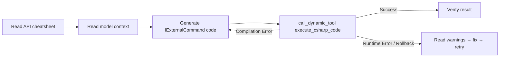
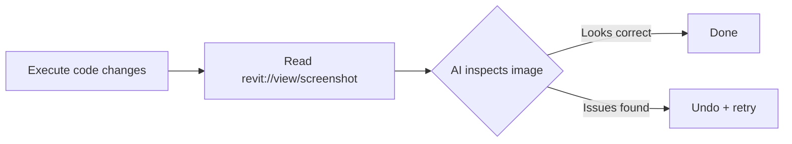
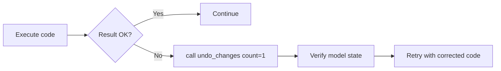
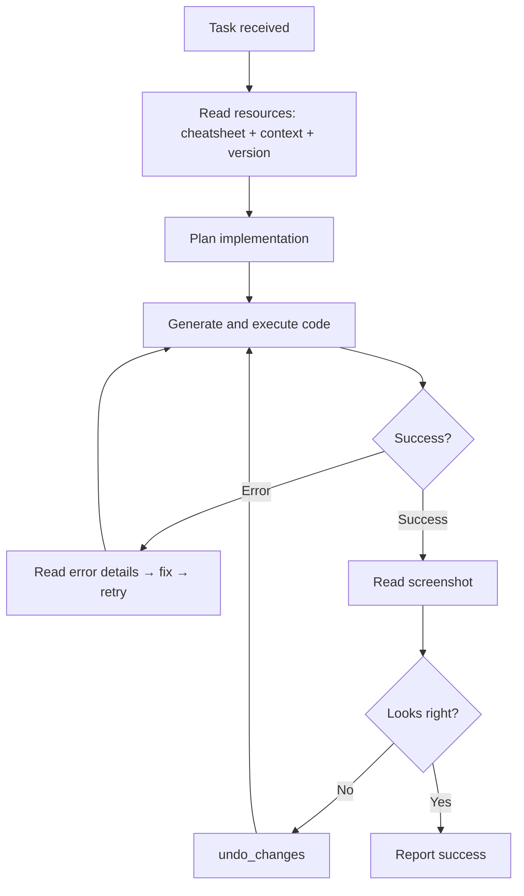

# MCP Workflow Patterns

Practical patterns for AI agents using RevitDevTool MCP tools.

---

## Workflow: Code Execution (Create/Read/Update/Delete)



### Key Points

- Always read `revit://api-cheatsheet` before first code generation (saves retries)
- Read `revit://model/context` for live state (levels, categories, active view)
- Error responses are categorized: `[COMPILATION ERROR]`, `[RUNTIME ERROR]`, `[ROLLBACK]`
- Rollback means ExecutionGuard resolved a constraint violation automatically

---

## Workflow: Vision (Verify Visual Results)



### Key Points

- `revit://view/screenshot` returns 1920px PNG of the active view
- Size changes between calls indicate model state actually changed
- Use after creating geometry to confirm placement
- Non-exportable views (Project Browser, Templates) return text error

---

## Workflow: Undo (Recover from Mistakes)



### Key Points

- `undo_changes` returns transaction names that were undone
- `redo_available` count shows what can be redone
- Undo stack is per-document, not per-session
- Must execute on host main thread (uses `IHostContextExecutor`)
- `count=N` undoes N most recent transactions

---

## Workflow: Full Development Loop



---

## Token Efficiency Tips

1. **Read cheatsheet once per session** — cache it mentally, don't re-read every call
2. **Read model context before each operation** — it's live and cheap (~200 tokens)
3. **Use `refresh_dynamic_catalog` only after host reconnects** — not between every call
4. **Structured errors save retries** — read the error category before regenerating code
5. **Screenshot is binary** — won't consume text tokens, but verify you have vision capability

---

## Multi-Instance Scenarios

When multiple hosts connect (e.g., Revit 2025 + Revit 2024), use `list_dynamic_tools` to see all registrations with their `hostInstanceId`, then pass `hostInstanceId` (PID) to disambiguate:

```json
{
  "name": "execute_csharp_code",
  "arguments": {"code": "..."},
  "hostInstanceId": 12345
}
```

---

## Related

- In-host dispatch: `docs/Execution/mcp-dispatch.md`
- Daemon architecture: `docs/MCP/daemon.md`
- Transport modes: `docs/MCP/transport.md`
