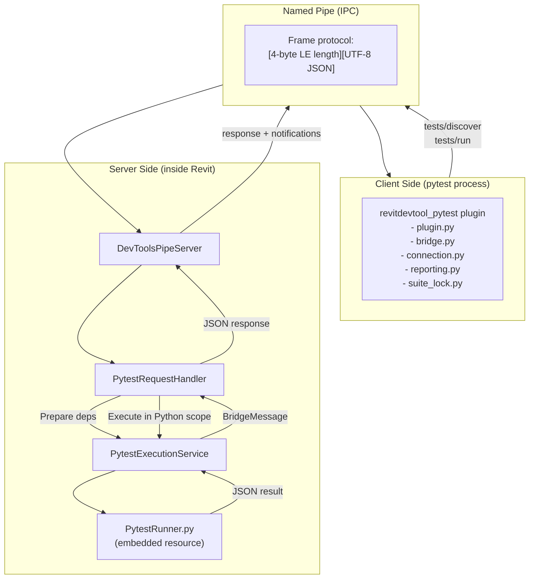
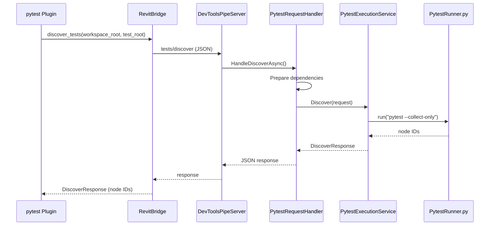
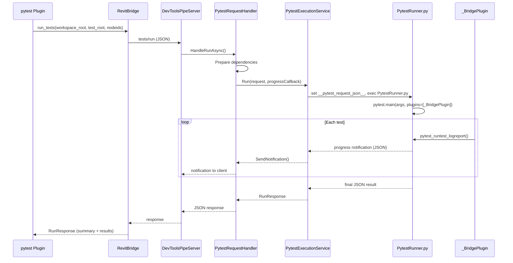

# PyTest Bridge Architecture

Architecture documentation for the pytest remote execution bridge between the `revitdevtool_pytest` plugin and RevitDevTool's Named Pipe server.

---

## Overview

---

## Client Side: `revitdevtool_pytest`

| File | Responsibility |
|------|---------------|
| **plugin.py** | pytest plugin entry point. Registers CLI + INI options (`--revit-version`, `--revit-launch`, `--revit-timeout`, `--revit-pipe`). Reads config from `[tool.pytest.ini_options]` in `pyproject.toml` (or `pytest.ini`/`tox.ini`/`setup.cfg`), with CLI overrides. Hooks into session lifecycle.
| **bridge.py** | `RevitBridge` — synchronous Named Pipe client. Connect/disconnect, frame-based RPC |
| **connection.py** | Bridge lifecycle: `ensure_bridge()` — connect, lease, auto-launch Revit if needed |
| **suite_lock.py** | Windows Mutex-based locking prevents multiple pytest processes on same Revit |
| **suite_leasing.py** | `SuiteLeaseStore` — exclusive test execution lease management |
| **reporting.py** | Maps remote `CaseResult[]` back to pytest `TestReport`. `run_remote_session` dispatches discover + run |
| **models.py** | Data models: `DiscoverRequest`, `RunRequest`, `CaseResult`, `BridgeResponse` |
| **dialog_resolver.py** | Handles Revit startup dialog detection and resolution |
| **constants.py** | Shared constants: pipe names, timeouts, phase/outcome enums |

## Server Side: `DevTools.Execution/External/Testing/`

| File | Responsibility |
|------|---------------|
| **PytestRequestHandler.cs** | Handles `tests/discover` and `tests/run` bridge messages |
| **PytestExecutionService.cs** | Core execution — serializes request, runs `PytestRunner.py` in Python scope, deserializes response |
| **PytestDependencyService.cs** | Ensures pytest + required packages installed before execution |
| **PytestPathResolver.cs** | Resolves test root and workspace root paths |
| **PytestContracts.cs** | Shared contracts: request/response types |

---

## Execution Flow

### Discovery

### Run

---

## Wire Protocol

Frame format: `[4-byte LE body length][UTF-8 JSON body]`

| Type | Structure |
|------|-----------|
| **Request** | `{"type":"request","id":"...","method":"...","params":{...}}` |
| **Response** | `{"type":"response","id":"...","result":{...}}` |
| **Error** | `{"type":"response","id":"...","error":{"message":"..."}}` |
| **Notification** | `{"type":"notification","method":"...","params":{...}}` |

---

## Related Documentation

- **[Execution Architecture](../Execution/README.md)** — Execution engine and Named Pipe server
- **RevitDevTool.PyTest** — [README](https://github.com/trgiangv/RevitDevTool.PyTest)

---

_Last updated: 2026-05-03_
