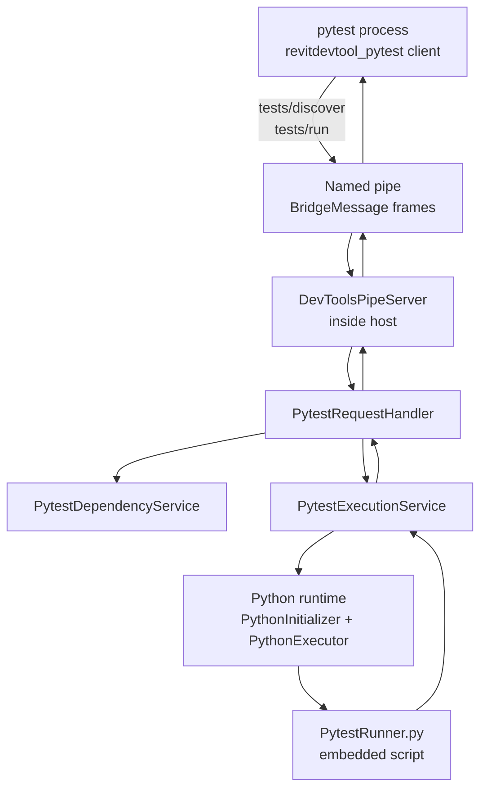
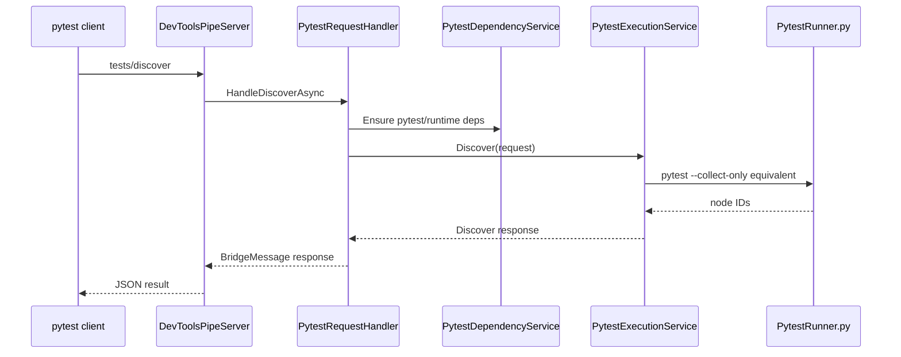
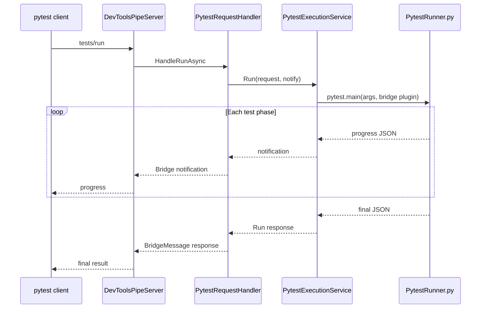

# PyTest Bridge Architecture

The pytest bridge lets an external pytest process discover and run tests inside a running host process through `DevToolsPipeServer`.

The current client plugin and workflow are Revit-oriented, but the server-side bridge lives in shared `DevTools.Execution`.

Last updated: 2026-05-29

---

## Source Map

| Area | Path |
|------|------|
| Pipe server | `source/DevTools.Execution/External/DevToolsPipeServer.cs` |
| Request handler | `source/DevTools.Execution/External/Handlers/PytestRequestHandler.cs` |
| Test execution service | `source/DevTools.Execution/External/Testing/PytestExecutionService.cs` |
| Dependency service | `source/DevTools.Execution/External/Testing/PytestDependencyService.cs` |
| Path resolver | `source/DevTools.Execution/External/Testing/PytestPathResolver.cs` |
| Contracts | `source/DevTools.Execution/External/Testing/PytestContracts.cs` |
| Embedded runner | `source/DevTools.Execution/Resources/scripts/PytestRunner.py` |

---

## Architecture

The server does not execute pytest as a separate process. It runs `PytestRunner.py` inside the host Python scope and returns serialized results through the bridge.

---

## Pipe Methods

| Method | Handler | Purpose |
|--------|---------|---------|
| `tests/discover` | `PytestRequestHandler.HandleDiscoverAsync` | Collect pytest node IDs under a test root. |
| `tests/run` | `PytestRequestHandler.HandleRunAsync` | Run requested node IDs and stream progress notifications. |

Frame format is shared with MCP routes: `[4-byte little-endian length][UTF-8 JSON BridgeMessage]`.

---

## Discovery Flow

---

## Run Flow

---

## Current Test Reality

The in-repo tests are not a deep end-to-end pytest bridge suite yet. Several tests still have stale path assumptions or require a prepared Pixi environment and built sample assets. Treat them as contract/smoke checks.

Known gaps are tracked in `docs/ai/known-test-gaps.md`.

When changing the pytest bridge:

- Add a focused contract or runner test if the changed code can run without a live host.
- Keep dependency preparation separate from discovery/run execution.
- Document missing live-host or named-pipe verification explicitly.

---

## Related Docs

- `docs/ai/mcp-pytest-bridge.md`
- `docs/Execution/README.md`
- `docs/MCP/README.md`
