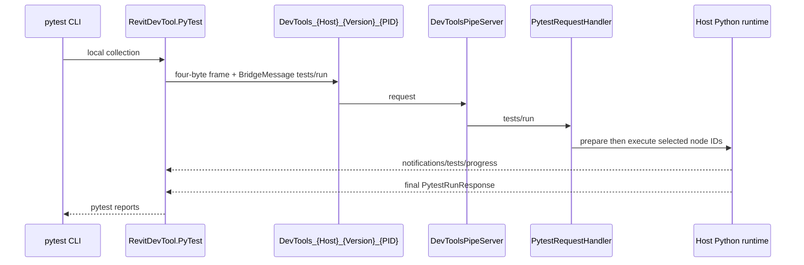

# PyTest Bridge Architecture

`RevitDevTool.PyTest` is an independently invoked pytest plugin that executes selected tests inside a live CAD/BIM host. It is not an MCP client or tool.

## Source map

| Area | Path |
|---|---|
| Direct pipe host | `source/DevTools.Execution/External/DevToolsPipeServer.cs` |
| Request handler | `source/DevTools.Execution/External/Handlers/PytestRequestHandler.cs` |
| Test execution and contracts | `source/DevTools.Execution/External/Testing/` |
| Embedded runner | `source/DevTools.Execution/Resources/scripts/PytestRunner.py` |
| Envelope/framing | `source/DevTools.Ipc/BridgeMessage.cs`, `BridgePipeConnection.cs` |
| Client plugin | Separate `RevitDevTool.PyTest` repository |

## Supported direct contract

| Concern | Contract |
|---|---|
| Pipe | `DevTools_{Host}_{Version}_{PID}` |
| Frame | Four-byte little-endian UTF-8 frame containing a `BridgeMessage` |
| Request | `tests/run`: `workspace_root`, `test_root`, `nodeids`, `pytest_args` |
| Progress | `notifications/tests/progress` notifications before the final response |
| Final result | `PytestRunResponse`: `exit_code`, `summary`, `results`, `collection_errors`, `rootdir` |

The plugin collects locally and sends its selected node IDs in `tests/run`. `tests/discover` is not a public bridge route; any prose describing remote discovery is stale. The host prepares dependencies before it enters host-context execution, runs pytest in its embedded Python runtime with failure/dialog suppression, and returns typed results for the plugin to map to normal pytest reports.

## Explicit separation from MCP

Pytest does not initialize MCP, invoke a daemon MCP tool, or traverse `DevTools.Daemon`. MCP Runtime V2 uses a different pipe (`DevTools.Mcp.v2.{pid}`) and SDK session. `DevTools.Ipc` retains `BridgeMessage` and framing intentionally for this direct lane.

## Current test reality

The in-repository tests are contract/smoke coverage, not comprehensive live-host assurance. Some suites require a prepared Pixi/Python environment, built assets, and a live host. Keep dependency preparation separate from execution, preserve progress-before-final-response ordering, and report an unavailable host/pipe/environment precisely rather than changing unrelated infrastructure. See `docs/agents/known-test-gaps.md`.
