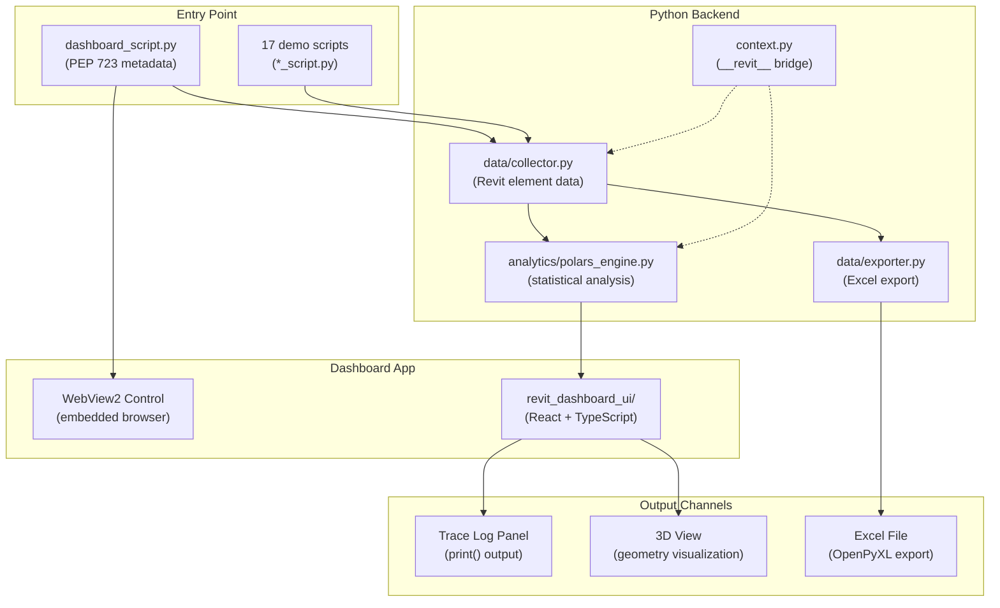
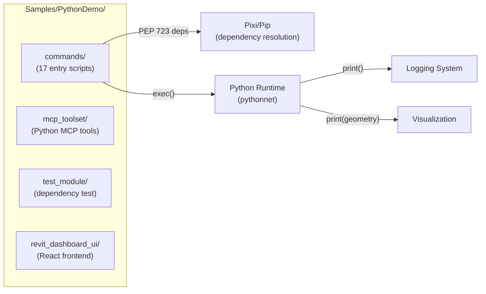
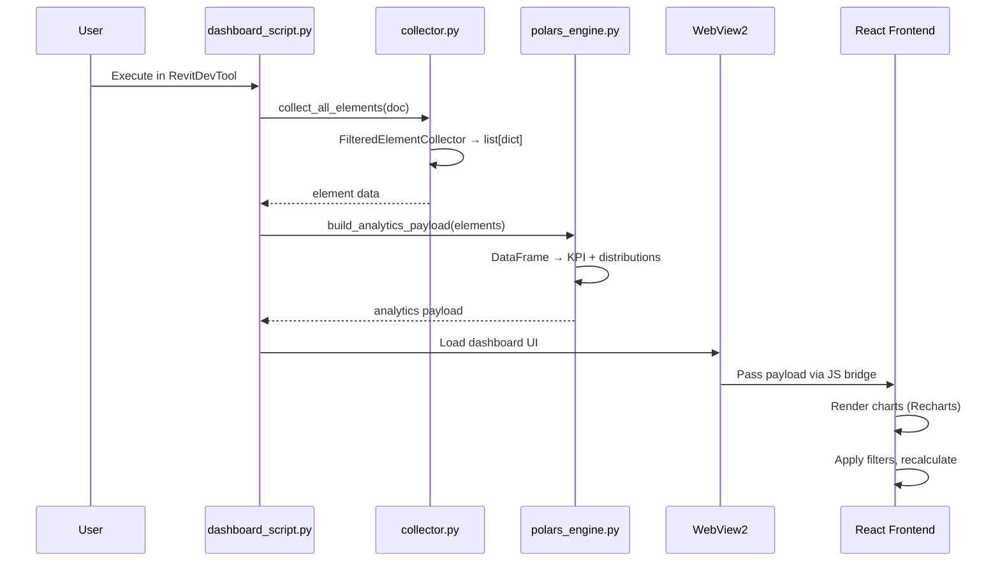

# PythonDemo Architecture

Python + WebView2 dashboard application demonstrating RevitDevTool's capabilities: code execution, dependency resolution, logging, and visualization.

**Source:** `Samples/PythonDemo/`

---

## System Overview



---

## Component Map



---

## Dashboard Data Flow



---

## Entry Scripts (`commands/`)

| Script | Module | Key Feature |
|--------|--------|------------|
| `dashboard_script.py` | All | WebView2 dashboard with analytics |
| `data_analysis_script.py` | Execution | Polars DataFrame analysis |
| `visualization_curve_script.py` | Visualization | Curve/edge display in 3D |
| `visualization_solid_script.py` | Visualization | Solid decomposition display |
| `visualization_xyz_script.py` | Visualization | Point cloud display |
| `logging_format_script.py` | Logging | Color keywords + JSON output |
| `logging_batch_script.py` | Logging | 10,000+ message stress test |
| `debugpy_script.py` | Debugging | VSCode debugger integration |
| `export_data_script.py` | Export | OpenPyXL Excel export |
| `selectionfilter_script.py` | API | Interface implementation |
| `shapely_script.py` | Geometry | 2D geometry operations |
| `trimesh_script.py` | Geometry | 3D mesh processing |
| `sklearn_script.py` | ML | scikit-learn integration |
| `fcl_script.py` | .NET | Python.NET interop examples |
| `modeless_script.py` | UI | Modeless dialog example |
| `pipe_bridge_script.py` | IPC | Named Pipe bridge demo |
| `module_test_script.py` | Testing | Import module test |

---

## MCP Toolset (`mcp_toolset/`)

Python-based MCP tool implementations consumed by the MCP registry:

```
mcp_toolset/
├── revitdevtool_mcp.py       # MCP server entry point
├── parser_annotation_sample.py
├── parser_lowlevel_sample.py
├── dto/                      # Data transfer objects (9 files)
└── tools/                    # Tool implementations (10 files)
```

---

## Test Module (`test_module/`)

Demonstrates Python dependency resolution for multi-file projects:

```
test_module/
├── __init__.py
├── contracts.py
├── diagnostics.py
├── engine.py
├── state.py
└── plugins/
    ├── __init__.py
    ├── normalize.py
    └── scale.py
```

---

## Dashboard Frontend (`revit_dashboard_ui/`)

| Technology | Purpose |
|-----------|---------|
| **React 18** | Component-based UI |
| **TypeScript** | Type-safe frontend code |
| **Vite** | Build tool + dev server |
| **Recharts** | Interactive charts (bar, pie, line) |
| **CSS Modules** | Scoped styling |

Quality gates: `npm run quality` (typecheck + lint), `npm run build` (production).

---

## Related Modules

- **[Execution Architecture](../Execution/README.md)** — PEP 723 dependency resolution + Python execution
- **[MCP Architecture](../MCP/README.md)** — Python MCP toolset integration
- **[Logging Architecture](../Logging/README.md)** — print() output capture
- **[Visualization Architecture](../Visualization/README.md)** — Geometry display from scripts

---

_Last updated: 2026-05-03_
