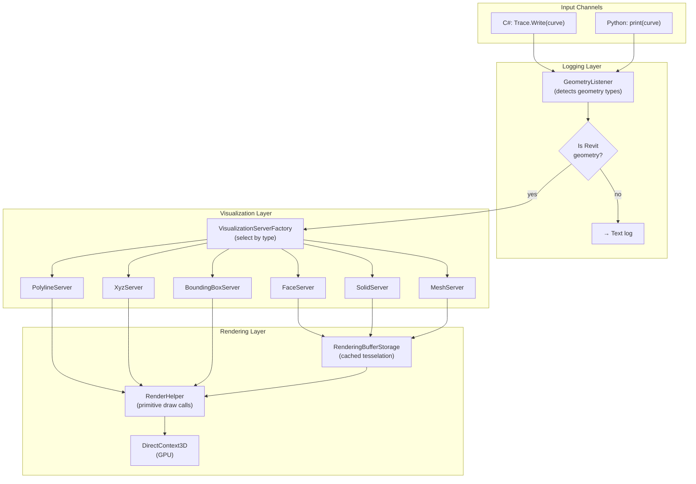
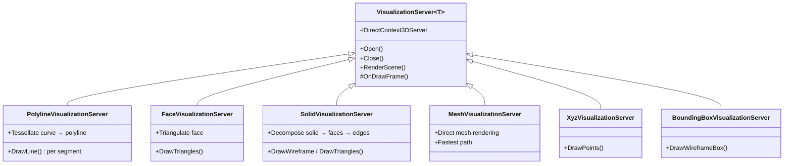
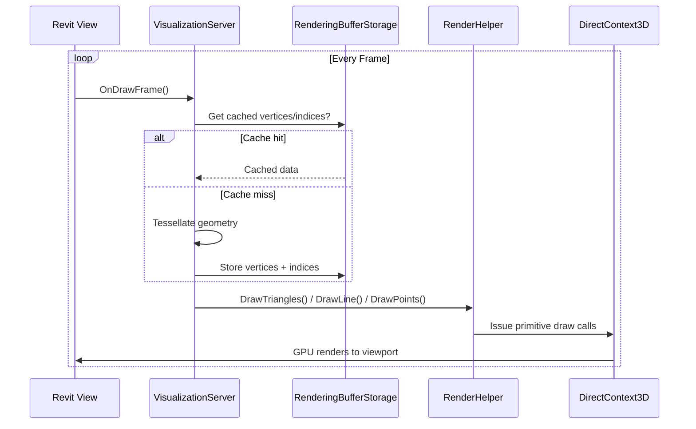
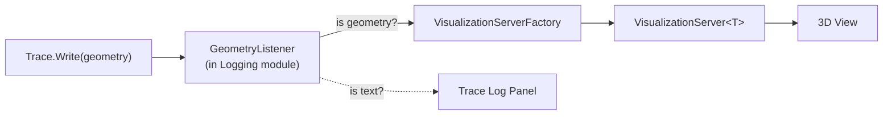

# Visualization System Architecture

Transient 3D geometry rendering via Revit's `DirectContext3D` API. Geometry is intercepted from log output and rendered without creating model elements.

**Source:** `source/RevitDevTool/Visualization/`

---

## Architecture Overview

---

## Server-Per-Type Pattern

Each geometry type has a dedicated `VisualizationServer<TGeometry>`:

| Server | Type | Rendering Method |
|--------|------|-----------------|
| `PolylineVisualizationServer` | `Curve` (Line, Arc, NurbSpline, HermiteSpline) | Tessellated polyline |
| `FaceVisualizationServer` | `Face` (Planar, Cylindrical, Conical, Revolved, Ruled) | Triangulated mesh |
| `SolidVisualizationServer` | `Solid` | Face decomposition → wireframe or filled |
| `MeshVisualizationServer` | `Mesh` | Direct triangle rendering |
| `XyzVisualizationServer` | `XYZ` | Point spheres |
| `BoundingBoxVisualizationServer` | `BoundingBoxXYZ` | Wireframe edges |

---

## Rendering Pipeline

**Key points:**
- Transient content: geometry disappears each frame unless redrawn
- Two-pass rendering: opaque pass (depth testing) then transparent pass (blending)
- `RenderingBufferStorage` caches tessellation to avoid recomputation
- Servers subscribe to `DrawFrame` events; unsubscribe on disposal

---

## Integration with Logging

The `GeometryListener` in the Logging module intercepts all `Trace.Write()` calls. If the value is a Revit geometry type (`Curve`, `Face`, `Solid`, etc.), it routes to Visualization instead of the text log.

---

## Related Modules

- **[Logging Architecture](../Logging/README.md)** — GeometryListener captures geometry from trace output
- **[Execution Architecture](../Execution/README.md)** — Scripts produce geometry via Revit API

---

_Last updated: 2026-05-03_
