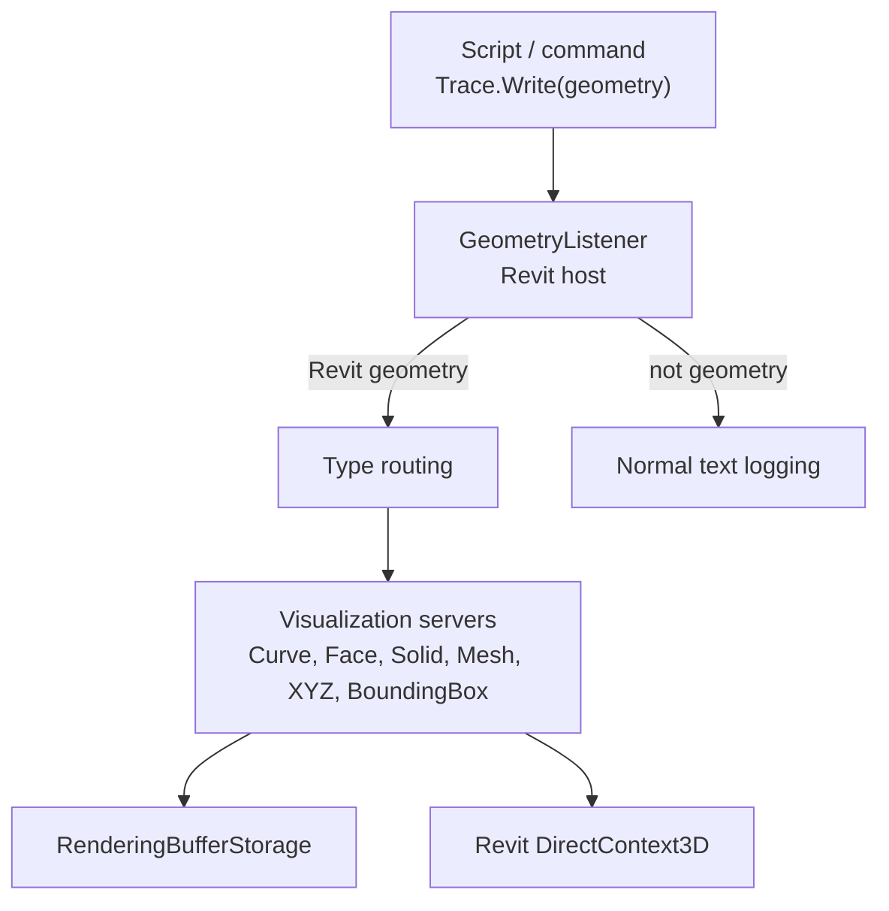
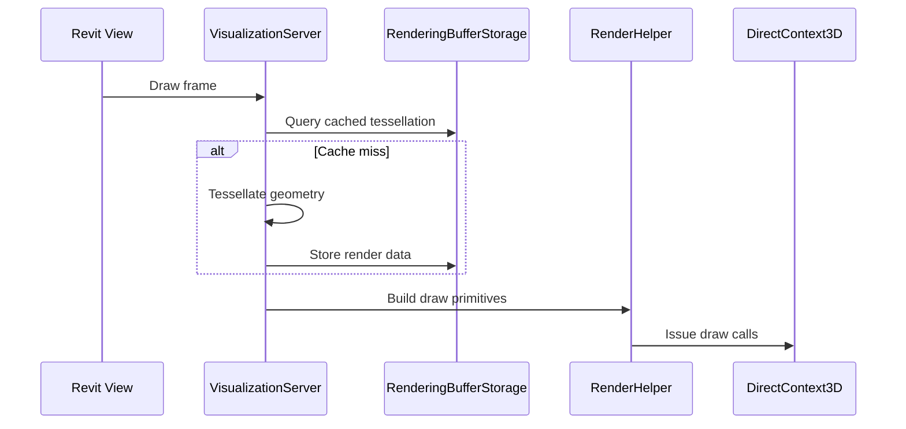

# Visualization System Architecture

Visualization is currently a Revit-host feature. It renders transient geometry through Revit DirectContext3D when Revit geometry objects are written through the logging path.

Last updated: 2026-05-29

---

## Source Map

| Area | Path |
|------|------|
| Revit geometry listener | `source/RevitDevTool/Logging/Listeners/GeometryListener.cs` |
| Server base/contracts | `source/RevitDevTool/Visualization/Contracts/` |
| Concrete servers | `source/RevitDevTool/Visualization/Server/` |
| Render helpers | `source/RevitDevTool/Visualization/Helpers/` |
| Render buffer cache | `source/RevitDevTool/Visualization/Render/RenderingBufferStorage.cs` |
| Settings view models | `source/RevitDevTool/ViewModel/Settings/Visualization/` |
| Settings views | `source/RevitDevTool/View/Settings/Visualization/` |

---

## Flow

Geometry visualization is coupled to Revit API types and DirectContext3D. Other hosts should add their own visualization adapters rather than reuse this implementation directly.

---

## Server-Per-Type Pattern

| Server | Geometry |
|--------|----------|
| `PolylineVisualizationServer` | Revit `Curve` / tessellated polyline |
| `FaceVisualizationServer` | Revit `Face` |
| `SolidVisualizationServer` | Revit `Solid` |
| `MeshVisualizationServer` | Revit `Mesh` |
| `XyzVisualizationServer` | Revit `XYZ` |
| `BoundingBoxVisualizationServer` | Revit `BoundingBoxXYZ` |
| `PlaneVisualizationServer` | Revit plane-like data |

Servers are registered as concrete singletons in Revit host DI. Keep new Revit geometry types aligned with this pattern.

---

## Rendering Pipeline

`RenderingBufferStorage` avoids repeated tessellation where possible. Servers are responsible for lifecycle and frame rendering.

---

## Settings

Visualization settings are Revit-host settings. View models live under `source/RevitDevTool/ViewModel/Settings/Visualization/` and are wired by `RevitHostingExtensions.AddApplicationServices()`.

---

## Change Rules

- Do not move Revit API geometry types into shared `DevTools.Logging` or `DevTools.Presentation`.
- Keep host-neutral logging behavior intact for non-geometry trace output.
- Add new Revit geometry rendering as a dedicated server plus settings if needed.
- For non-Revit hosts, create host-specific visualization adapters.

---

## Related Docs

- `docs/Logging/README.md`
- `docs/ai/host-boundaries.md`
- `docs/Execution/README.md`
