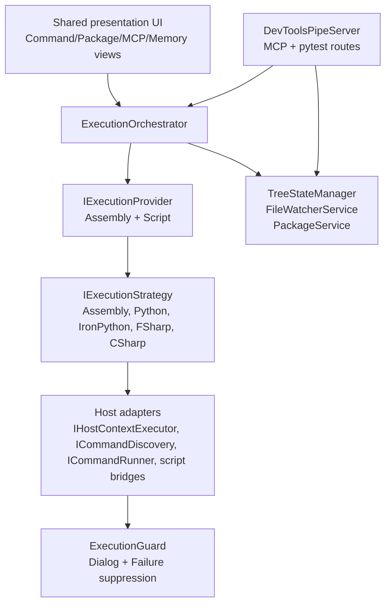

# Execution System Architecture

The execution system is the shared runtime in `source/DevTools.Execution/`. It discovers user code, builds the execution tree, watches roots for changes, resolves script dependencies, and dispatches work through host adapters.

The platform is not Revit-only. Revit and AutoCAD currently provide host adapters; future .NET-capable hosts should plug in through the same abstractions.

Last updated: 2026-07-11

---

## Source Map

| Area | Path |
|------|------|
| Shared registrations | `source/DevTools.Execution/ExecutionExtensions.cs` |
| Orchestrator | `source/DevTools.Execution/Services/ExecutionOrchestrator.cs` |
| Providers | `source/DevTools.Execution/Providers/` |
| External pipe server | `source/DevTools.Execution/External/DevToolsPipeServer.cs` |
| MCP runtime | `source/DevTools.Execution/External/Mcp/` |
| Pytest bridge | `source/DevTools.Execution/External/Testing/` |
| Embedded scripts | `source/DevTools.Execution/Resources/scripts/` |
| Execution guard | `source/RevitDevTool.Core/Execution/` |
| Revit adapters | `source/RevitDevTool/HostAdapters/`, `source/RevitDevTool/Hosting/` |
| AutoCAD adapters | `source/AcadDevTool/HostAdapters/`, `source/AcadDevTool/Hosting/` |

---

## Architecture



`DevTools.Execution` owns orchestration and contracts. Host projects own API-thread dispatch, command discovery, command invocation, script builtins, and host-specific context.

---

## Execution Enums

Two enums in `source/DevTools.Execution.Abstractions/` separate container organisation from execution backend:

```csharp
public enum ContainerMode { Script, Assembly }
public enum ExecutionMode { Python, IronPython, FSharp, CSharp, Dotnet, Unsupported }
public enum ExecutionGuardMode { Passthrough, Suppress }
```

---

## Host Boundary

Shared execution depends on interfaces:

| Interface | Purpose |
|-----------|---------|
| `IHostContextExecutor` | Marshal work to the host-safe context/API thread. |
| `ICommandDiscovery` | Parse host commands from an assembly. |
| `ICommandRunner` | Invoke discovered or compiled commands. |
| `ICompiledScriptBridge` | Provide references and host-specific compile context. |
| `IPythonBridge` | Configure CPython builtins/scope for the host. |
| `IIronPythonBridge` | Configure IronPython runtime and search paths for the host. |
| `IDebuggerBridge` | Open debugger/runtime hooks from shared UI. |
| `IDocumentBridge` | Open, close, and save documents in the host context. |

Revit wiring lives in `RevitHostingExtensions`. AutoCAD wiring lives in `AcadHostingExtensions`. New hosts should add their own adapter project rather than leaking host APIs into `DevTools.Execution`.

---

## Deep Documentation

| Topic | File |
|-------|------|
| Script runtimes, orchestrator flow, package service | [code-execution.md](code-execution.md) |
| Dialog & failure suppression (ExecutionGuard) | [execution-guard.md](execution-guard.md) |
| Pytest in-host bridge | [pytest-bridge.md](pytest-bridge.md) |
| MCP primitive dispatch & pipe server | [mcp-dispatch.md](mcp-dispatch.md) |

---

## Verification

Current tests are useful but shallow. When changing execution behavior:

- Build the most relevant host/year with `scripts/build-host.ps1`.
- Add a focused test for pure shared logic when practical.
- Document live-host verification gaps explicitly.

---

## Related Docs

- `docs/agents/execution-system.md` (agent digest — quick reference)
- `docs/agents/host-boundaries.md`
- `docs/architecture/MCP/README.md`
- `docs/architecture/PyTest/README.md`
- `docs/architecture/Logging/README.md`
