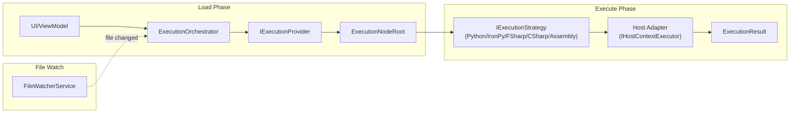

# Code Execution: Scripts & Assemblies

## Orchestrator Flow

**Load**: UI requests a path → orchestrator asks providers to discover nodes → builds execution tree.

**Execute**: User selects a node → strategy compiles/interprets → dispatches to host thread → returns result.

**Watch**: File watcher monitors roots → triggers reload on changes → `TreeStateManager` preserves UI state.

---

## ContainerMode

| Mode | Provider | Notes |
|------|----------|-------|
| `Script` | `ScriptExecutionProvider` | Folder scan for `*script.py`, `*script.fsx`, `*script.csx`. |
| `Assembly` | `AssemblyExecutionProvider` | `.dll` reflection. Host-specific `ICommandDiscovery`. |

`ScriptExecutionProvider` skips folders: `docs`, `resources`, `bin`, `obj`, `packages`, `node_modules`, `output`, caches, virtualenvs, and agent/tool folders.

---

## ExecutionMode (Script Runtimes)

### Python

Init, backends, host-attach, and native constraints: [python-runtime.md](python-runtime.md).

- Host owns CPython → attach pythonnet, then **uv**. Pixi is not tried.
- No host interpreter → **Pixi**. uv is not tried.
- Pip only if that chosen manager’s setup/`VerifyRunnableAsync` fails.
- Overlay, `python3.dll` forwarder, and init order: [python-runtime.md](python-runtime.md).

### IronPython

- `IronPythonExecutionStrategy` executes `*_ipy_script.py`.
- Two stacks: pyRevit loaded → `IIronPythonBridge.TryGetHostEngine` (ScriptExecutor) + static `IronPythonDebugger` on that loader engine (`clean: false`, `full_frame: false`, reuse). No pyRevit → embedded 3.4.2: `IronPythonInitializer` creates the session engine in its `InitializeAsync` sync prefix; `IronPythonExecutor` runs scripts on that engine. Same static debugger; do not `CreateEngine` or `Runtime.Shutdown` on the loader engine ([0033](../../decisions/0033-ironpython-pydevd-debugger.md)).
- Host bridges configure builtins and CLR assemblies only. AutoCAD `AcadIronPythonBridge` loads AcCoreMgd / AcDbMgd / AcMgd (parity with CPython `SetupAcad.py`). Revit injects `__revit__` and RevitAPI / RevitAPIUI. ScriptExecutor search paths are pyRevit's command-generator list plus the directories of TFM-selected extension DLLs and the pydevd extract root. `pyrevitlib` / `site-packages` come from walking `PyRevitLoader` up to `pyRevitfile`. `PyRevitAssemblyLoader` picks one managed DLL per simple name from `lib/**` and `bin/*/` by `TargetFrameworkAttribute` vs the host runtime. One load per `*.extension`. Embedded 3.4.2 uses `IronPythonSearchPaths.ForNativeHost` only. `DlrScriptHost` is the DLR façade (typed 3.4 or `ReflectionBound` on a foreign loader engine). pyRevit `ScriptExecutor` / `PyRevitLoader` bindings stay in the Revit host. `IronPythonDebugger.RefreshUserModules` takes a host drop root and skip list (Revit: `*.extension`, skip the pyRevit install root that contains `pyRevitfile`).
- Embedded 3.4.2 uses Frames without `Tracing`. The pyRevit loader engine must not set `full_frame` (that enables `Tracing` and IronPython 3.4 cannot `import pydevd`). User-extension `sys.modules` entries are dropped before each pyRevit Run. `from pyrevit import HOST_APP` runs on the loader engine before pydevd `enable_tracing` (warmup and each Run) so `_perf.mark()` cannot import `coreutils` while `HOST_APP` is still unset. Listen imports pydevd under `cli` then forces `IS_WINDOWS=True`.
- In-process debugger is PyDev.Debugger **2.8.0** under `%APPDATA%\RevitDevTool\pydevd\PyDev.Debugger-pydev_debugger_2_8_0`. The host listens with `HTTP_JSON_PROTOCOL` + `pydevd._enable_attach` on **4567** (no `_wait_for_attach`). VS Code/Cursor attaches with `"type": "debugpy"` connect `localhost:4567` (same client as CPython on **5678**; two sockets). Handshake and expand-getattr quieting live in `IpyDebugger.py`. Execution UI chips read `DebugEndpoints` (`Port`, `Attached` per runtime). Policy: [0033](../../decisions/0033-ironpython-pydevd-debugger.md).

### FSharp

- `FSharpExecutionStrategy` compiles `.fsx` through `FSharpCompilationCache`.
- `FSharpDependencyResolver` handles `#r "nuget: ..."` directives.
- `NugetManager` restores packages under `%APPDATA%\RevitDevTool\nuget`.
- When nuget or file `#r` must be rewritten, the graph is copied under `%TEMP%\DevTools\fsx_cache` (commented `#r`, remapped `#load`, `--reference:`). Each temp file starts with `#line 1 "<original>"` so FSI `--debug+` sequence points map back to the source the user edits. Eval of an unchanged graph still uses the original path.
- Compilation has a hard timeout.
- Host year `#if` symbols (`REVIT` / `AUTOCAD`, `{HOST}{year}`, `{HOST}{year}_OR_GREATER`) come from `CompileScriptSymbols` via `IHostAppInfo.VersionNumber`, matching `props/Revit.targets` and `props/AutoCad.targets`. FSI gets them as `--define:`.

### CSharp

- `CSharpExecutionStrategy` compiles `.csx` through `CSharpCompilationCache`.
- `CSharpDirectiveParser` handles references and package directives. `#r` / `#load` are commented in place (line numbers stay aligned with the file on disk).
- AppDomain assemblies are still imported as Roslyn metadata refs (`#r` / NuGet first). Duplicate simple names (e.g. Revit 2027 `Autodesk.Http.*` under `AddIns\IssuesManagement`) are skipped so CS1704 does not fail the compile.
- Emit is Debug + portable PDB, loaded with the collectible/net48 isolation session so an attached host debugger can bind the original `.csx`. `#r nuget` still resolves through `NugetManager`; it is not left as compiler syntax.
- Compiled script outputs use the feature-owned `ScriptIsolationPlan` with the
  shared assembly-isolation session. Identity and lifecycle behavior follows
  the [assembly-isolation product contract](../../product/assembly-isolation.md).
- Compilation has a hard timeout.
- Roslyn parse options take the same `CompileScriptSymbols` list, so `.csx` can use
  `#if REVIT2025_OR_GREATER` (and AutoCAD-family equivalents) like host add-in code.

### Assembly (Dotnet)

- `AssemblyExecutionStrategy` loads IL from `.dll`, invokes method.
- Also used as MCP source kind for .NET assembly tools.

---

## Package Service

`PackageService` is the UI facade. It branches on **marketplace** only:

| Marketplace | Store |
|-------------|--------|
| NuGet | `NugetPackageStore` |
| CondaForge / PyPI | `IPythonPackageStore` for the **current** `PythonBackend` |

Python backends are equal implementations of `IPythonPackageStore` (`PixiPackageStore`, `UvPackageStore`, `PipPackageStore`). `PackageService` picks the store whose `Backend` matches `PythonInitializer.Provider`. No `switch` on backend inside `PackageService`.

- **uv**: host-owned-interpreter sidecar (PyPI, version-matched).
- **Pixi**: owns in-process CPython when the host has no interpreter (conda-forge + PyPI).
- **pip**: last chain step — pyRevit `cengines` when the chosen Pixi or uv manager cannot run.

Operations: list, remove, remove all, update latest, and repair.
