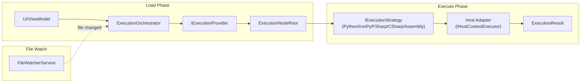

# Code Execution: Scripts & Assemblies

## Orchestrator Flow

**Load**: UI requests a path → orchestrator asks providers to discover nodes → builds execution tree.

**Execute**: User selects a node → strategy compiles/interprets → dispatches to host thread → returns result.

**Watch**: File watcher monitors roots → triggers reload on changes → `TreeStateManager` preserves UI state.

---

## ContainerMode

| Mode | Provider | Notes |
|------|----------|-------|
| `Script` | `ScriptExecutionProvider` | Folder scan for `*script.py`, `*script.fsx`, `*script.csx`. |
| `Assembly` | `AssemblyExecutionProvider` | `.dll` reflection. Host-specific `ICommandDiscovery`. |

`ScriptExecutionProvider` skips folders: `docs`, `resources`, `bin`, `obj`, `packages`, `node_modules`, `output`, caches, virtualenvs, and agent/tool folders.

---

## ExecutionMode (Script Runtimes)

### Python

- `PythonInitializer` chooses Pixi first, then pip-backed pyRevit CPython if Pixi cannot run.
- `PythonEmbedded` extracts `Parser.py`, `ToolParser.py`, `PytestRunner.py`, setup scripts, and `pixi.toml`.
- `PythonDepsManager` parses PEP 723 dependencies through `Parser.py`. Installed-state JSON may include conda git-describe versions; Parser treats those as unconstrained instead of failing the resolve.
- Pixi uses conda-forge first and PyPI fallback.
- Pip fallback depends on `pyrevit.exe attached` to locate `bin/cengines/CPY*/python.exe`.

### IronPython

- `IronPythonExecutionStrategy` executes `*_ipy_script.py`.
- Has independent runtime but prioritizes pyRevit's IronPython engine first (if pyRevit is installed).
- Host bridges configure builtins, references, and search paths.

### FSharp

- `FSharpExecutionStrategy` compiles `.fsx` through `FSharpCompilationCache`.
- `FSharpDependencyResolver` handles `#r "nuget: ..."` directives.
- `NugetManager` restores packages under `%APPDATA%\RevitDevTool\nuget`.
- Compilation has a hard timeout.

### CSharp

- `CSharpExecutionStrategy` compiles `.csx` through `CSharpCompilationCache`.
- `CSharpDirectiveParser` handles references and package directives.
- Compiled script outputs use the feature-owned `ScriptIsolationPlan` with the
  shared assembly-isolation session. Identity and lifecycle behavior follows
  the [assembly-isolation product contract](../../product/assembly-isolation.md).
- Compilation has a hard timeout.

### Assembly (Dotnet)

- `AssemblyExecutionStrategy` loads IL from `.dll`, invokes method.
- Also used as MCP source kind for .NET assembly tools.

---

## Package Service

`PackageService` gives the UI a unified package surface:

- **Pixi** (primary package manager): supports both conda-forge and PyPI channels in a single environment
- **pip fallback**: when Pixi is not whitelisted in a corporate environment, falls back to CPython engine bundled with pyRevit (if installed)
- FSharp/NuGet packages

Package operations: list, remove, remove all, update latest, and repair.
