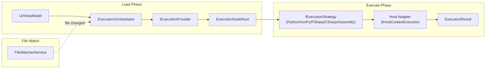

# Code Execution: Scripts & Assemblies

## Orchestrator Flow

**Load**: UI requests a path → orchestrator asks providers to discover nodes → builds execution tree.

**Execute**: User selects a node → strategy compiles/interprets → dispatches to host thread → returns result.

**Watch**: File watcher monitors roots → triggers reload on changes → `TreeStateManager` preserves UI state.

---

## ContainerMode

| Mode | Provider | Notes |
|------|----------|-------|
| `Script` | `ScriptExecutionProvider` | Folder scan for `*script.py`, `*script.fsx`, `*script.csx`. |
| `Assembly` | `AssemblyExecutionProvider` | `.dll` reflection. Host-specific `ICommandDiscovery`. |

`ScriptExecutionProvider` skips folders: `docs`, `resources`, `bin`, `obj`, `packages`, `node_modules`, `output`, caches, virtualenvs, and agent/tool folders.

---

## ExecutionMode (Script Runtimes)

### Python

Init, backends, host-attach, and native constraints: [python-runtime.md](python-runtime.md).

- Host owns CPython → attach pythonnet, then **uv**. Pixi is not tried.
- No host interpreter → **Pixi**. uv is not tried.
- Pip only if that chosen manager’s setup/`VerifyRunnableAsync` fails.
- Overlay, `python3.dll` forwarder, and init order: [python-runtime.md](python-runtime.md).

### IronPython

- `IronPythonExecutionStrategy` executes `*_ipy_script.py`.
- Has independent runtime but prioritizes pyRevit's IronPython engine first (if pyRevit is installed).
- Host bridges configure builtins, references, and search paths.

### FSharp

- `FSharpExecutionStrategy` compiles `.fsx` through `FSharpCompilationCache`.
- `FSharpDependencyResolver` handles `#r "nuget: ..."` directives.
- `NugetManager` restores packages under `%APPDATA%\RevitDevTool\nuget`.
- Compilation has a hard timeout.

### CSharp

- `CSharpExecutionStrategy` compiles `.csx` through `CSharpCompilationCache`.
- `CSharpDirectiveParser` handles references and package directives.
- Compiled script outputs use the feature-owned `ScriptIsolationPlan` with the
  shared assembly-isolation session. Identity and lifecycle behavior follows
  the [assembly-isolation product contract](../../product/assembly-isolation.md).
- Compilation has a hard timeout.

### Assembly (Dotnet)

- `AssemblyExecutionStrategy` loads IL from `.dll`, invokes method.
- Also used as MCP source kind for .NET assembly tools.

---

## Package Service

`PackageService` is the UI facade. It branches on **marketplace** only:

| Marketplace | Store |
|-------------|--------|
| NuGet | `NugetPackageStore` |
| CondaForge / PyPI | `IPythonPackageStore` for the **current** `PythonBackend` |

Python backends are equal implementations of `IPythonPackageStore` (`PixiPackageStore`, `UvPackageStore`, `PipPackageStore`). `PackageService` picks the store whose `Backend` matches `PythonInitializer.Provider`. No `switch` on backend inside `PackageService`.

- **uv**: host-owned-interpreter sidecar (PyPI, version-matched).
- **Pixi**: owns in-process CPython when the host has no interpreter (conda-forge + PyPI).
- **pip**: last chain step — pyRevit `cengines` when the chosen Pixi or uv manager cannot run.

Operations: list, remove, remove all, update latest, and repair.
