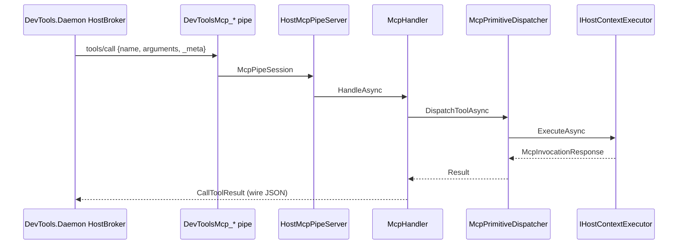

# MCP Dispatch: In-Host Primitive Execution

## Overview

MCP tools and resources execute inside the host process behind a **spec-first** named-pipe
server (`HostMcpPipeServer` + `McpHandler`). The handler routes `tools/call` and
`resources/read` through `IMcpPrimitiveDispatcher` on the host thread.

---

## Source Map

| File | Role |
|------|------|
| `source/DevTools.Mcp.Adapter/External/HostMcpPipeServer.cs` | Newline-delimited JSON-RPC on `DevToolsMcp_*` |
| `source/DevTools.Mcp.Adapter/Host/McpHandler.cs` | Spec wire handler (`2026-07-28`, `server/discover`) |
| `source/DevTools.Mcp.Core/Protocol/` | Wire DTOs, encoders, `McpSpecKeys` |
| `source/DevTools.Mcp.Catalog/McpCatalogStore.cs` | Tool/resource registry |
| `source/DevTools.Mcp.Catalog/Discovery/ToolsetInvoker.cs` | .NET toolset invoke + `ToolsetResultSerializer` |
| `source/DevTools.Execution/External/Mcp/Dispatchers/McpPrimitiveDispatcher.cs` | Dispatch implementation |
| `source/DevTools.Execution/External/Mcp/BuiltIn/CSharpCodeTool.cs` | Built-in: `execute_csharp_code` |
| `source/DevTools.Execution/External/DevToolsPipeServer.cs` | Pytest/control pipe only |

---

## Execution Flow

---

## Backend Routing

`McpPrimitiveDispatcher.DispatchToolAsync` routes on `McpRegisteredTool.Binding.SourceKind`:

| Backend | Invoke mechanism |
|---------|------------------|
| Built-in C# (`IBuiltInMcpTool`) | Direct invoke on host assembly |
| .NET toolset (ALC) | `ToolsetInvoker` + JSON bridge (`ToolsetResultSerializer`) |
| Python toolset | `PythonExecutor` + `ToolInvoke.py` |
| Ad-hoc C# (`ExecutionMode.CSharp`) | Rare catalog path |

See [Platform boundaries](../MCP/platform-boundaries.md) for MRTR and ALC detail.
