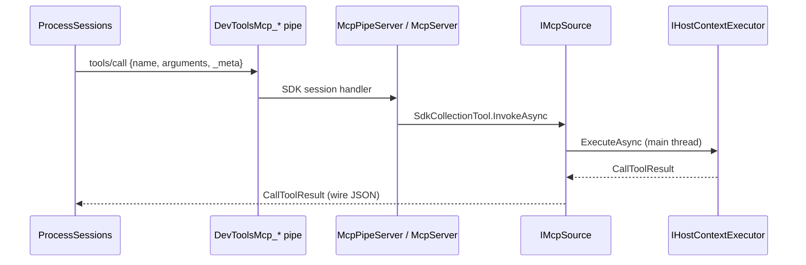

# MCP Dispatch: In-Host Primitive Execution

## Overview

MCP tools and resources execute inside the host process behind an SDK **`McpServer`**
on `DevToolsMcp_*`. Each pipe connection gets `McpServer.Create(StreamServerTransport, …)`
with tools/resources populated from `McpCatalogStore` and invoked via **`IMcpSource`**
backends on the host thread.

---

## Source Map

| File | Role |
|------|------|
| `source/DevTools.Mcp.Catalog/Transport/McpPipeServer.cs` | Accept loop; per-connection `PipeEndpoint` + SDK server |
| `source/DevTools.Mcp.Catalog/Hosting/McpServerCollections.cs` | Fill SDK tool/resource collections from catalog |
| `source/DevTools.Mcp.Catalog/Core/Protocol/McpSpecKeys.cs` | Wire names (`Tool.Invoke` = `invoke_dynamic`, etc.) |
| `source/DevTools.Mcp.Catalog/McpCatalogStore.cs` | `RegisteredTool` / `RegisteredResource` / `RegistryCatalog` |
| `source/DevTools.Mcp.Catalog/Discovery/ResultBridge.cs` | toolset object → host `CallToolResult` |
| `source/DevTools.Execution/External/Mcp/Backends/*.cs` | `BuiltInSource`, `DotnetSource`, `PythonSource` |
| `source/DevTools.Execution/External/Mcp/Hosting/McpCallFilter.cs` | Host `InputRequiredException` → wire shape |
| `source/DevTools.Execution/External/DevToolsPipeServer.cs` | Pytest/control pipe only |

---

## Execution Flow

```mermaid
sequenceDiagram
    participant Daemon as ProcessSessions
    participant Pipe as DevToolsMcp_* pipe
    participant Server as McpPipeServer / McpServer
    participant Source as IMcpSource
    participant Host as IHostContextExecutor

    Daemon->>Pipe: tools/call {name, arguments, _meta}
    Pipe->>Server: SDK session handler
    Server->>Source: SdkCollectionTool.InvokeAsync
    Source->>Host: ExecuteAsync (main thread)
    Host-->>Source: CallToolResult
    Source-->>Daemon: CallToolResult (wire JSON)
```

---

## Backend Routing

Routing uses `RegisteredTool.Binding` (`PrimitiveBinding`) and `SourceKind`:

| Backend | Invoke mechanism |
|---------|------------------|
| Built-in C# (`IBuiltInMcpTool`) | `BuiltInSource` |
| .NET toolset (ALC) | `DotnetSource` + `ResultBridge.ToHostCallToolResult` |
| Python toolset | `PythonSource` + `ToolInvoke.py` (SDK in-process client) |

See [Platform boundaries](../MCP/platform-boundaries.md) for MRTR and ALC detail.
