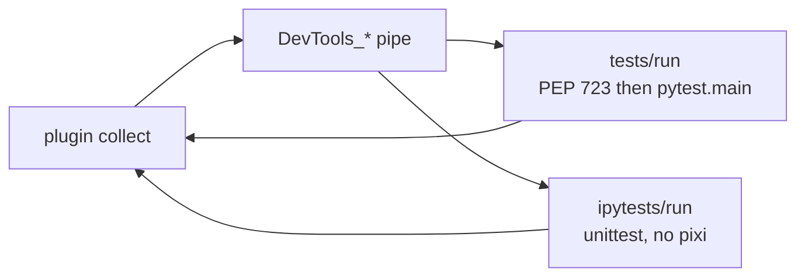

# Pytest Bridge

Local pytest collects. The host runs tests over `DevTools_{Host}_{Version}_{PID}` (`BridgeMessage`). Not `DevToolsMcp_*`.

Client plugin: sibling `RevitDevTool.PyTest`. How to write tests: `.agents/skills/revit-pytest/SKILL.md`.

## Files

| Path | Role |
|------|------|
| `External/Handlers/PytestRequestHandler.cs` | `tests/run` |
| `External/Handlers/IpyTestRequestHandler.cs` | `ipytests/run` |
| `External/Testing/PytestExecutionService.cs` | in-host `PytestRunner.py` |
| `External/Testing/IpyTestExecutionService.cs` | in-host `IpyTestDriver.py` (pyRevit, else embedded 3.4) |
| `External/Testing/PytestDependencyService.cs` | PEP 723 via active provider — **CPython `tests/run` only** |
| `External/Testing/PytestContracts.cs` | wire models |
| `Resources/scripts/PytestRunner.py` | `pytest.main(--capture=sys)` |
| `Resources/scripts/IpyTestDriver.py` | unittest, dialect 2.7 ∩ 3.4 |
| `Resources/scripts/SetupRevit.py` / `SetupAcad.py` | host builtins |

## Flow

`test_*_ipy.py` is pytest routing only. Host unittest does not care about that name. Policy: [0026](../../decisions/0026-ironpython-unittest-script-execution.md).

## Rules

- `PytestRunner.py` must start with `from __future__ import annotations`. `import pytest` is inside `_run()` so a missing package becomes a JSON error; annotations must not evaluate `pytest` at exec (Python 3.13 `NameError: name 'pytest' is not defined`).
- Guard `Suppress` for the whole run.
- PEP 723 on CPython `conftest.py` / `test_*.py` only — never on `test_*_ipy.py`.
- Capture: CPython `--capture=sys` + restore `print` onto `sys.stdout`; IPy per-test tee. No session StringIO.
- IPy: no f-strings; never assign to the name `print`. `sys.path` includes the test dir up to workspace.
- Lease + mutex: `host + version + workspace`. One pytest process. Mixed `test_*.py` + `test_*_ipy.py` under one conftest is fine.
- `--maxfail=N` forwarded verbatim. Local stop is pytest Session. IPy: driver `shouldStop` in-file, C# loop across files.
- Pipe wait: CPython `per_test × N + launch_timeout`; IPy `per_test × N`.
- CPython `tests/run` uses the same `PythonInitializer` as scripts (host-attach + uv sidecar; PEP 723 via `PytestDependencyService` on the active provider).
- `ExecuteAsync` does not take the pipe-disconnect token (breakpoint can park later runs).

## Wire

Same request for both methods: `workspace_root`, `test_root`, `nodeids`, `pytest_args`. IPy response may set `engine` to `pyrevit` or `embedded`.
