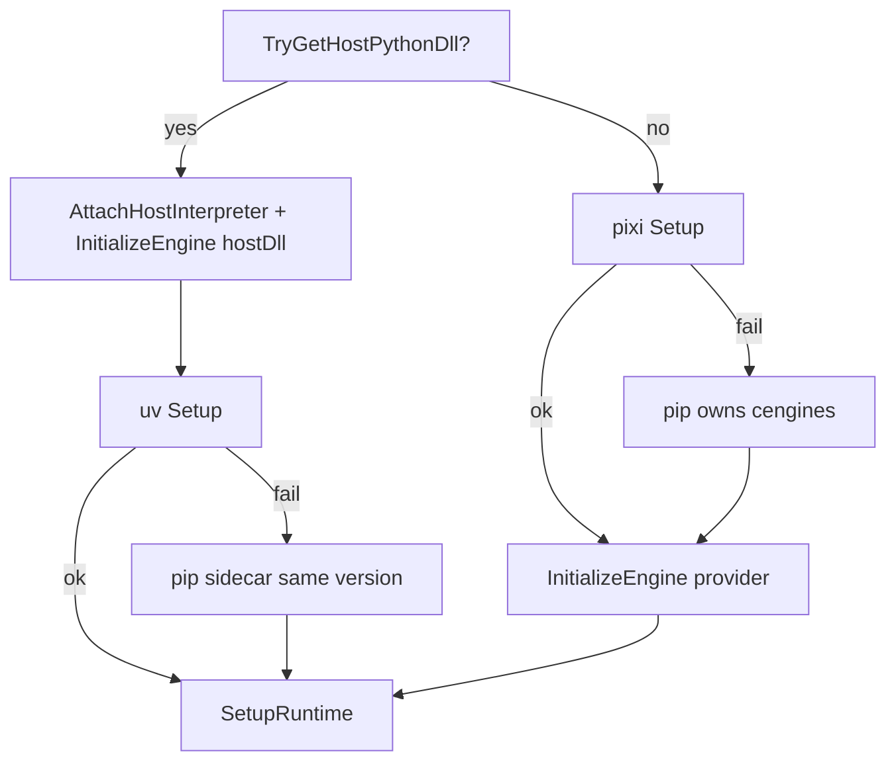

# Python Runtime

In-process CPython via pythonnet. Source: `source/DevTools.Execution/Providers/Python/`.

This page is the constraint record. Keep source comments to one-line API summaries.

## Pipeline

`PythonInitializer.InitializeAsync`:

1. Take `InitLock` (`WaitAsync`).
2. If already initialized, return.
3. Probe the host (`TryGetHostPythonDll`). Set `HostOwnsInterpreter`.
4. If host DLL: snapshot version onto uv **and** pip (`AttachHostInterpreter`), then `InitializeEngine(hostDll)` — must stay before `ResolveProviderAsync`.
5. `ResolveProviderAsync`: host owns interpreter → uv, else pixi. If that manager exe cannot run → pip (pyRevit `cengines`). Pip does not change who owns the interpreter.
6. If no host DLL: `InitializeEngine(provider)` (pixi or pip).
7. `SetupRuntime`.

Two axes, not one chain:

| Axis | Question | Result |
|------|----------|--------|
| Interpreter | Is CPython already in this process? | Yes → attach, never map a second `PythonDLL`. No → this process owns pixi or pip. |
| Packages | Can `uv.exe` / `pixi.exe` run? | Yes → that manager. No → pyRevit `cengines` + `python -m pip`. |

Host-attach + pip only works when the cengine **version** equals the host (`python312.dll` vs `python313.dll`). A different pyRevit engine cannot load `.pyd` / encodings into the host interp — that was `CPY3123` on Plant 3D 3.13. Own-process + pip: any ready `CPY*` **is** the interpreter, so its version need not match a host. Version is read from `python3xx.dll`, not from the folder name.

`InitializeEngine` is the only `PythonEngine.Initialize()` site. Two prologues, then `ProgramName` / `Initialize` / `BeginAllowThreads`:

| Process | Prologue | Must not |
|---------|----------|----------|
| Host already initialized CPython | `Runtime.PythonDLL = hostDll`; `ClearPythonnetStash` | Set `PythonHome`; map a sidecar DLL |
| This process owns CPython | `PrepareProcess(home)`; `GetPythonDllPath()`; `PythonEngine.PythonHome = home` | Attach a second interpreter |

`SetupRuntime` (GIL held): if this process owns CPython, `os.add_dll_directory` the prefix. If the host owns it, overlay sidecar stdlib (`DLLs` then `Lib`), `encodings.__path__`, then `LoadStableAbiForwarder` (sidecar `python3.dll` by full path). Then `InjectSitePackages`, global scope, debugpy.

`PythonBackend` lives in `Models/PythonBackend.cs` (Pixi / Uv / Pip). Keyed DI on `PyEnvironmentProvider` uses those values.

## Constraints

Do not “fix” these in source without updating this page.

### CAD start thread

Host `RunBlocking` does not pump. Any hop **before** `PythonEngine.Initialize()` lands on the thread pool: AV (`InitExt`, no GIL) or deadlock (pending-call / GIL). Host-attach therefore runs `InitializeEngine(hostDll)` before `ResolveProviderAsync`. Do not add `InitExt` / `Py_AddPendingCall`. Init takes the lock with `WaitAsync` (not `Wait(0)`); do not insert other awaits between lock acquire and host `InitializeEngine`.

### Host-owned interpreter

Plant 3D and similar may load `python3xx.dll` and call `Py_Initialize` before the add-in. A second in-process CPython (e.g. pixi `python314.dll`) is an ABI crash.

- Probe loaded modules only (`Py_IsInitialized`). Do not touch pythonnet first, or `FromEnv` / Pixi DLL load will mismatch.
- Bind pythonnet to the versioned interpreter (`python313.dll`), not Windows `python3.dll`. That file is a PEP 384 stable-ABI forwarder: subset of the C API, same filename on 3.11 / 3.13 / pixi.
- `ClearPythonnetStash`: take the host GIL and delete `sys.clr_data` so pythonnet does not restore a `NoopFormatter` stash.
- Do not `Py_Finalize` / `PythonEngine.Shutdown` — that tears down the host interpreter (use-after-free on later host Python and CAD exit).
- Do not `os.add_dll_directory` a **pixi/conda** `Library\bin` into the host interp (OpenSSL vs Autodesk stub DLLs). Do not `add_dll_directory` the uv prefix either — `.pyd` files load with `LOAD_WITH_ALTERED_SEARCH_PATH` from `DLLs`.
- PEP 723 installs into the **sidecar**, never into the host prefix: uv `uv-env\{major.minor}`, or pip matching `cengines\CPY*` when `uv.exe` cannot run. `site.addsitedir` that `Lib\site-packages` last (packages only — do not set `PYTHONHOME` / `sys.prefix` to the sidecar).
- Plant 3D host stdlib is `python313.zip` next to `python313.dll` (not a `Lib` directory). Observed mix: `stringprep` from the zip, `unicodedata`/`select` from sidecar `DLLs`. **Append** matching-version sidecar `DLLs` then `Lib` (`pyvenv.cfg` `home`) onto `sys.path`. Never put the sidecar **base** (the dir with `python313.dll`) on `sys.path`. `encodings` is already imported from the zip, so append sidecar `Lib/encodings` to `encodings.__path__` (submodules do not consult `sys.path`). abi3 wheels (polars runtime) import `python3.dll`; the host process often only mapped `python3xx.dll`. `LoadLibrary` the matching sidecar `python3.dll` by full path so the loader binds `python313.dll` to the already-loaded host module — do not `LoadLibrary` sidecar `python313.dll`. Do not register individual codecs. `uv python install --no-bin` so scoop/user shims are not replaced.

`HostOwnsInterpreter` skips `Py_Finalize` / `PythonEngine.Shutdown` and `os.add_dll_directory`. Overlay + `python3.dll` load still run.

### Pixi-owned OpenSSL (DLL plant)

Revit (and some Autodesk hosts) ship empty `libssl-3-x64.dll` / `libcrypto-3-x64.dll` next to the exe. Those win the default loader search over conda `Library\bin`, so in-process `import ssl` fails with Win32 193.

`PrepareProcess` (owned interpreter only): prepend conda `Library\bin` to PATH, `AddDllDirectory`, then preload crypto then ssl by absolute path before `PythonEngine.Initialize()`. Env root and `DLLs` are not search dirs — pythonnet loads `python3xx.dll` by full path; adding those folders does not beat exe-adjacent stubs.

### VerifyRunnable

`PyEnvironmentProvider.VerifyRunnableAsync` runs `{ManagerExePath} --version`. Pixi and uv set `ManagerExePath` to their AppData exe; pip has none. Installers only download. Failure of the chosen manager opens the pip step (sidecar if host-attached, owned interpreter otherwise).

## Providers

| Backend | When | Role | Prefix |
|---------|------|------|--------|
| uv | Host owns interpreter | PyPI sidecar keyed to host major.minor (`python313.dll` → `3.13` / `cp313`). Never mapped as in-process `PythonDLL` when attached. Layout: `uv-env\{major.minor}` venv, `uv-env\uv-python`, `uv-env\uv-cache`. | `%APPDATA%\RevitDevTool\uv-env\{major.minor}` |
| Pixi | No host interpreter | Owns in-process CPython (conda-forge, then PyPI). Bootstrap lives in `SetupEnvironmentAsync`. | `%APPDATA%\RevitDevTool\pixi-env\.pixi\envs\default` |
| pip | `uv.exe` or `pixi.exe` cannot run | pyRevit `cengines` + `python -m pip`. Host-attach sidecar only if engine version equals host. Own-process: first ready `CPY*` is `PythonDLL` (any version). | engine dir with `python.exe` |

`IsEnvironmentReady()` is `File.Exists(PythonExe)` for pixi/pip. uv also requires `pyvenv.cfg` `home` to still contain `python.exe` (a leftover trampoline after moving `uv-python` is not ready). Stale venvs are recreated with `uv venv --clear`. Locked installers (`PixiInstaller`, `UvInstaller`) live under AppData `bin`.

Package policy: skip-if-listed for all backends. Pixi missing specs use search-first conda vs PyPI ([0014](../../decisions/0014-pep723-skip-if-listed-search-first.md)); argv lives in `PixiArgs` (`install` / `add [--pypi]` / `search` / `list`). uv package ops are `uv.exe pip … --python <venv>` via `UvArgs` (not `python -m pip`). Pip is pyRevit `cengines` when those manager exes cannot run — sidecar if the host already owns CPython, interpreter if not.

`PythonEmbedded` extracts `Parser.py`, `ToolParser.py`, `PytestRunner.py`, setup scripts, and `pixi.toml`. Parser is overwritten every load; `pixi.toml` is not if present. Manifest names are resolved across `DevTools.Execution.dll` and ILRepack-merged host layouts (`AcadDevTool.DevTools.Execution.Resources.scripts.*`). Session `~/.pixi/config.toml` sets `tls-root-certs = "system"` for corporate CAs. Pixi `search` uses exit code only — `--json` with `--limit` can dump multi-MB.

PEP 723 parsing: `PythonDepsManager` through `Parser.py`. Installed-state JSON may include conda git-describe versions; Parser treats those as unconstrained.

## Related

- Lasting policy (interpreter owner vs package manager): [0030](../../decisions/0030-host-owned-cpython-and-package-managers.md)
- Orchestrator / package UI: [code-execution.md](code-execution.md) (`IPythonPackageStore` for the current backend)
- Pytest CPython `tests/run` uses this same initializer: [pytest-bridge.md](pytest-bridge.md)
- Product contract: [product/execution.md](../../product/execution.md)
- Agent digest: [execution-system.md](../../agents/execution-system.md)
