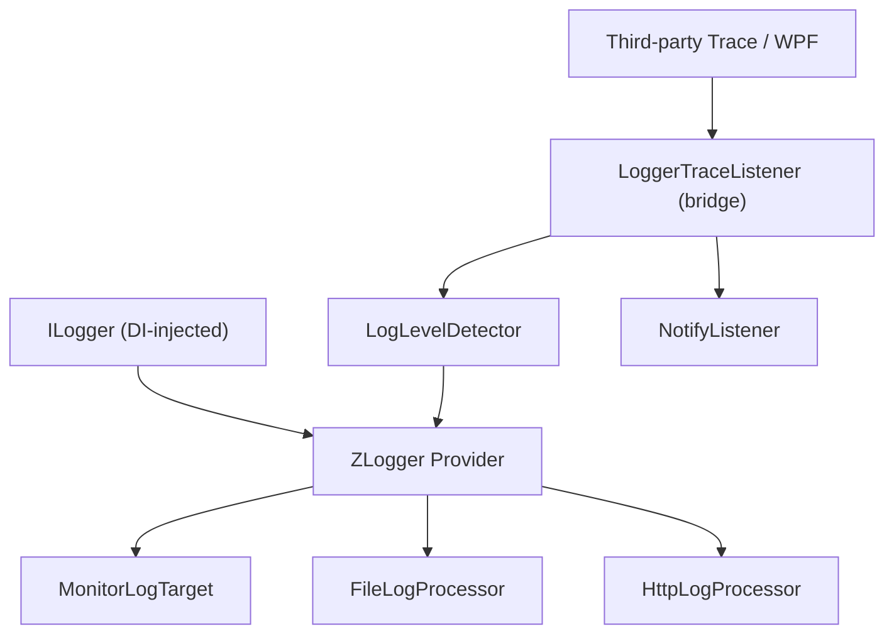
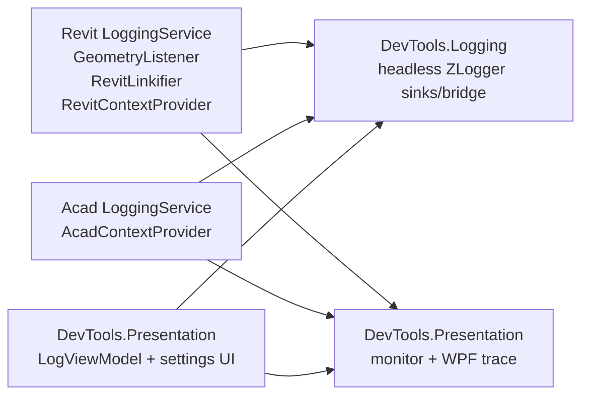

# Logging System Architecture

Logging uses `ILogger<T>` via Microsoft.Extensions.Logging (MEL) with ZLogger as the provider. All business code injects `ILogger<T>` through DI; a legacy `LoggerTraceListener` bridge remains for third-party/WPF trace sources only.

Last updated: 2026-08-29

---

## Source Map

| Area                                      | Path                                              |
| ----------------------------------------- | ------------------------------------------------- |
| Shared logging library                    | `source/DevTools.Logging/`                      |
| Startup crash timeline                    | `source/DevTools.Logging/Diagnostics/StartupTrace.cs` |
| Monitor pane (Scintilla / WPF trace)      | `source/DevTools.Presentation/Logging/`         |
| Shared presentation contracts             | `source/DevTools.Presentation/Interfaces/`      |
| Revit logging lifecycle                   | `source/RevitDevTool/Logging/LoggingService.cs` |
| Revit enrichers/linkify/geometry listener | `source/RevitDevTool/Logging/`                  |
| AutoCAD logging lifecycle                 | `source/AcadDevTool/Logging/LoggingService.cs`  |
| AutoCAD enrichers                         | `source/AcadDevTool/Logging/`                   |

---

## Logging Pattern (Standard)

All services, providers, and view models use DI-injected `ILogger<T>` with ZLogger extension methods:

```csharp
public sealed class MyService(ILogger<MyService> logger)
{
    public void DoWork()
    {
        logger.ZLogInformation($"Starting work...");
        logger.ZLogError($"Something failed: {ex.Message}");
    }
}
```

For static utility classes that cannot use DI, pass an optional `ILogger? logger = null` parameter:

```csharp
internal static class MyHelper
{
    public static void DoStatic(string input, ILogger? logger = null)
    {
        logger?.ZLogDebug($"Processing {input}");
    }
}
```

---

## Shared Logging Layer



`DevTools.Logging` owns the headless pipeline:

- ZLogger provider registration (`LoggingExtensions.AddLoggingProvider()` — config, notify, file, HTTP; no monitor)
- `LoggerTraceListener` (bridge for third-party Trace sources only)
- `ConsoleRedirector` (captures Console.Out → Trace for third-party libs; NUnit run is an exception — [output.md](output.md#consolewriteline-captured-by-consoleredirector))
- `NotifyListener`
- `LogLevelDetector` (keyword-based level for bridged Trace messages)
- File/HTTP targets and sink options
- `StartupTrace` (pre-DI RAM buffer; writes `crash_{app}_{ver}_{pid}.log` on startup failure or unhandled exception while trace is active — not a ZLogger provider)

`DevTools.Presentation` owns the monitor pane (`IMonitorLogTarget`, `MonitorLogTarget`, `AddMonitorLogging`) and WPF `PresentationTraceSources` attach/detach.

Host projects own when listeners are registered, which enrichers are active, and any host-specific linkification or geometry routing. Hosts call `AddLoggingProvider()` then `AddMonitorLogging`.

---

## Host Composition



Revit registration is in `RevitHostingExtensions.AddLoggingServices()`. AutoCAD registration is in `AcadHostingExtensions.AddLoggingServices()`.

---

## Severity Detection

`LogLevelDetector` scans bridged Trace message content and maps known keywords to MEL levels. Only applies to the `LoggerTraceListener` bridge path — `ILogger<T>` calls already carry explicit levels.

| Level       | Example keywords                                                 |
| ----------- | ---------------------------------------------------------------- |
| Critical    | `CRITICAL`, `FATAL`, `PANIC`, `SECURITY`                 |
| Error       | `ERROR`, `FAILED`, `EXCEPTION`, `TIMEOUT`, `INVALID`   |
| Warning     | `WARNING`, `DEPRECATED`, `OBSOLETE`, `MEMORY`, `RETRY` |
| Information | default                                                          |

---

## Revit-Specific Extensions

Revit adds behavior that must not leak into shared logging:

- `GeometryListener` intercepts Revit geometry objects written to `Trace`.
- `RevitLinkifier` detects Revit element references in monitor text and creates clickable selection links.
- `RevitContextProvider` enriches log records with selected Revit context fields.
- Visualization routing sends geometry to DirectContext3D servers under `source/RevitDevTool/Visualization/`.

AutoCAD has its own context provider/enricher path and does not share Revit geometry routing.

---

## Output Targets

| Target  | Implementation       | Notes                                             |
| ------- | -------------------- | ------------------------------------------------- |
| Monitor | `MonitorLogTarget` (Presentation) | UI monitor through Scintilla/ZLogger integration. |
| File    | `FileLogProcessor` | Rolling `log_{app}_{ver}_{pid}_{timestamp}_{seq}` when file logging is enabled. |
| Startup | `StartupTrace`     | Pre-DI. Buffer in RAM; create `crash_{app}_{ver}_{pid}.log` only if `Fail` runs (catch or unhandled while trace is active). Milestone lines use `+seconds` elapsed, not ZLogger `[HH:mm:ss LVL]`. AutoClean ignores `crash_*`. |
| HTTP    | `HttpLogProcessor` | Remote sink path.                                 |
| Notify  | `NotifyListener`   | UI update notifications (bridge path only).       |

---

## Third-Party Addin Logging Integration

Third-party addins that want their log output to appear in the DevTools monitor and file sinks can bridge their own `ILogger<T>` + ZLogger pipeline into DevTools by routing log entries through `System.Diagnostics.Trace`.

**Note:** Depending on the addin's architecture, you can wire logging through `Microsoft.Extensions.Hosting` or directly via `IServiceCollection`. The example below uses the simplest `ServiceCollection`-only approach.

```csharp
// In the third-party addin's service registration:
private static ServiceProvider CreateServiceProvider()
{
    var services = new ServiceCollection();

    services.AddLogging(builder =>
    {
        builder.SetMinimumLevel(LogLevel.Debug);
        builder.AddZLoggerInMemory(
            processorKey: null,
            configure: options =>
            {
                options.UsePlainTextFormatter(formatter =>
                {
                    formatter.SetPrefixFormatter(
                        $"[{0:short}] [{1}] ",
                        (in template, in info) =>
                            template.Format(info.LogLevel, info.Category));
                });
            },
            configureProcessor: processor =>
            {
                processor.MessageReceived += msg =>
                    System.Diagnostics.Trace.WriteLine(msg);
            });
    });

    return services.BuildServiceProvider();
}
```

**How it works:**

1. The third-party addin uses its own `ILogger<T>` + ZLogger with an in-memory processor.
2. `MessageReceived` writes each formatted log entry to `System.Diagnostics.Trace.WriteLine()`.
3. DevTools' `LoggerTraceListener` (always active once `LoggingService.Initialize()` runs) intercepts `Trace` output and routes it into the shared MEL pipeline.
4. The log entry flows through `LogLevelDetector` → `NotifyListener` (auto-show pane) → ZLogger providers → Monitor / File / HTTP sinks.

**Key points:**

- The third-party addin does **not** need a dependency on DevTools libraries.
- Only `System.Diagnostics.Trace` and `ZLogger` are required.
- The `NotifyListener.TraceReceived` event fires for every bridged entry, triggering auto-show of the DevTools dockable pane or floating window.
- For addins that already use `Trace.Write`, no ZLogger setup is needed — `LoggerTraceListener` captures `Trace` output directly.
- The `[level]` prefix in the formatter (`${0:short}`) is required: `Trace.WriteLine` does not carry level information, so `LogLevelDetector` scans the message for level prefixes like `[DBG]`, `[ERR]`, `[WRN]` to determine the correct MEL log level.

---

## Migration Notes

As of 2026-06-28, all project-owned code uses `ILogger<T>` + ZLogger. The `LoggerTraceListener` bridge remains active for:

- WPF `PresentationTraceSources` (data binding errors, etc.)
- Revit SDK internal traces
- Python runtime `Trace.Write` (stdout capture from embedded scripts)
- Any third-party library that writes to `System.Diagnostics.Trace`

Do **not** add new `Trace.TraceError/Warning/Information` or `Debug.WriteLine` calls in project-owned code. Use `ILogger<T>` injection instead.

---

## Change Rules

- Use `ILogger<T>` for all new logging in project-owned code.
- Keep `LoggerTraceListener` bridge for third-party/WPF trace sources.
- Keep shared logging host-neutral.
- Put host document/context/linkification/geometry behavior in host projects.
- If changing geometry routing, update `docs/architecture/Visualization/README.md` too.
- If changing sinks or shared options, update this doc and `docs/agents/host-boundaries.md` when the boundary changes.

---

## Related Docs

- `docs/architecture/Visualization/README.md`
- `docs/architecture/Execution/README.md`
- `docs/agents/host-boundaries.md`
