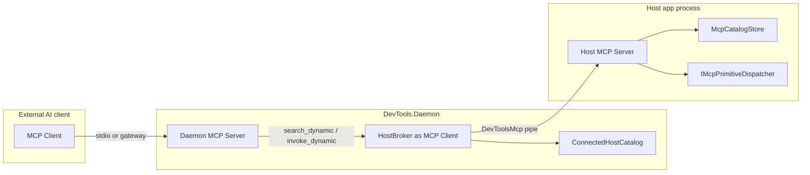

# MCP Integration Architecture

Model Context Protocol integration lets external AI clients (Claude Desktop, Cursor, ChatGPT, Perplexity, etc.) talk to running host applications through the standalone **DevTools.Daemon** and the in-host spec-first MCP named-pipe runtime (`McpHandler` on protocol `2026-07-28`).

The stack is host-agnostic. The Daemon discovers `DevToolsMcp_{Host}_{Version}_{PID}` pipes via `HostBroker`, hydrates a per-machine/PID `ConnectedHostCatalog`, and exposes only infrastructure tools plus `search_dynamic` / `invoke_dynamic`.

Last updated: 2026-08-31

## Vocabulary

| Term | Meaning | Do not call it |
|------|---------|----------------|
| **Daemon MCP Server** | `DevTools.Daemon` process; AI client talks here (stdio / gateway) | host server |
| **Host MCP Server** | Spec wire handler inside Revit/AutoCAD; pipe `DevToolsMcp_*` | daemon |
| **HostBroker** | Daemon-side **MCP client** + owner of `ConnectedHostCatalog` | MCP server |
| **ConnectedHostCatalog** | In-memory index of host tools/resources by machine+PID (daemon) | `McpCatalogStore` |
| **McpCatalogStore** | In-host primitive registry feeding the Host MCP Server | `ConnectedHostCatalog` |
| **App container** | Real `IServiceCollection` / `IHost` for Daemon or host add-in | temp `ServiceProvider` in options builders |
| **Shared server features** | Tasks + call-log filters on daemon `McpServerOptions` | host wire logging |
| **Protocol JSON** | `McpJsonUtilities.DefaultOptions` | parallel custom options |
| **Tool text JSON** | `McpJsonUtilities.DefaultOptions` via `ToolHelpers` | indented / pretty-print |

## Dual-server flow

- **Daemon MCP Server:** fixed tools/prompts, `ListChanged = false`; host capabilities are not projected into `tools/list`.
- **Host MCP Server:** catalog tools/resources, `ListChanged = true`; prompts are daemon-owned.
- **`invoke_dynamic`:** daemon tool → `HostBroker` → `HostSession.CallToolPassthroughAsync` on the host session.

## DI and lifecycle

Each process has one **app container** (Daemon `ServerHostBuilder` or host `AddExecutionServices`). MCP feature registration happens once there — no temporary `BuildServiceProvider` when building `McpServerOptions`.

| Service | Lifetime | Job |
|---------|----------|-----|
| `IMcpTaskStore` / `InMemoryMcpTaskStore` | Singleton | SDK Tasks extension |
| `IHostBroker` → `HostBroker` | Singleton | Connected session registry + `ConnectedHostCatalog` |
| `IHostDiscovery` → `HostBroker` | Singleton | Background pipe poll; opens/kills `HostSession` |
| `IMcpPipeScanner` / `McpPipeScanner` | Singleton | OS scan for `DevToolsMcp_*` (no connect) |
| `IHostLaunchService` / `HostLaunchService` | Singleton | Resolve exe/args, start process (not session open) |
| `McpEngine` | Singleton | Daemon `ToolCollection` / `PromptCollection` only |
| `McpCatalogStore`, dispatcher | Singleton | In-host app container |
| `StdioHostedService` / `GatewayHostedService` / `HostMcpPipeServer` | HostedService | Transport sessions |
| `McpServer` session | **Not** in DI — `McpServer.Create` per transport | Factory / hosted service |

**Session lifecycle (daemon):** `IHostDiscovery` polls `IMcpPipeScanner` every 2s. New pipe → `HostSession.ConnectAsync` → `ConnectedHostCatalog.Replace`. Pipe gone or transport complete → `ConnectedHostCatalog.Remove` → `HostSession.DisposeAsync`. `launch_host` only starts the OS process; discovery opens the MCP session when the host pipe appears.

**Options pipeline (daemon):**

1. `McpServerFactory` fills tool/prompt collections and capabilities.
2. `McpServerConfigurator.Apply(options, appServices)` runs `IConfigureOptions<McpServerOptions>` (Tasks) and attaches call-log filters.
3. `StdioHostedService` / `GatewayHostedService` creates `McpServer.Create(transport, options)` per session.

**Host pipe:** `HostMcpPipeServer` delegates newline-delimited JSON-RPC to `McpHandler` (spec `2026-07-28`, no `initialize` handshake).

Composition: `DevTools.Mcp.Server` (daemon fixed surface), `DevTools.Mcp.Client` (broker), `DevTools.Mcp.Adapter` (host wire handler), `DevTools.Mcp.Catalog` (in-host registry).

## JSON serialization

Policy: [0031](../../decisions/0031-daemon-json-source-gen.md) — source-gen JSON in support of Daemon AOT ([0032](../../decisions/0032-daemon-mewui-and-aot.md)).

| Layer | Serializer |
|-------|------------|
| MCP SDK protocol types | Tier 1 `ToolHelpers.ProtocolOptions` (`McpJsonUtilities.DefaultOptions`) |
| Daemon tool DTOs (`search_dynamic`, `invoke_dynamic`, …) | Tier 2 `McpToolJson.Options` (chained `McpServerJsonContext`) |
| Control pipe, settings.json, pytest framing, MTP `testing/*`, log redaction | Dedicated context per wire — see 0031 |
| ALC toolsets, Python catalogs, `FileInfoResult`, `FileConfig` | Outside facades (polymorphic / foreign identity) |

## Documentation

| Document | Contents |
|----------|----------|
| [SDK gap matrix](sdk-gap-matrix.md) | Living ✅/⚠️/⏸ map vs `ModelContextProtocol` 2.2.0 |
| [JSON (0031)](../../decisions/0031-daemon-json-source-gen.md) | Source-gen JSON; supports [0032](../../decisions/0032-daemon-mewui-and-aot.md) AOT |
| [Platform boundaries](platform-boundaries.md) | Host wire, ALC, error hop; MRTR is plumbing ([0027](../../decisions/0027-mcp-product-surface.md)) |
| [Daemon](daemon.md) | Architecture, lifecycle, auth, control pipe API — UI/AOT: [0032](../../decisions/0032-daemon-mewui-and-aot.md) |
| [Transport](transport.md) | Stdio mode, Gateway WebSocket, dual pipe protocols |
| [Tools](tools.md) | Fixed daemon surface, ConnectedHostCatalog, in-host primitives |
| [In-Host Runtime](in-host-runtime.md) | Host spec handler, registry flow, dispatch |
| [Workflows](workflows.md) | Practical AI agent patterns |

## Source Map

| Area | Path |
|------|------|
| Daemon composition/UI, auth, transports | `source/DevTools.Daemon/` |
| MCP contracts | `source/DevTools.Mcp.Core/` |
| Toolset registry and discovery | `source/DevTools.Mcp.Catalog/` |
| Host spec handler and named-pipe server | `source/DevTools.Mcp.Adapter/Host/`, `External/HostMcpPipeServer.cs` |
| Daemon-side broker, sessions, and discovery | `source/DevTools.Mcp.Client/` |
| Fixed external tools, prompts, and server options | `source/DevTools.Mcp.Server/` |
| Offline metadata contracts / Revit / AutoCAD readers | `source/DevTools.FileMetadata.Core/`, `Revit/`, `Acad/` |
| IPC transport / pytest control pipe | `source/DevTools.Ipc/`, `source/DevTools.Execution/External/DevToolsPipeServer.cs` |
| Gateway relay | Separate repo: `McpGateway` |

`DevTools.Daemon` is the executable composition and UI shell; `DevTools.Mcp.Server` owns the external MCP surface. Dependencies point inward to Core: Catalog, Adapter, and Client consume Core; Server consumes Core + Client; file-format readers consume FileMetadata.Core. The daemon composes these modules and does not host the in-process adapter.

## Verification

- `tests/DevTools.Mcp.Core.Tests` — protocol models and JSON encoders.
- `tests/DevTools.Mcp.Catalog.Tests` — ConnectedHostCatalog, parsers, toolset isolation.
- `tests/DevTools.Mcp.Adapter.Tests` — host spec conformance and named-pipe handler.
- `tests/DevTools.Mcp.Client.Tests` / `Server.Tests` — pipe scanner, SDK stream, search/invoke harness.
- `tests/DevTools.Daemon.Tests` — stdio composition.
- `tests/DevTools.Execution.Tests` — pytest bridge framing and pipe-name identity.
- Live-host smoke remains required for full host dispatch confidence.

## Related

- `docs/product/mcp.md`
- `docs/agents/mcp-pytest-bridge.md`
- `docs/architecture/Execution/README.md`
