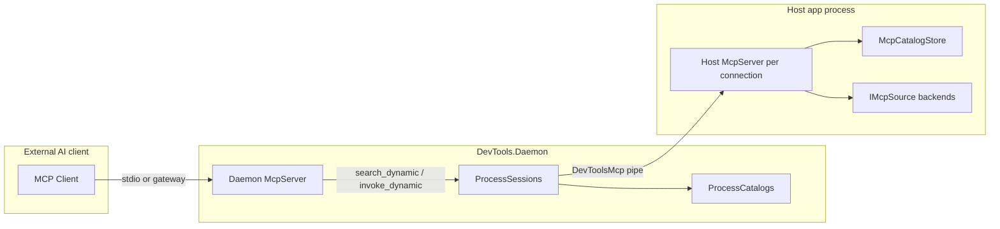

# MCP Integration Architecture

Model Context Protocol integration lets external AI clients (Claude Desktop, Cursor, ChatGPT, Perplexity, etc.) talk to running host applications through the standalone **DevTools.Daemon** and an in-host **SDK `McpServer`** on the MCP named pipe (`DevToolsMcp_*`, protocol `2026-07-28`).

The stack is host-agnostic. The Daemon discovers pipes via `ProcessSessions`, hydrates a per-process **`ProcessCatalogs`** index, and exposes only infrastructure tools plus `search_dynamic` / `invoke_dynamic`.

Last updated: 2026-10-03

## Vocabulary

| Term | Meaning | Do not call it |
|------|---------|----------------|
| **Daemon MCP Server** | `DevTools.Daemon` process; AI client talks here (stdio / gateway) | host server |
| **Host MCP Server** | SDK `McpServer` per pipe connection inside Revit/AutoCAD | daemon |
| **ProcessSessions** | Daemon-side pipe poll + `McpClient` sessions + `ProcessCatalogs` | `HostBroker`, `ConnectedHostCatalog` |
| **ProcessCatalogs** | In-memory index of tools/resources per connected `processId` (daemon) | `McpCatalogStore` |
| **McpCatalogStore** | In-host registry (`RegisteredTool` / `RegisteredResource` / `RegistryCatalog`) | `ProcessCatalogs` |
| **CatalogId** | Opaque locator `dci2.{processId}.{kind}.{contentHash}.{target}`; wire field **`id`** | `capabilityId`, `hostInstanceId` |
| **App container** | Real `IServiceCollection` / `IHost` for Daemon or host add-in | temp `ServiceProvider` in options builders |
| **Shared server features** | Tasks + call-log filters on daemon `McpServerOptions` | host-only logging |
| **Protocol JSON** | `McpJsonUtilities.DefaultOptions` | parallel custom options |
| **Tool text JSON** | `McpJsonUtilities.DefaultOptions` via `ToolHelpers` | indented / pretty-print |

## Dual-server flow

```mermaid
flowchart LR
  subgraph external [External AI client]
    Client[MCP Client]
  end

  subgraph daemonProc [DevTools.Daemon]
    DaemonSrv[Daemon McpServer]
    Sessions[ProcessSessions]
    Catalog[ProcessCatalogs]
  end

  subgraph hostProc [Host app process]
    HostSrv[Host McpServer per connection]
    Store[McpCatalogStore]
    Sources[IMcpSource backends]
  end

  Client -->|"stdio or gateway"| DaemonSrv
  DaemonSrv -->|"search_dynamic / invoke_dynamic"| Sessions
  Sessions --> Catalog
  Sessions -->|"DevToolsMcp pipe"| HostSrv
  HostSrv --> Store
  HostSrv --> Sources
```

- **Daemon MCP Server:** fixed tools/prompts in `McpEngine`, `ListChanged = false`; host capabilities are not projected into `tools/list`.
- **Host MCP Server:** `McpPipeServer` accepts connections; each connection gets `McpServer.Create(StreamServerTransport, …)` with tools/resources from `McpServerCollections`.
- **`invoke_dynamic`:** daemon `InvokeTool` → `ProcessSession.CallToolPassthroughAsync` (via `McpClientPassthrough` for no auto-MRTR) → host `tools/call`.

## DI and lifecycle

Each process has one **app container** (Daemon `ServerHostBuilder` or host `AddExecutionServices`). MCP feature registration happens once there.

| Service | Lifetime | Job |
|---------|----------|-----|
| `IMcpTaskStore` / `InMemoryMcpTaskStore` | Singleton | SDK Tasks extension (daemon) |
| `IProcessSessions` → `ProcessSessions` | Singleton | Session registry + `ProcessCatalogs` |
| `DiscoveryHostedService` | HostedService | 2s poll → connect/disconnect `ProcessSession` |
| `IMcpPipeScanner` | Singleton | OS scan for `DevToolsMcp_*` (no connect) |
| `IHostLaunchService` | Singleton | Start host OS process (not MCP session) |
| `McpEngine` | Singleton | Daemon `ToolCollection` / `PromptCollection` |
| `McpCatalogStore`, `IMcpSource` backends | Singleton | In-host catalog + invoke |
| `McpPipeServer` | HostedService | Host MCP pipe accept loop |
| `McpServer` (host) | Per pipe connection | `PipeEndpoint` — not in root DI |
| `StdioHostedService` / `GatewayHostedService` | HostedService | Daemon transport sessions |

**Session lifecycle (daemon):** `DiscoveryHostedService` drives `ProcessSessions.RunAsync` (2s). New pipe → `ProcessSession.ConnectAsync` → catalog list into `ProcessCatalogs`. Pipe gone or client completion → remove session and catalog slice; a pipe that is still discovered is connected again on the next poll. `launch_host` only starts the OS process; discovery opens the MCP session when the host pipe appears.

**Host pipe:** `McpPipeServer` uses SDK `StreamServerTransport` over the named pipe (newline-delimited JSON-RPC, full MCP session including `initialize`).

Composition: **`DevTools.Daemon`** (external surface, process discovery, auth, UI), **`DevTools.Mcp.Catalog`** (host pipe server, catalog store, protocol keys, hosting), **`DevTools.Execution`** (`IMcpSource` backends under `External/Mcp/`), **`DevTools.Mcp.Revit`** / **`DevTools.Mcp.Acad`** (built-in tools). Former split assemblies (`DevTools.Mcp.Core`, `.Client`, `.Server`, `.Adapter`) are folded into these; namespaces such as `DevTools.Mcp.Core.*` remain under `DevTools.Mcp.Catalog/Core/`.

## JSON serialization

Policy: [0031](../../decisions/0031-daemon-json-source-gen.md) — source-gen JSON on Daemon wires. UI: [0032](../../decisions/0032-daemon-mewui-and-aot.md).

| Layer | Serializer |
|-------|------------|
| MCP SDK protocol types | `ToolHelpers.ProtocolOptions` (`McpJsonUtilities.DefaultOptions`) |
| Daemon tool DTOs (`search_dynamic`, `invoke_dynamic`, …) | `McpToolJson.Options` / `McpServerJsonContext` |
| Control pipe, settings.json, pytest framing, MTP `testing/*` | Dedicated context per wire — see 0031 |

## Documentation

| Document | Contents |
|----------|----------|
| [SDK gap matrix](sdk-gap-matrix.md) | Living map vs `ModelContextProtocol` 2.2.0 |
| [JSON (0031)](../../decisions/0031-daemon-json-source-gen.md) | Source-gen JSON on Daemon wires |
| [Platform boundaries](platform-boundaries.md) | Host wire, ALC, error hop; MRTR is plumbing ([0027](../../decisions/0027-mcp-product-surface.md)) |
| [Daemon](daemon.md) | Architecture, lifecycle, auth, control pipe API |
| [Transport](transport.md) | Stdio mode, Gateway WebSocket, dual pipe protocols |
| [Tools](tools.md) | Fixed daemon surface, ProcessCatalogs, in-host primitives |
| [In-Host Runtime](in-host-runtime.md) | Host SDK server, registry flow, `IMcpSource` |
| [Workflows](workflows.md) | Practical AI agent patterns |
| [Flow audit (historical)](flow-and-simplification.md) | Pre-merge analysis; see [0039](../../decisions/0039-mcp-flow-audit-sdk-reuse-and-vocabulary.md) **As implemented** |

## Source Map

| Area | Path |
|------|------|
| Daemon composition/UI, auth, transports, external MCP | `source/DevTools.Daemon/` (`Mcp/`) |
| Host catalog, pipe server, protocol keys, SDK collections | `source/DevTools.Mcp.Catalog/` |
| Built-in execute tools + `IMcpSource` backends | `source/DevTools.Execution/External/Mcp/` |
| Revit / AutoCAD built-in MCP tools | `source/DevTools.Mcp.Revit/`, `DevTools.Mcp.Acad/` |
| Offline metadata | `source/DevTools.FileMetadata.*` |
| Pytest/control pipe | `source/DevTools.Ipc/`, `source/DevTools.Execution/External/DevToolsPipeServer.cs` |
| Gateway relay | Separate repo: `McpGateway` |

`McpSpecKeys` (`Tool`, `Resource`, `Result` — flat, no `Host`/`Daemon` nesting) lives in `DevTools.Mcp.Catalog/Core/Protocol/`. Wire tool names: `search_dynamic`, `invoke_dynamic` (`McpSpecKeys.Tool.Invoke`).

## Verification

- `tests/DevTools.Daemon.Tests` — stdio composition, task selection, catalog id/resolver.
- `tests/DevTools.Mcp.Catalog.Tests` — store, parsers, toolset isolation, host pipe harness.
- `tests/DevTools.Mcp.Adapter.Tests` — SDK host pipe integration (name retained).
- `tests/DevTools.Mcp.Server.Tests` / `Client.Tests` / `Core.Tests` — daemon dynamic tools and contracts (reference `DevTools.Daemon` + Catalog).
- `tests/DevTools.Execution.Mcp.Tests` — `McpConnectTracker`, `McpCallFilter`, connect metrics.
- Live-host smoke: `docs/agents/mcp-integration-test.md`.

## Related

- `docs/product/mcp.md`
- `docs/agents/mcp-pytest-bridge.md`
- `docs/architecture/Execution/README.md`
