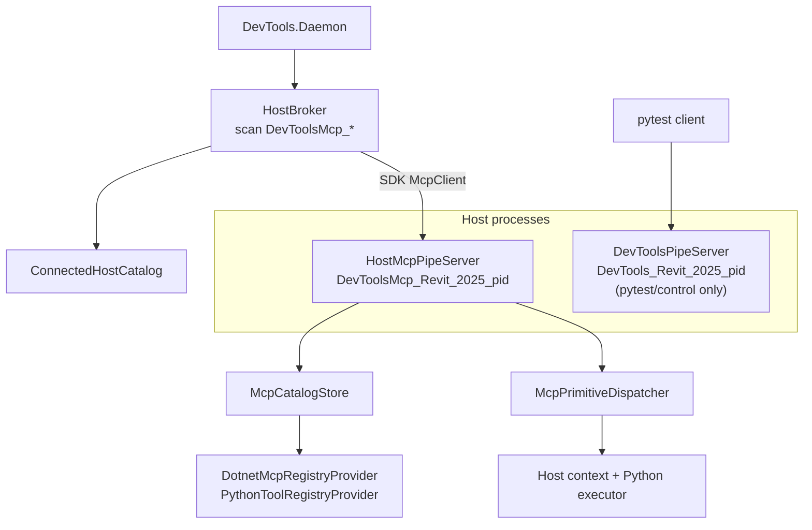
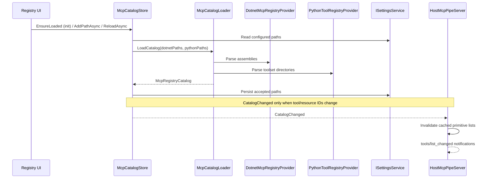

# In-Host MCP Runtime

The in-host runtime runs inside Revit/AutoCAD and handles actual tool/resource execution
behind a spec-first MCP handler on `DevToolsMcp_*` (protocol `2026-07-28`).

## Runtime Shape

The Daemon owns external MCP protocol routing and host selection. `HostBroker`
scans for `DevToolsMcp_{Host}_{Version}_{PID}` whose PID is still a live process, connects with `StreamClientTransport`,
and hydrates `ConnectedHostCatalog`. The host process owns execution, registry loading, and
host-safe invocation. Pytest/control remains on the `DevTools_*` pipe.

## Registry Flow

## Dispatch Flow

`HostMcpPipeServer` delegates JSON-RPC to `McpHandler`, which encodes list/read/call
responses from `McpCatalogStore` and `IMcpPrimitiveDispatcher` on the host thread.
Cancellation is the request token; tool-internal timeouts stay on the tool.

Host prompts are not registered; guidance lives in daemon fixed prompts.

| Primitive | .NET path | Python path |
|-----------|-----------|-------------|
| Tool call (built-in) | `IBuiltInMcpTool` via dispatcher | `PythonExecutor` binding |
| Tool call (.NET toolset, ALC) | `ToolsetInvoker` + `ToolsetResultSerializer` JSON bridge | — |
| Resource read | Dispatcher resource path | Python resource binding |

See [Platform boundaries](platform-boundaries.md) for ALC and MRTR detail.

## Parser Library

MCP contracts live in `source/DevTools.Mcp.Core/`; catalog/discovery lives in `DevTools.Mcp.Catalog/`; the daemon-side capability index is in `DevTools.Mcp.Client/`; and SDK host adapters, including `HostMcpPipeServer`, are in `DevTools.Mcp.Adapter/`. `source/DevTools.Ipc/` owns `BridgeMessage.cs`, `BridgePipeConnection.cs`, `HostPipeName.cs`, and the dual pipe prefixes. Wire-format property names belong in Core's `McpSpecKeys` (`DevTools.Mcp.Core/Protocol/`). Daemon-specific contract keys live in `DaemonPropertyNames`.
