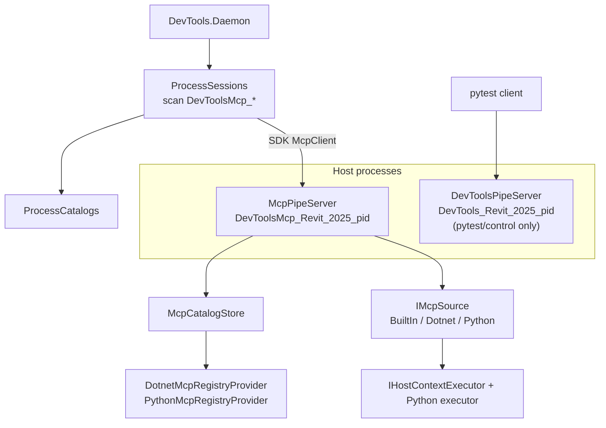
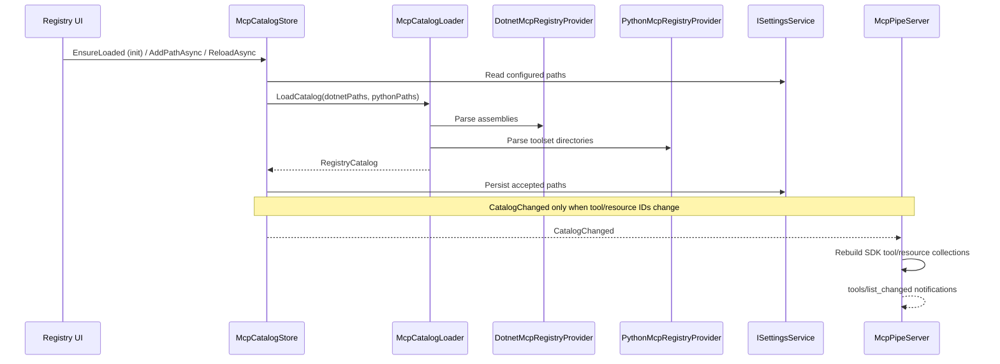

# In-Host MCP Runtime

The in-host runtime runs inside Revit/AutoCAD and handles tool/resource execution
behind an SDK **`McpServer`** on `DevToolsMcp_*` (protocol `2026-07-28`).

## Runtime Shape

```mermaid
flowchart TB
    Daemon["DevTools.Daemon"]
    Sessions["ProcessSessions<br/>scan DevToolsMcp_*"]
    Catalog["ProcessCatalogs"]

    subgraph hosts["Host processes"]
        McpPipe["McpPipeServer<br/>DevToolsMcp_Revit_2025_pid"]
        PytestPipe["DevToolsPipeServer<br/>DevTools_Revit_2025_pid<br/>(pytest/control only)"]
    end

    Registry["McpCatalogStore"]
    Providers["DotnetMcpRegistryProvider<br/>PythonMcpRegistryProvider"]
    Sources["IMcpSource<br/>BuiltIn / Dotnet / Python"]
    Host["IHostContextExecutor + Python executor"]

    Daemon --> Sessions
    Sessions --> Catalog
    Sessions -->|"SDK McpClient"| McpPipe
    McpPipe --> Registry
    Registry --> Providers
    McpPipe --> Sources
    Sources --> Host
    Pytest["pytest client"] --> PytestPipe
```

The Daemon owns external MCP routing and process selection. `ProcessSessions`
scans for `DevToolsMcp_{Host}_{Version}_{PID}` whose PID is still live, connects
with `StreamClientTransport`, and hydrates `ProcessCatalogs`. The host process
owns execution, registry loading, and host-thread invocation. Pytest/control
remains on the `DevTools_*` pipe.

## Registry Flow

```mermaid
sequenceDiagram
    participant UI as Registry UI
    participant Store as McpCatalogStore
    participant Loader as McpCatalogLoader
    participant Dotnet as DotnetMcpRegistryProvider
    participant Python as PythonMcpRegistryProvider
    participant Settings as ISettingsService
    participant HostServer as McpPipeServer

    UI->>Store: EnsureLoaded (init) / AddPathAsync / ReloadAsync
    Store->>Settings: Read configured paths
    Store->>Loader: LoadCatalog(dotnetPaths, pythonPaths)
    Loader->>Dotnet: Parse assemblies
    Loader->>Python: Parse toolset directories
    Loader-->>Store: RegistryCatalog
    Store->>Settings: Persist accepted paths
    Note over Store,HostServer: CatalogChanged only when tool/resource IDs change
    Store-->>HostServer: CatalogChanged
    HostServer->>HostServer: Rebuild SDK tool/resource collections
    HostServer-->>HostServer: tools/list_changed notifications
```

## Dispatch Flow

Each connected pipe gets `McpServer.Create` with tools/resources from
`McpServerCollections.Populate`. Invoke runs on the host thread via
`IHostContextExecutor` inside `IMcpSource` implementations (`BuiltInSource`,
`DotnetSource`, `PythonSource` in `DevTools.Execution/External/Mcp/Backends/`).
`McpCallFilter` maps `InputRequiredException` to wire `input_required`.
Cancellation is the request token; tool-internal timeouts stay on the tool.

Host prompts are not registered; guidance lives in daemon fixed prompts.

| Primitive | .NET path | Python path |
|-----------|-----------|-------------|
| Tool call (built-in) | `IBuiltInMcpTool` via `BuiltInSource` | `PythonSource` + `ToolInvoke.py` |
| Tool call (.NET toolset, ALC) | `DotnetSource` + `ResultBridge.ToHostCallToolResult` | — |
| Resource read | SDK resource handlers on collections | Python resource binding |

See [Platform boundaries](platform-boundaries.md) for ALC and MRTR detail.

## Parser Library

Shared MCP models and `McpSpecKeys` live under `DevTools.Mcp.Catalog/Core/`
(namespaces `DevTools.Mcp.Core.*`). Daemon catalog indexing is
`DevTools.Daemon/Mcp/Processes/`. Host pipe server is
`DevTools.Mcp.Catalog/Transport/McpPipeServer.cs`.
`source/DevTools.Ipc/` owns pytest/control framing and pipe name helpers.
