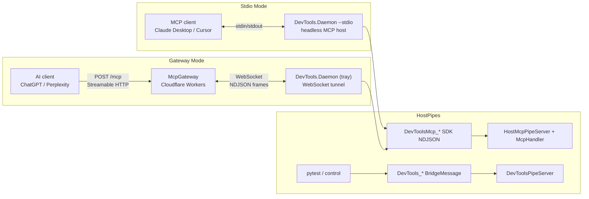

# Transport Modes

The Daemon supports two independent transport modes for external MCP clients.
Separately, host connectivity uses **two named-pipe protocols** that must not be mixed.

| Mode | Trigger | Transport | Use case |
|------|---------|-----------|----------|
| **Stdio** | `--stdio` arg | Direct `StreamServerTransport` on process stdin/stdout | Local MCP clients |
| **Gateway** | Auto on sign-in (tray host only) | Outbound WebSocket to Cloudflare relay | Remote AI clients |

## Dual Host Pipe Protocols

| Pipe | Format | Protocol | Owner |
|------|--------|----------|-------|
| `DevTools_{Host}_{Version}_{PID}` | Length-prefixed `BridgeMessage` | Pytest + control IPC | `DevToolsPipeServer` |
| `DevToolsMcp_{Host}_{Version}_{PID}` | Newline-delimited JSON-RPC | Spec wire `2026-07-28` (`server/discover`) | `HostMcpPipeServer` + `McpHandler` |

Do not multiplex SDK frames onto the pytest pipe (or the reverse).

## Stdio Mode

When an AI client spawns `DevTools.Daemon.exe --stdio`, a **new process** runs a self-contained MCP server on stdin/stdout. It boots its own `McpEngine`, `HostBroker`, and `DiscoveryHostedService` independently.

Key properties:
- Custom process entrypoint handles `--stdio` before WPF tray startup.
- Bypasses the `SingleInstance` mutex.
- Discovers `DevToolsMcp_*` pipes independently.
- Auth tokens are read from the shared DPAPI file.
- Process exits when the MCP client disconnects.
- No control pipe, gateway tunnel, or tray icon in this mode.
- External tool/prompt surface is fixed (`ListChanged = false`).

## Gateway Mode

Outbound WebSocket connection to the McpGateway (Cloudflare Workers + Durable Objects):

1. `GatewayTunnelClient` connects to `wss://<gateway>/tunnel` with Bearer token
2. Sends `register` frame with `machine_id`, `machine_name`, `host_apps`
3. Wraps WebSocket frames as NDJSON streams via custom adapters
4. Runs full MCP server over that transport
5. Auto-reconnects with exponential backoff on failure
6. Sends periodic `heartbeat` frames with updated `host_apps`

## Multi-Machine Routing

One user can have Daemons on multiple machines connected to the same Gateway. The Gateway's Durable Object maintains a `Map<machine_id, WebSocket>`:

- **Single machine** → AI requests auto-route (no header needed)
- **Multiple machines** → AI must include `x-target-machine: <machine_id>` header
- **Discovery** → `GET /machines` or `list_machines` MCP tool lists connected machines
- **Dynamic invoke** → `search_dynamic` / `invoke_dynamic` include `machineId` + `hostInstanceId`
