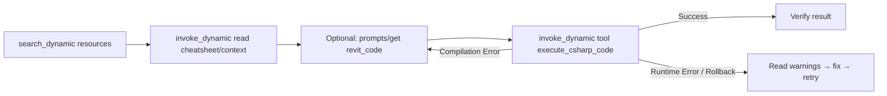
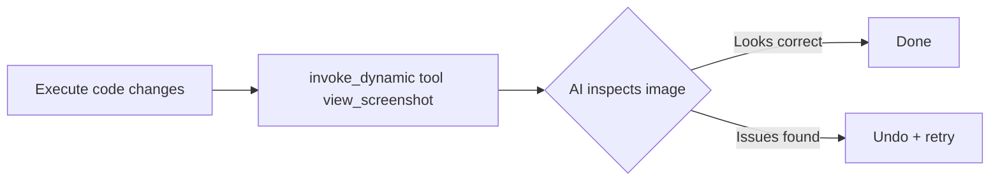
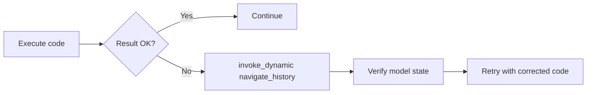
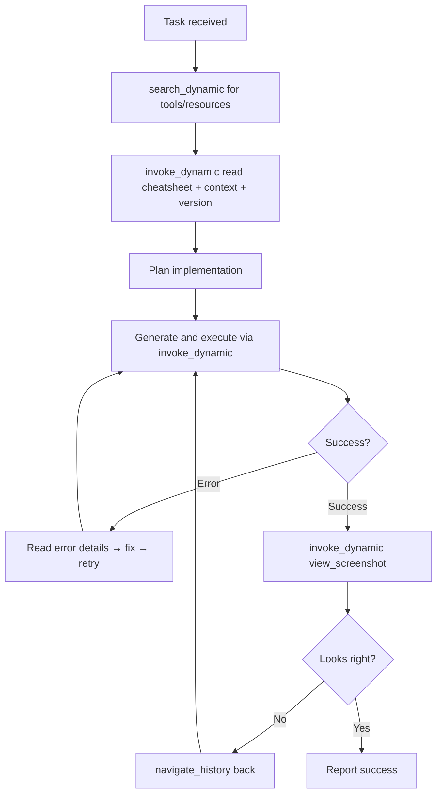

# MCP Workflow Patterns

Practical patterns for AI agents using RevitDevTool MCP tools.

---

## Workflow: Code Execution (Create/Read/Update/Delete)



### Key Points

- Discover host targets with `search_dynamic` (includes `machineId` + `hostInstanceId`)
- Read resources via `invoke_dynamic` with `kind=resource` (or `resource_template`)
- Execute with `invoke_dynamic` `kind=tool` `target=execute_csharp_code`
- Error responses are categorized: `[COMPILATION ERROR]`, `[RUNTIME ERROR]`, `[ROLLBACK]`

---

## Workflow: Vision (Verify Visual Results)



---

## Workflow: Undo (Recover from Mistakes)



### Key Points

- `navigate_history`: `direction="back"|"forward"`, `steps=N`
- Always pass `hostInstanceId` when multiple hosts are connected

---

## Workflow: Full Development Loop



---

## Token Efficiency Tips

1. **search_dynamic is local** — repeated searches do not open host pipes
2. **Read cheatsheet once per session** — cache it, don't re-read every call
3. **Read model context before each operation** — live and cheap
4. **Do not expect external tool list changes** — `ConnectedHostCatalog` refreshes internally only
5. **Structured errors save retries** — read the error category before regenerating code

---

## Multi-Instance Scenarios

```json
{
  "name": "invoke_dynamic",
  "arguments": {
    "capabilityId": "<from search_dynamic>",
    "hostInstanceId": 12345,
    "arguments": { "code": "..." }
  }
}
```

Use `list_host_instances` or `search_dynamic` to discover PIDs and capability IDs.

---

## Related

- In-host dispatch: `docs/architecture/Execution/mcp-dispatch.md`
- Daemon architecture: `docs/architecture/MCP/daemon.md`
- Transport modes: `docs/architecture/MCP/transport.md`
