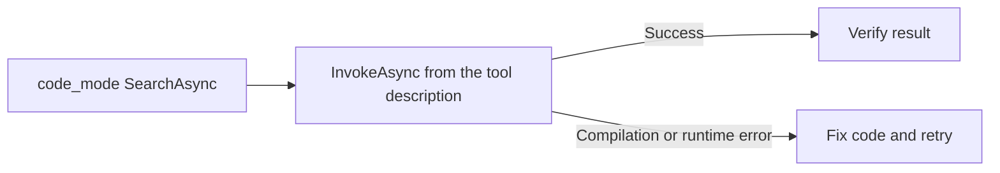
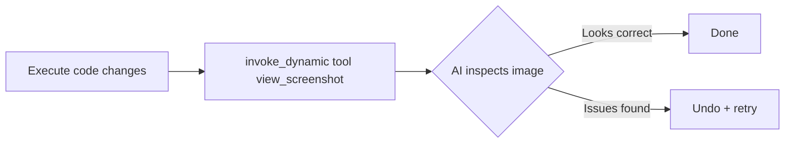
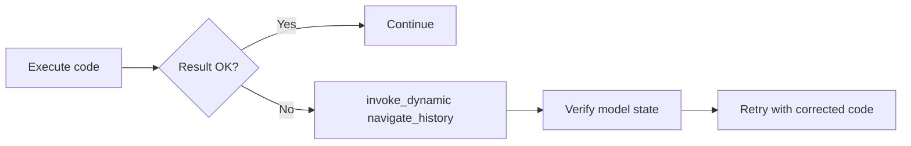
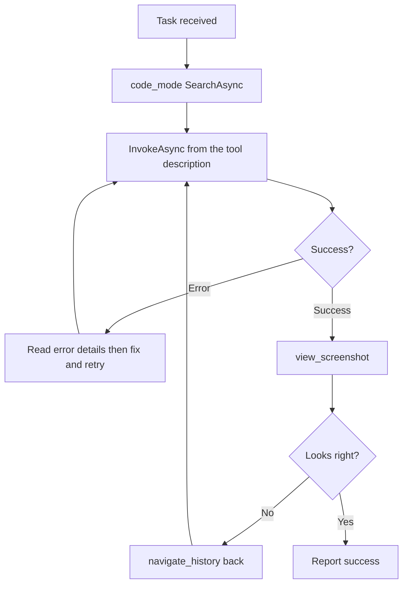

# MCP Workflow Patterns

Practical patterns for AI agents using RevitDevTool MCP tools.

---

## Workflow: Code Execution (Create/Read/Update/Delete)


```mermaid
flowchart LR
    A[code_mode SearchAsync] --> B[InvokeAsync from the tool description]
    B -->|Success| E[Verify result]
    B -->|Compilation or runtime error| F[Fix code and retry]
```

### Key Points

- Discover host targets with `search_dynamic` (each hit includes opaque `id` and `processId`)
- Read resources via `invoke_dynamic` with the resource/template `id` from search
- Execute tools via `invoke_dynamic` with the tool `id` and `arguments`
- Error responses are categorized: `[COMPILATION ERROR]`, `[RUNTIME ERROR]`, `[ROLLBACK]`

---

## Workflow: Vision (Verify Visual Results)


```mermaid
flowchart LR
    A[Execute code changes] --> B[invoke_dynamic tool view_screenshot]
    B --> C{AI inspects image}
    C -->|Looks correct| D[Done]
    C -->|Issues found| E[Undo + retry]
```

---

## Workflow: Undo (Recover from Mistakes)


```mermaid
flowchart LR
    A[Execute code] --> B{Result OK?}
    B -->|Yes| C[Continue]
    B -->|No| D[invoke_dynamic navigate_history]
    D --> E[Verify model state]
    E --> F[Retry with corrected code]
```

### Key Points

- `navigate_history`: `direction="back"|"forward"`, `steps=N`
- Use `search_dynamic(processId=…)` when multiple host processes are connected

---

## Workflow: Full Development Loop


```mermaid
flowchart TD
    Start[Task received] --> Search[code_mode SearchAsync]
    Search --> Code[InvokeAsync from the tool description]
    Code --> Check{Success?}
    Check -->|Error| Fix[Read error details then fix and retry]
    Fix --> Code
    Check -->|Success| Verify[view_screenshot]
    Verify --> Visual{Looks right?}
    Visual -->|No| Undo[navigate_history back]
    Undo --> Code
    Visual -->|Yes| Done[Report success]
```

---

## Token Efficiency Tips

1. **search_dynamic is local** — repeated searches do not open host pipes
2. **The execute tool description has the entry pattern** — start from that description.
3. **Read model context before each operation** — live and cheap
4. **Do not expect external tool list changes** — `ProcessCatalogs` refreshes internally only
5. **Structured errors save retries** — read the error category before regenerating code

---

## Multi-Instance Scenarios

```json
{
  "name": "code_mode",
  "arguments": {
    "code": "var matched = await SearchAsync(\"execute\"); return await InvokeAsync(matched[0].Name, new { code = \"...\" }, matched[0].ProcessId);"
  }
}
```

Use `list_processes` to see process ids. `code_mode` searches and calls the host.

---

## Related

- In-host dispatch: `docs/architecture/Execution/mcp-dispatch.md`
- Daemon architecture: `docs/architecture/MCP/daemon.md`
- Transport modes: `docs/architecture/MCP/transport.md`
