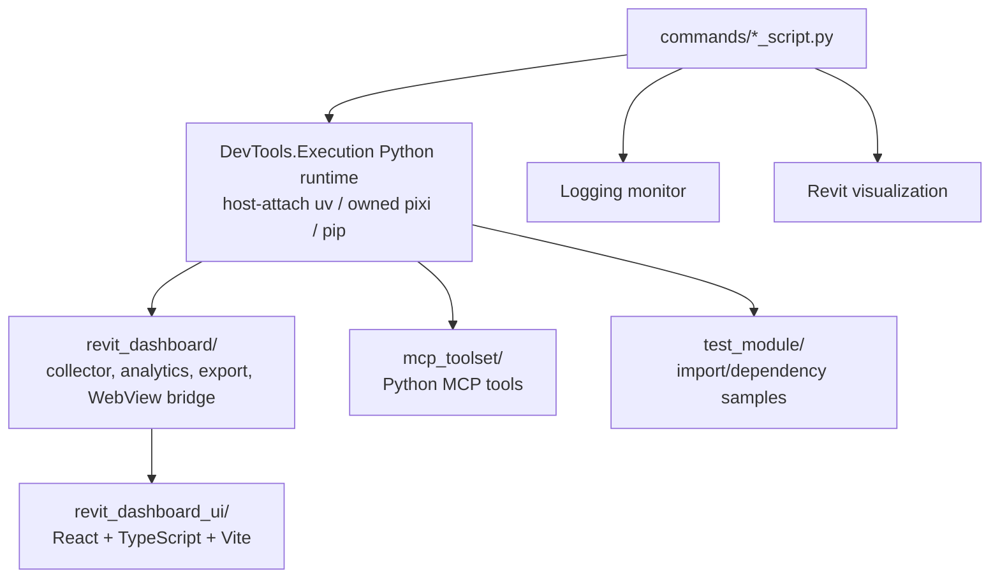

# PythonDemo Architecture

`samples/PythonDemo/` demonstrates the Python runtime, PEP 723 dependency resolution, logging, visualization, WebView2 dashboard patterns, and Python MCP toolsets.

Last updated: 2026-05-29

---

## Source Map

| Area | Path |
|------|------|
| Entry scripts | `samples/PythonDemo/commands/` |
| Dashboard backend | `samples/PythonDemo/revit_dashboard/` |
| Dashboard frontend | `samples/PythonDemo/revit_dashboard_ui/` |
| Python MCP toolset | `samples/PythonDemo/mcp_toolset/` |
| Import/dependency test module | `samples/PythonDemo/test_module/` |

---

## Component Map



---

## Entry Scripts

`commands/` contains the executable script entries discovered by `ScriptExecutionProvider`.

| Script | Purpose |
|--------|---------|
| `dashboard_script.py` | Launches the WebView2 dashboard sample. |
| `data_analysis_script.py` | Polars/data-analysis demo. |
| `debugpy_script.py` | Debugger integration demo. |
| `export_data_script.py` | Excel export demo. |
| `fcl_script.py` | Geometry/collision dependency demo. |
| `logging_batch_script.py` | Logging stress sample. |
| `logging_format_script.py` | Logging format/severity sample. |
| `modeless_script.py` | Modeless UI sample. |
| `module_test_script.py` | Multi-file import/dependency sample. |
| `pipe_bridge_script.py` | Named-pipe bridge sample. |
| `selectionfilter_script.py` | Revit API interface sample. |
| `shapely_script.py` | 2D geometry dependency sample. |
| `sklearn_script.py` | ML dependency sample. |
| `trimesh_script.py` | 3D mesh dependency sample. |
| `visualization_curve_script.py` | Revit curve visualization. |
| `visualization_solid_script.py` | Revit solid visualization. |
| `visualization_xyz_script.py` | Revit point visualization. |

---

## Dashboard Backend

`revit_dashboard/` is the Python backend used by `dashboard_script.py`.

| Folder | Role |
|--------|------|
| `analytics/engine.py` | Builds analytics payloads. |
| `contracts/payload.py` | Payload contracts exchanged with the frontend. |
| `core/event_queue.py` | Queue/event support. |
| `data/` | Category, collector, heavy-family, and warning data helpers. |
| `export/excel_exporter.py` | Excel export path. |
| `presentation/bridge.py` | Python to WebView bridge. |
| `presentation/webview_host.py` | WebView host integration. |
| `revit_api/handler.py` | Revit API interaction layer. |
| `runner.py` | Dashboard runner orchestration. |

---

## Dashboard Frontend

`revit_dashboard_ui/` is a Vite application.

| Technology | Current role |
|------------|--------------|
| React 19 | UI runtime |
| TypeScript 5.9 | Type checking |
| Vite 7 | Build/dev tooling |
| Recharts 3 | Charts |
| Semi UI, Radix UI, lucide-react | UI controls/icons |
| Tailwind CSS 4 | Styling pipeline |

Quality gates:

```powershell
npm run quality
npm run build
```

---

## Python MCP Toolset

`mcp_toolset/` contains parser samples and a larger Revit-oriented Python MCP toolset.

Key folders:

- `tools/` - MCP tool functions grouped by domain.
- `services/` - Revit/API service logic behind tools.
- `dto/` - DTO contracts.
- `shared/` - common responses, constants, transactions, element helpers.
- `parser_annotation_sample.py` and `parser_lowlevel_sample.py` - parser coverage samples.

---

## Test Module

`test_module/` demonstrates multi-file Python imports and plugin-style dependency structure. It is a sample for script dependency behavior, not a deep test suite.

---

## Related Docs

- `docs/architecture/Execution/README.md`
- `docs/architecture/MCP/README.md`
- `docs/architecture/Logging/README.md`
- `docs/architecture/Visualization/README.md`
