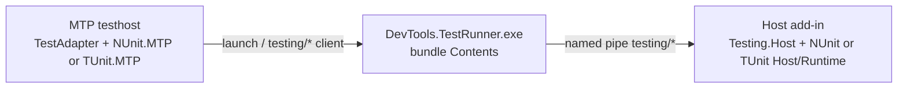

# Host Testing Architecture

In-host tests use Microsoft.Testing.Platform. Testhost discovery is local;
execution goes through `DevTools.TestRunner` into the host `testing/*`
handler. NUnit is the default provider; TUnit is supported on Revit and
AutoCAD-family hosts.

Product: [`host-testing.md`](../../product/host-testing.md),
[`tunit-host-testing.md`](../../product/tunit-host-testing.md).
Agent digest: [`host-testing.md`](../../agents/host-testing.md).

Last updated: 2026-08-29

---

## Source Map

| Area | Path |
|------|------|
| Neutral contracts, `HostTestConfig`, `TestingRunTraceScope` | `source/DevTools.Testing.Abstractions/` |
| Shared discovery-refs / isolated testhost load | `source/DevTools.Testing.Abstractions/Loading/` |
| `testing/*` JSON + Runner process client | `source/DevTools.Testing.Transport/` |
| In-host `testing/*` handler + generation store | `source/DevTools.Testing.Host/` (`MarshaledTestRequestHandler` → `DotnetTestRequestHandler`) |
| Runtime folder resolve + generation file classify | `source/DevTools.Testing.Host/Loading/` |
| Published MTP adapter, plugin load (`HostMtpRegistration`) | `source/DevTools.TestAdapter/` |
| Local NUnit `ExploreTests` (testhost sibling DLL) | `source/DevTools.NUnit.MTP/` |
| In-host NUnit engine | `source/DevTools.NUnit.Runtime/` |
| NUnit closure / filter / generation policy | `source/DevTools.NUnit.Host/` |
| Local TUnit catalog (`Sources.TestEntries`) | `source/DevTools.TUnit.MTP/` |
| In-host TUnit.Engine library call | `source/DevTools.TUnit.Runtime/` |
| TUnit generation / ALC provider | `source/DevTools.TUnit.Host/` |
| Runner CLI + composition | `source/DevTools.TestRunner/`, `source/DevTools.TestRunner.Core/` |
| Runner IDE attach (Visual Studio EnvDTE only) | `source/DevTools.TestRunner.Core/Debugging/` |
| Spawned-host cancel (MTP testhost exit during launch wait) | `DebugHostLifetime`, `HostLaunchWaiter.TerminateIfIncomplete` |

`DevTools.Testing.*` must not reference `DevTools.NUnit.*` or `DevTools.TUnit.*`.
Each provider owns discovery, identity, filters, and in-host execution. See
[0021](../../decisions/0021-testing-kernel-and-provider-owned-framework-runtime.md)
and [0022](../../decisions/0022-nunit-mtp-only-testing-stack.md).

---

## Two release artifacts

Installer `build/Modules/*` does **not** pack or publish the test adapter.

| Artifact | Ships | Command / workflow |
|----------|--------|--------------------|
| NuGet `RevitDevTool.TestAdapter` | Adapter + private `build/runtime` closure + `DevTools.NUnit.MTP.dll` + `DevTools.TUnit.MTP.dll` | `scripts/pack-test-adapter.ps1` · `PublishTestAdapter.yml` |
| Host installer / bundle | Add-in, `Testing.Host`, NUnit and TUnit Host/Runtime, `DevTools.TestRunner.exe` | `scripts/pack.ps1` · `build/Modules/*` · `PublishRelease.yml` |

- Bump `<Version>` in `DevTools.TestAdapter.csproj` before `PublishTestAdapter.yml`. Independent of installer GitVersion.
- Only TestAdapter is packable. MTP, Runtime, Host, Abstractions, and Transport are `IsPackable=false`.
- Changing Host/Runtime/Runner needs an installer deploy. Changing testhost discovery or launch options needs a TestAdapter pack.

---

## Adapter pack

`source/DevTools.TestAdapter/DevTools.TestAdapter.csproj` is the pack entry.
Consumer copy/layout lives in `build/RevitDevTool.TestAdapter.targets`.

### Nupkg layout

- `lib/{tfm}/DevTools.TestAdapter.dll` — MTP compile surface (Ipc + Transport merged in; net48 also merges STJ BCL).
- `build/runtime/{tfm}/` — `DevTools.NUnit.MTP.dll`, `DevTools.TUnit.MTP.dll`, `DevTools.Testing.Abstractions.dll` (shared `HostTestDiscovery`). Same three files on net48, net8, and net10.
- Testhost 3rd-party BCL comes from the consumer `Microsoft.Testing.Platform.MSBuild` graph plus net48 binding redirects, not from this nupkg.

### Pipeline (`scripts/pack-test-adapter.ps1`)

```text
restore TestAdapter (Abstractions, Transport, Ipc)
restore NUnit.MTP and TUnit.MTP for all TFMs (do not pass TargetFramework)
build NUnit.MTP and TUnit.MTP -c Release (net48 + net8 + net10)
pack TestAdapter --no-restore
  copies existing MTP.dll per TFM
```

Not in this graph: `Testing.Host`, `NUnit.Host`, `NUnit.Runtime` as a built
project, `DevTools.TestRunner`. Runtime sources are Compile-linked into MTP.

### Constraints

- Do not add `TestAdapter` → `NUnit.MTP` `ProjectReference`. MTP is a testhost
  sibling so net48 ILRepack cannot merge it and testhost binds the consumer
  NUnit copy. In-repo test projects may reference MTP with
  `ReferenceOutputAssembly=false` for build order only.
- Do not `ProjectReference` TestAdapter from MTP. Testhost must share
  `HostTestDiscovery` from Abstractions; a merged adapter copy is CS0234 /
  CS0433 on net48.
- Restore TestAdapter alone does not write `NUnit.MTP/obj/project.assets.json`
  (`NETSDK1004`).
- Pack runs per TestAdapter TFM in parallel. An inner MTP Restore inherits
  `TargetFramework` and rewrites `project.assets.json` for one TFM
  (`NETSDK1005`, typically missing `net48`). Inner Restore must
  `RemoveProperties=TargetFramework`. Prefer building all MTP TFMs in the
  pack script before `dotnet pack`.
- Keep `AppendTargetFrameworkToOutputPath=true` on packable multi-TFM testing
  projects.
- `CopyMTPSibling` copies MTP and Abstractions only from `build/runtime`
  (the nupkg layout). In-repo `_StagePackageRuntime` fills that folder with
  sibling MTP output (`bin\Debug|Release\$(TargetFramework)\`) and Abstractions.
  Ipc/Transport are ILRepacked into the adapter on every TFM. Sibling copy
  always overwrites the selected MTP (`SkipUnchangedFiles=false`).

---

## Runtime split



Testhost never loads Autodesk APIs. Host execution stays in the add-in.

`testing/run` is marshaled onto the host idle thread. `ExecuteAsync` must not
take the pipe-disconnect token (same as pytest `tests/run`). Cancelling that
dispatcher Task while a test is frozen at a breakpoint leaves idle work
running and parks later `testing/run` because `ExternalEvent` is still
pending. Disconnect still cancels the request CTS, but the pipe server does
not dispose it until in-flight `OnMessageReceived` finishes. `testing/hello`
resets a Completed/Poisoned session so a new client is not stuck.

### Adapter bootstrap

`TestingPlatformBuilderHook` only calls `AdapterBootstrap.Initialize`.
`AdapterTestConfig.TryReadPluginConfig()` reads `devtools.frameworkId`,
`devtools.mtpAssembly`, and `devtools.mtpEntry` from `testconfig.json` or
`[EntryAssembly].testconfig.json`. Missing or partial keys set
`HostMtpRegistration.LastError` and **must not throw** from the hook static
constructor. Empty `frameworkId` on run publishes a
`devtools.testadapter.run` error node (no `nunit` default).

MSBuild writes those keys from:

| Property | `testconfig` key | First-party default when empty |
|----------|------------------|--------------------------------|
| `TestingFramework` | `frameworkId` | `nunit` (props) |
| `MTPAssembly` | `mtpAssembly` | `nunit` → `DevTools.NUnit.MTP.dll`; `tunit` → `DevTools.TUnit.MTP.dll` |
| `MTPEntry` | `mtpEntry` | `nunit` → `DevTools.NUnit.MTP.NUnitMTP`; `tunit` → `DevTools.TUnit.MTP.TUnitMTP` |

`HostMtpRegistration` (TestAdapter) loads the configured sibling file name
beside the testhost. `mtpAssembly` must be a bare file name. There is no C#
`switch` on `nunit` / `tunit` in Abstractions. Packaged copy of an unmapped
`MTPAssembly` is skipped unless the file exists in the package
runtime dir. Sibling copy Errors when the DLL is missing from `build/runtime`
and `$(OutDir)` (override with `MTPCopy=false`).

A user-authored `testconfig.json` with a `devtools` section must already
contain `frameworkId`, `mtpAssembly`, and `mtpEntry` or the merge errors.
See [0024](../../decisions/0024-testing-core-open-closed-providers.md).

`Register` assigns both `HostTestDiscovery.Provider` (`IHostTestDiscoverer`)
and `HostTestDiscovery.RunMapper` (`IHostTestRunMapper`). There is no
framework catalog type and no “try TUnit then NUnit” probe. Load/register
failures must not throw from the hook static constructor.

The adapter publishes MTP `TestNode` / `TestMethodIdentifierProperty` from
`TestingDiscoveredTest` fields (`MethodArity` is the generic-method arity for
that property). NUnit identity (display names, source-bindable `TypeName`,
collapsed host filter XML, result fold) lives on `IHostTestDiscoverer` /
`IHostTestRunMapper` in `DevTools.NUnit.MTP`. TUnit identity expansion lives
in `DevTools.TUnit.Runtime` (`TUnitCatalog` / `TUnitExpansion` /
`TUnitTestIdentity`); testhost compile-links those files into `TUnit.MTP`.
The adapter must not parse NUnit `FullName` or TUnit Engine UIDs.

NUnit ExploreTests is host-free and must not read `testconfig.json` **host**
options (`hostName`, `forceLaunch`, …). Plugin keys (`frameworkId`,
`mtpAssembly`, `mtpEntry`) are adapter bootstrap only.

### Host generation

Each provider owns a generation policy (`NUnitGenerationPolicy`,
`TUnitGenerationPolicy`) with runtime folder/DLL names. Shared helpers on
public `TestingGenerationFiles` (Host): `Classify`, `ScanOutputDirectory`,
`IsSharedTestingContract`, `TryGetManagedAssemblyIdentity`,
`IsManagedAssembly`, `TryGetFileVersion`, `ContentEquals`, `MergeFile`,
`NormalizeRelativePath`, `GetRelativePath`, `IsVolatileGenerationOutput`.
`TestingGenerationPaths` is internal. Providers register with
`TryAddEnumerable<IHostTestFrameworkProvider>` and own their
`TestingGenerationStore` / session factory. Do not register those kernel
types as unkeyed singletons from a provider extension.

Do not add a shared runtime-descriptor catalog. Policy constants stay on the
provider type. NUnit/TUnit Host consume the solution `Polyfill` global package
on every TFM (`PolyUseEmbeddedAttribute` in `Directory.Build.props` so net48
does not CS0121 against `DevTools.Testing.Host`). TUnit's own polyfills stay off
(`EnableTUnitPolyfills=false`).

Each provider uses two targets files: `*RuntimePayload.targets` (Runtime owns
a payload folder) then `*HostPackaging.targets` (add-in copies that folder to
`NUnitRuntime\` / `TUnitRuntime\`). NUnit payload excludes host-owned
JSON/Ipc/Isolation/Abstractions. TUnit copies its full private closure
(CPM STJ). On net48, isolated resolve binds TUnit.Engine's STJ 9 request
onto that newer payload copy (`NetfxBclBind`). Host still ILRepacks STJ 10.

### Test output

`TestingRunTraceScope` buffers `Trace` / `Debug` per case. NUnit and TUnit
merge that buffer with framework Console into `CaseResult.Output` (IDE) and
write Console through to process `Trace` (pane). See [0017](../../decisions/0017-nunit-host-test-output-routing.md).
