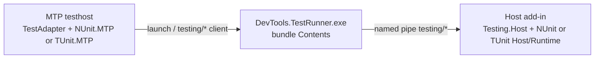

# Host Testing Architecture

In-host tests use Microsoft.Testing.Platform. Testhost discovery is local;
execution goes through `DevTools.TestRunner` into the host `testing/*`
handler. NUnit is the default provider; TUnit is supported on Revit and
AutoCAD-family hosts.

Product: [`host-testing.md`](../../product/host-testing.md),
[`tunit-host-testing.md`](../../product/tunit-host-testing.md).
Agent digest: [`host-testing.md`](../../agents/host-testing.md).

Last updated: 2026-09-09

---

## Source Map

| Area | Path |
|------|------|
| Neutral contracts, `HostTestConfig`, `TestingRunTraceScope` | `source/DevTools.Testing.Abstractions/` |
| Shared discovery-refs / isolated testhost load | `source/DevTools.Testing.Abstractions/Loading/` |
| `testing/*` JSON + Runner process client | `source/DevTools.Testing.Transport/` |
| In-host `testing/*` handler + generation store | `source/DevTools.Testing.Host/` (`MarshaledTestRequestHandler` → `DotnetTestRequestHandler`) |
| Runtime folder resolve + generation file classify | `source/DevTools.Testing.Host/Loading/` |
| Published MTP adapter, plugin load (`HostMtpRegistration`) | `source/DevTools.TestAdapter/` |
| Local NUnit `ExploreTests` (testhost sibling DLL) | `source/DevTools.NUnit.MTP/` |
| In-host NUnit engine | `source/DevTools.NUnit.Runtime/` |
| NUnit closure / filter / generation policy | `source/DevTools.NUnit.Host/` |
| Local TUnit catalog (`Sources.TestEntries`) | `source/DevTools.TUnit.MTP/` |
| In-host TUnit.Engine library call | `source/DevTools.TUnit.Runtime/` |
| TUnit generation / ALC provider | `source/DevTools.TUnit.Host/` |
| Runner CLI + composition | `source/DevTools.TestRunner/`, `source/DevTools.TestRunner.Core/` |
| Runner IDE attach (Visual Studio EnvDTE only) | `source/DevTools.TestRunner.Core/Debugging/` |
| Spawned-host cancel (MTP testhost exit during launch wait) | `DebugHostLifetime`, `HostLaunchWaiter.TerminateIfIncomplete` |

`DevTools.Testing.*` must not reference `DevTools.NUnit.*` or `DevTools.TUnit.*`.
Each provider owns discovery, identity, filters, and in-host execution. See
[0021](../../decisions/0021-testing-kernel-and-provider-owned-framework-runtime.md)
and [0022](../../decisions/0022-nunit-mtp-only-testing-stack.md).

---

## Two release artifacts

Installer `build/Modules/*` does **not** pack or publish the test adapter.

| Artifact | Ships | Command / workflow |
|----------|--------|--------------------|
| NuGet `RevitDevTool.TestAdapter` | Adapter + private `build/runtime` closure + `DevTools.NUnit.MTP.dll` + `DevTools.TUnit.MTP.dll` | `scripts/pack-test-adapter.ps1` · `PublishTestAdapter.yml` |
| Host installer / bundle | Add-in, `Testing.Host`, NUnit and TUnit Host/Runtime, `DevTools.TestRunner.exe` | `scripts/pack.ps1` · `build/Modules/*` · `PublishRelease.yml` |

- Bump `<Version>` in `DevTools.TestAdapter.csproj` before `PublishTestAdapter.yml`. Independent of installer GitVersion.
- Only TestAdapter is packable. MTP, Runtime, Host, Abstractions, and Transport are `IsPackable=false`.
- Changing Host/Runtime/Runner needs an installer deploy. Changing testhost discovery or launch options needs a TestAdapter pack.

---

## Adapter pack

`source/DevTools.TestAdapter/DevTools.TestAdapter.csproj` is the pack entry.
Consumer copy/layout lives in `build/RevitDevTool.TestAdapter.targets`.

### Nupkg layout

- `lib/{tfm}/DevTools.TestAdapter.dll` — MTP compile surface (Ipc + Transport merged in; net48 also merges STJ BCL).
- `build/runtime/{tfm}/` — `DevTools.NUnit.MTP.dll`, `DevTools.TUnit.MTP.dll`, `DevTools.Testing.Abstractions.dll` (shared `HostTestDiscovery`). Same three files on net48, net8, and net10.
- Testhost 3rd-party BCL comes from `Microsoft.Testing.Platform.MSBuild` 2.4.0 plus net48 binding redirects, not from this nupkg. The adapter csproj references it with `PrivateAssets=none` (NuGet's default `PrivateAssets` would drop build assets from the nuspec) and with **all** assets (`include="All"` in the nuspec) so pack writes a dependency that restores both testhost generation and `Microsoft.Testing.Platform.dll` — an NUnit-only consumer has no other source of the MTP runtime. `RepackBinariesExcludes` keeps those testhost DLLs out of the merged adapter. `DevTools.TestAdapter.Tests` uses `ProjectReference` `PrivateAssets=all` plus a direct Abstractions reference so that graph does not flow into xunit. Other PackageReference / ProjectReference stay `PrivateAssets=all`. Testhost BCL is not packed as files.

### Pack order (`scripts/pack-test-adapter.ps1`)

```text
1. restore TestAdapter (Abstractions, Transport, Ipc)
2. restore NUnit.MTP + TUnit.MTP for all TFMs (never pass TargetFramework)
3. build NUnit.MTP + TUnit.MTP -c Release (net48 + net8 + net10)
4. pack TestAdapter --no-restore
     lib/{tfm}            ILRepacked adapter
     build/runtime/{tfm}  MTP siblings + Abstractions (existing DLLs, per TFM)
     build/*.props|targets consumer build files
```

Not in this graph: `Testing.Host`, `NUnit.Host`, `NUnit.Runtime` as a built
project, `DevTools.TestRunner`. Runtime sources are Compile-linked into MTP.

### Consumer build order (`build/RevitDevTool.TestAdapter.targets`)

```text
0. TestingFramework -> MTPAssembly / MTPEntry   property map (see table below)
1. _ResolveRuntimeDir                           pick build/runtime/{tfm}
2. CopyMTPSibling      AfterTargets=Build       MTPAssembly + Abstractions -> $(OutDir)
3. WriteDiscoveryRefs  AfterTargets=Build       $(TargetName).discovery-refs.txt
4. GenerateTestConfig  BeforeTargets=BeforeBuild  -> $(AssemblyName).testconfig.json
```

### Package independence

The two packed files must stay free of consumer build settings: no
`$(Configuration)` sniffing, no repo-relative paths, no `RuntimeIdentifier`, no
`ProjectReference`. `Packed_build_files_do_not_depend_on_the_consumer_configuration`
(TestAdapter.Tests) enforces that, and `AssertPackageClosure` asserts the nupkg
ships only `build/RevitDevTool.TestAdapter.props|targets` plus the net4x source
shim `build/netfx/ModuleInitializerAttribute.cs`.

`build/RevitDevTool.TestAdapter.Local.targets` holds everything that does know
this repo — `DevToolsTestAdapterLocal` (relaxes the missing-runtime Error), the
`_MTPConfiguration` mapping from `Debug.Autodesk.YYYY` to `Debug`/`Release`, MTP
build-order `ProjectReference`s, and `_StagePackageRuntime`. It is not packed;
the packaged targets import it only when the file exists next to them.

One setting stays with the consumer because the package cannot set it:

- `net48`: `<RuntimeIdentifier>win-x64</RuntimeIdentifier>`. The test project is
  an `Exe`, and NuGet restore does not read a RID from `build/*.props`, so
  restore writes the RID-less target while the build asks for a RID one
  (`NETSDK1047`).

TUnit on `net48` needs `[ModuleInitializer]`, which .NET Framework does not
declare. TUnit injects `Polyfill` from its own targets, and restore never reads
package targets, so that reference resolves to nothing (`CS0234`) or duplicates a
`Polyfill` the project already has (`NU1504`). The package therefore defaults
`EnableTUnitPolyfills=false` in `build/*.props` and the
`NetFxModuleInitializer` target compiles
`build/netfx/ModuleInitializerAttribute.cs` into net4x TUnit projects. It backs
off when a `PackageReference`/`GlobalPackageReference` named `Polyfill` or another
`ModuleInitializerAttribute.cs` is already in the compilation; set
`NetFxModuleInitializer=false` to opt out entirely. Consumer cases:
[tunit-host-testing.md](../../product/tunit-host-testing.md).

In-repo samples use the `ProjectReference` path, where the adapter's private
`Microsoft.Testing.Platform` reference does not flow; the NUnit samples add that
`PackageReference` themselves. NuGet consumers get it from the
`RevitDevTool.TestAdapter` → `Microsoft.Testing.Platform.MSBuild` dependency.

Consumer shapes proven by the two verify paths — `scripts/test-adapter-matrix.ps1`
(in-repo samples, net48 / net8 / net10) and `PackageConsumerTests` (packed nupkg,
same three runtimes, NUnit and TUnit): central package management,
`TreatWarningsAsErrors`, a repo-wide `EnableDynamicLoading=true` (the package
forces `false` for the testhost), `AppendTargetFrameworkToOutputPath=false` under
`Debug|Release.Autodesk.YYYY`, and `-windows10.0.19041.0` platform variants.

### Constraints

- Do not add `TestAdapter` → `NUnit.MTP` `ProjectReference`. MTP is a testhost
  sibling so net48 ILRepack cannot merge it and testhost binds the consumer
  NUnit copy. In-repo test projects may reference MTP with
  `ReferenceOutputAssembly=false` for build order only.
- Do not `ProjectReference` TestAdapter from MTP. Testhost must share
  `HostTestDiscovery` from Abstractions; a merged adapter copy is CS0234 /
  CS0433 on net48.
- Restore TestAdapter alone does not write `NUnit.MTP/obj/project.assets.json`
  (`NETSDK1004`).
- Pack runs per TestAdapter TFM in parallel. An inner MTP Restore inherits
  `TargetFramework` and rewrites `project.assets.json` for one TFM
  (`NETSDK1005`, typically missing `net48`). Inner Restore must
  `RemoveProperties=TargetFramework`. Prefer building all MTP TFMs in the
  pack script before `dotnet pack`.
- Keep `AppendTargetFrameworkToOutputPath=true` on packable multi-TFM testing
  projects.
- `CopyMTPSibling` copies MTP and Abstractions only from `build/runtime`
  (the nupkg layout). In-repo `_StagePackageRuntime` fills that folder from
  sibling MTP output (`bin\Debug|Release\$(TargetFramework)\`). Ipc/Transport are
  ILRepacked into the adapter on every TFM. Sibling copy always overwrites the
  selected MTP (`SkipUnchangedFiles=false`): a timestamp-stale sibling shows up
  as "0 Tests found".

---

## Runtime split



Testhost never loads Autodesk APIs. Host execution stays in the add-in.

`testing/run` is marshaled onto the host idle thread. `ExecuteAsync` must not
take the pipe-disconnect token (same as pytest `tests/run`). Cancelling that
dispatcher Task while a test is frozen at a breakpoint leaves idle work
running and parks later `testing/run` because `ExternalEvent` is still
pending. Disconnect still cancels the request CTS, but the pipe server does
not dispose it until in-flight `OnMessageReceived` finishes. `testing/hello`
resets a Completed/Poisoned session so a new client is not stuck.

### Adapter bootstrap

`TestingPlatformBuilderHook` only calls `AdapterBootstrap.Initialize`.
`AdapterTestConfig.TryReadPluginConfig()` reads `devtools.frameworkId`,
`devtools.mtpAssembly`, and `devtools.mtpEntry` from `testconfig.json` or
`[EntryAssembly].testconfig.json`. Missing or partial keys set
`HostMtpRegistration.LastError` and **must not throw** from the hook static
constructor. Empty `frameworkId` on run publishes a
`devtools.testadapter.run` error node (no `nunit` default).

MSBuild writes those keys from:

| Property | `testconfig` key | First-party default when empty |
|----------|------------------|--------------------------------|
| `TestingFramework` | `frameworkId` | `nunit` (props) |
| `MTPAssembly` | `mtpAssembly` | `nunit` → `DevTools.NUnit.MTP.dll`; `tunit` → `DevTools.TUnit.MTP.dll` (targets) |
| `MTPEntry` | `mtpEntry` | `nunit` → `DevTools.NUnit.MTP.NUnitMTP`; `tunit` → `DevTools.TUnit.MTP.TUnitMTP` (targets) |

The `TestingFramework` → `MTPAssembly` / `MTPEntry` map must stay in the
**targets**. NuGet imports `build/*.props` from `Microsoft.Common.props`, before
the consumer `PropertyGroup`, so mapping in the props pinned every packaged
consumer to NUnit even with `<TestingFramework>tunit</TestingFramework>`.

`RuntimeAssemblyResolver.EnsureRegistered` attaches `AssemblyResolve` **before**
reading discovery refs. `build/runtime` siblings are copied next to the testhost
but are absent from the consumer `deps.json`, so on .NET they load only through
that handler — and `DiscoveryRefs` itself lives in Abstractions. Touching
Abstractions first fails the JIT of the registering method and leaves the process
with no resolver (`FileNotFoundException: DevTools.Testing.Abstractions`).

`HostMtpRegistration` (TestAdapter) loads the configured sibling file name
beside the testhost. `mtpAssembly` must be a bare file name. There is no C#
`switch` on `nunit` / `tunit` in Abstractions. Packaged copy of an unmapped
`MTPAssembly` is skipped unless the file exists in the package
runtime dir. Sibling copy Errors when the DLL is missing from `build/runtime`
and `$(OutDir)` (override with `MTPCopy=false`).

A user-authored `testconfig.json` with a `devtools` section must already
contain `frameworkId`, `mtpAssembly`, and `mtpEntry` or the merge errors.
See [0024](../../decisions/0024-testing-core-open-closed-providers.md).

`Register` assigns both `HostTestDiscovery.Provider` (`IHostTestDiscoverer`)
and `HostTestDiscovery.RunMapper` (`IHostTestRunMapper`). There is no
framework catalog type and no “try TUnit then NUnit” probe. Load/register
failures must not throw from the hook static constructor.

The adapter publishes MTP `TestNode` / `TestMethodIdentifierProperty` from
`TestingDiscoveredTest` fields (`MethodArity` is the generic-method arity for
that property). NUnit identity (display names, source-bindable `TypeName`,
collapsed host filter XML, result fold) lives on `IHostTestDiscoverer` /
`IHostTestRunMapper` in `DevTools.NUnit.MTP`. TUnit identity expansion lives
in `DevTools.TUnit.Runtime` (`TUnitCatalog` / `TUnitExpansion` /
`TUnitTestIdentity`); testhost compile-links those files into `TUnit.MTP`.
The adapter must not parse NUnit `FullName` or TUnit Engine UIDs.

NUnit ExploreTests is host-free and must not read `testconfig.json` **host**
options (`hostName`, `forceLaunch`, …). Plugin keys (`frameworkId`,
`mtpAssembly`, `mtpEntry`) are adapter bootstrap only.

### Host generation

Each provider owns a generation policy (`NUnitGenerationPolicy`,
`TUnitGenerationPolicy`) with runtime folder/DLL names. Shared helpers on
public `TestingGenerationFiles` (Host): `Classify`, `ScanOutputDirectory`,
`IsSharedTestingContract`, `TryGetManagedAssemblyIdentity`,
`IsManagedAssembly`, `TryGetFileVersion`, `ContentEquals`, `MergeFile`,
`NormalizeRelativePath`, `GetRelativePath`, `IsVolatileGenerationOutput`.
`TestingGenerationPaths` is internal. Providers register with
`TryAddEnumerable<IHostTestFrameworkProvider>` and own their
`TestingGenerationStore` / session factory. Do not register those kernel
types as unkeyed singletons from a provider extension.

### AutoCAD-family launch

Family hosts share `acad.exe`. The vertical is selected by argv
(`AcadArgumentBuilder` `/product` + Civil `/ld` `/p`), not a different
executable. Discovery reads `HKLM\SOFTWARE\Autodesk\AutoCAD\*\InstalledProducts`:
default value is the install dir, subkeys are product codes (`C3D`, `PLNT3D`,
`ACAD`, …). Year comes from the folder name (`AutoCAD 2026`), floored at
`HostVersions.AutodeskMinimal`. `HostName` must be that vertical so the runner waits for
`DevTools_{Plant3D|Civil3D}_*`.

Do not add a shared runtime-descriptor catalog. Policy constants stay on the
provider type. NUnit/TUnit Host consume the solution `Polyfill` global package
on every TFM (`PolyUseEmbeddedAttribute` in `Directory.Build.props` so net48
does not CS0121 against `DevTools.Testing.Host`). TUnit's own polyfills stay off
(`EnableTUnitPolyfills=false`).

Each provider uses two targets files: `*RuntimePayload.targets` (Runtime owns
a payload folder) then `*HostPackaging.targets` (add-in copies that folder to
`NUnitRuntime\` / `TUnitRuntime\`). NUnit payload excludes host-owned
JSON/Ipc/Isolation/Abstractions. TUnit copies its full private closure
(CPM STJ). On net48, isolated resolve binds TUnit.Engine's STJ 9 request
onto that newer payload copy (`NetfxClosureBind`). Host still ILRepacks STJ 10.

### Test output

`TestingRunTraceScope` buffers `Trace` / `Debug` per case. NUnit and TUnit
merge that buffer with framework Console into `CaseResult.Output` (IDE) and
write Console through to process `Trace` (pane). See [0017](../../decisions/0017-nunit-host-test-output-routing.md).
