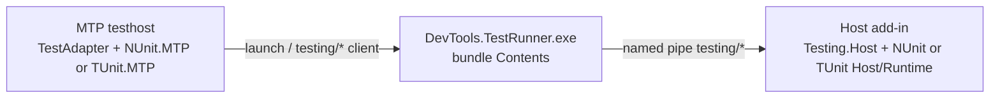

# Host Testing Architecture

In-host tests use Microsoft.Testing.Platform. Testhost discovery is local;
execution goes through `DevTools.TestRunner` into the host `testing/*`
handler. NUnit is the default provider; TUnit is Revit-only.

Product: [`nunit-host-testing.md`](../../product/nunit-host-testing.md),
[`tunit-host-testing.md`](../../product/tunit-host-testing.md).
Agent digest: [`nunit-host-testing.md`](../../agents/nunit-host-testing.md).

Last updated: 2026-08-22

---

## Source Map

| Area | Path |
|------|------|
| Neutral contracts, `HostTestConfig`, MTP plugin load | `source/DevTools.Testing.Abstractions/` |
| Shared discovery-refs / isolated testhost load | `source/DevTools.Testing.Abstractions/Loading/` |
| `testing/*` JSON + Runner process client | `source/DevTools.Testing.Transport/` |
| In-host `testing/*` handler + generation store | `source/DevTools.Testing.Host/` |
| Runtime folder resolve + generation file classify | `source/DevTools.Testing.Host/Loading/` |
| Published MTP adapter (`RevitDevTool.TestAdapter`) | `source/DevTools.TestAdapter/` |
| Local NUnit `ExploreTests` (testhost sibling DLL) | `source/DevTools.NUnit.MTP/` |
| In-host NUnit engine | `source/DevTools.NUnit.Runtime/` |
| NUnit closure / filter / generation policy | `source/DevTools.NUnit.Host/` |
| Local TUnit catalog (`Sources.TestEntries`) | `source/DevTools.TUnit.MTP/` |
| In-host TUnit.Engine library call | `source/DevTools.TUnit.Runtime/` |
| TUnit generation / ALC provider | `source/DevTools.TUnit.Host/` |
| Runner CLI + composition | `source/DevTools.TestRunner/`, `source/DevTools.TestRunner.Core/` |

`DevTools.Testing.*` must not reference `DevTools.NUnit.*` or `DevTools.TUnit.*`.
Each provider owns discovery, identity, filters, and in-host execution. See
[0021](../../decisions/0021-testing-kernel-and-provider-owned-framework-runtime.md)
and [0022](../../decisions/0022-nunit-mtp-only-testing-stack.md).

---

## Two release artifacts

Installer `build/Modules/*` does **not** pack or publish the test adapter.

| Artifact | Ships | Command / workflow |
|----------|--------|--------------------|
| NuGet `RevitDevTool.TestAdapter` | Adapter + private `build/runtime` closure + `DevTools.NUnit.MTP.dll` + `DevTools.TUnit.MTP.dll` | `scripts/pack-test-adapter.ps1` · `PublishTestAdapter.yml` |
| Host installer / bundle | Add-in, `Testing.Host`, NUnit and TUnit Host/Runtime, `DevTools.TestRunner.exe` | `scripts/pack.ps1` · `build/Modules/*` · `PublishRelease.yml` |

- Bump `<Version>` in `DevTools.TestAdapter.csproj` before `PublishTestAdapter.yml`. Independent of installer GitVersion.
- Only TestAdapter is packable. MTP, Runtime, Host, Abstractions, and Transport are `IsPackable=false`.
- Changing Host/Runtime/Runner needs an installer deploy. Changing testhost discovery or launch options needs a TestAdapter pack.

---

## Adapter pack

`source/DevTools.TestAdapter/DevTools.TestAdapter.csproj` is the pack entry.
Consumer copy/layout lives in `build/RevitDevTool.TestAdapter.targets`.

### Nupkg layout

- `lib/{tfm}/DevTools.TestAdapter.dll` — MTP compile surface.
- `build/runtime/net48/` — `DevTools.NUnit.MTP.dll`, `DevTools.TUnit.MTP.dll`, `DevTools.Testing.Abstractions.dll`.
- `build/runtime/net8.0-windows7.0/` and `net10.0-windows7.0/` — Abstractions, Transport, Ipc, NUnit.MTP, TUnit.MTP (and net8 JSON closure).
- net48 ILRepacks the adapter except Abstractions (shared `HostTestDiscovery` with MTP).

### Pipeline (`scripts/pack-test-adapter.ps1`)

```text
restore TestAdapter (Abstractions, Transport, Ipc)
restore NUnit.MTP and TUnit.MTP for all TFMs (do not pass TargetFramework)
build NUnit.MTP and TUnit.MTP -c Release (net48 + net8 + net10)
pack TestAdapter --no-restore
  copies existing MTP.dll per TFM
```

Not in this graph: `Testing.Host`, `NUnit.Host`, `NUnit.Runtime` as a built
project, `DevTools.TestRunner`. Runtime sources are Compile-linked into MTP.

### Constraints

- Do not add `TestAdapter` → `NUnit.MTP` `ProjectReference`. MTP is a testhost
  sibling so net48 ILRepack cannot merge it and testhost binds the consumer
  NUnit copy. In-repo test projects may reference MTP with
  `ReferenceOutputAssembly=false` for build order only.
- Do not `ProjectReference` TestAdapter from MTP. Testhost must share
  `HostTestDiscovery` from Abstractions; a merged adapter copy is CS0234 /
  CS0433 on net48.
- Restore TestAdapter alone does not write `NUnit.MTP/obj/project.assets.json`
  (`NETSDK1004`).
- Pack runs per TestAdapter TFM in parallel. An inner MTP Restore inherits
  `TargetFramework` and rewrites `project.assets.json` for one TFM
  (`NETSDK1005`, typically missing `net48`). Inner Restore must
  `RemoveProperties=TargetFramework`. Prefer building all MTP TFMs in the
  pack script before `dotnet pack`.
- Keep `AppendTargetFrameworkToOutputPath=true` on packable multi-TFM testing
  projects.
- In-repo `CopyDevToolsNUnitMtp` copies `DevTools.NUnit.MTP.dll` from
  `bin\Debug|Release\$(TargetFramework)\`, matching `RevitDevTool.slnx`
  (MTP/TestAdapter map Autodesk solution configs → project `Debug`/`Release`).
  Do not prefer `bin\Debug.Autodesk.YYYY\`; those folders go stale when only
  one year is rebuilt, and a missing year folder used to skip the copy silently.

---

## Runtime split



Testhost never loads Autodesk APIs. Host execution stays in the add-in.

### Adapter bootstrap

`TestingPlatformBuilderHook` only calls `AdapterBootstrap.Initialize`.
`AdapterTestConfig.RequireFrameworkId()` reads `devtools.frameworkId` from
`testconfig.json` or `[EntryAssembly].testconfig.json` (MTP naming). Missing
id throws. `HostMTPRegistration` then loads exactly one sibling:

| `frameworkId` | DLL | Entry |
|---------------|-----|--------|
| `nunit` | `DevTools.NUnit.MTP.dll` | `DevTools.NUnit.MTP.NUnitMTP.Register` |
| `tunit` | `DevTools.TUnit.MTP.dll` | `DevTools.TUnit.MTP.TUnitMTP.Register` |

`Register` assigns both `HostTestDiscovery.Provider` (`IHostTestDiscoverer`)
and `HostTestDiscovery.RunMapper` (`IHostTestRunMapper`). There is no
framework catalog type and no “try TUnit then NUnit” probe. Load/register
failures must not throw from the hook static constructor.

The adapter publishes MTP `TestNode` / `TestMethodIdentifierProperty` from
`TestingDiscoveredTest` fields (`MethodArity` is the generic-method arity for
that property). NUnit identity (display names, source-bindable `TypeName`,
collapsed host filter XML, result fold) lives on `IHostTestDiscoverer` /
`IHostTestRunMapper` in `DevTools.NUnit.MTP`. TUnit identity expansion lives
in `DevTools.TUnit.Runtime` (`TUnitCatalog` / `TUnitExpansion` /
`TUnitTestIdentity`); testhost compile-links those files into `TUnit.MTP`.
The adapter must not parse NUnit `FullName` or TUnit Engine UIDs.

NUnit ExploreTests is host-free and must not read `testconfig.json` **host**
options (`hostName`, `forceLaunch`, …). `frameworkId` is adapter bootstrap
only.

### Host generation

Each provider owns a generation policy (`NUnitGenerationPolicy`,
`TUnitGenerationPolicy`) with runtime folder/DLL names. Shared helpers:

| Helper | Role |
|--------|------|
| `HostRuntimeSources.ResolveBesideHost` | `{hostDir}/{RuntimeFolderName}/{RuntimeAssemblyFileName}` |
| `TestingGenerationFiles.Classify` / `ScanOutputDirectory` | managed / native / pdb / other |

Do not add a shared runtime-descriptor catalog. Policy constants stay on the
provider type. NUnit/TUnit Host csproj remove the solution `Polyfill` global
package so net48 does not collide with `DevTools.Testing.Host`.
