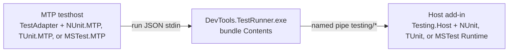

# Host Testing Architecture

In-host tests use Microsoft.Testing.Platform. Testhost discovery is local;
execution goes through `DevTools.TestRunner` into the host `testing/*`
handler. NUnit is the default provider. TUnit and MSTest are opt-in
providers on Revit and AutoCAD-family hosts.

Product: [`host-testing.md`](../../product/host-testing.md),
[`tunit-host-testing.md`](../../product/tunit-host-testing.md).
Agent digest: [`host-testing.md`](../../agents/host-testing.md).
MSTest pin: [0038](../../decisions/0038-mstest-host-provider.md).

Last updated: 2026-10-01

---

## Source Map

| Area | Path |
|------|------|
| Neutral contracts, `TestConfig`, `TestRunTraceScope` | `source/DevTools.Testing.Abstractions/` |
| Shared discovery-refs / isolated testhost load | `source/DevTools.Testing.Abstractions/Loading/` |
| `testing/*` JSON + Runner process client | `source/DevTools.Testing.Transport/` |
| In-host `testing/*` handler + generation store + first-party NUnit/TUnit/MSTest providers | `source/DevTools.Testing.Host/` (`MarshaledTestRequestHandler` → `TestingRequestHandler`) |
| Runtime folder resolve + generation file classify | `source/DevTools.Testing.Host/Loading/` |
| NUnit closure / filter / generation policy | `source/DevTools.Testing.Host/NUnit/` |
| TUnit generation / ALC provider | `source/DevTools.Testing.Host/TUnit/` |
| MSTest generation / ALC provider (4.4.1 + MTP 2.4.1) | `source/DevTools.Testing.Host/MSTest/` |
| Published MTP adapter, sibling builder hooks | `source/DevTools.TestAdapter/` |
| Local NUnit `ExploreTests` + `NUnitTestRunMapper` | `source/DevTools.NUnit.MTP/` |
| In-host NUnit engine | `source/DevTools.NUnit.Runtime/` |
| NUnit display-name walk (`ITest.FullName`; last-dot, quote-aware suffix/whitespace, canonicalize) | `source/DevTools.NUnit.Runtime/NUnitNameSyntax.cs` |
| NUnit FullName split / IDE uid / group key | `source/DevTools.NUnit.Runtime/NUnitTestNameParser.cs` |
| Local TUnit catalog (`Sources.TestEntries`) | `source/DevTools.TUnit.MTP/` |
| In-host TUnit.Engine library call | `source/DevTools.TUnit.Runtime/` |
| Local MSTest `--list-tests` discoverer | `source/DevTools.MSTest.MTP/` |
| In-host MSTest `TestApplication` session | `source/DevTools.MSTest.Runtime/` |
| Runner CLI + composition | `source/DevTools.TestRunner/` |
| Runner IDE attach (Visual Studio EnvDTE only) | `source/DevTools.TestRunner/Debugging/` |
| Spawned-host cancel (user cancel before pipe ready) | `HostLaunchWaiter.TerminateIfIncomplete` |

`DevTools.Testing.Abstractions` must not reference `DevTools.NUnit.*`,
`DevTools.TUnit.*`, or `DevTools.MSTest.*`. `DevTools.Testing.Host` contains
the first-party in-host providers. Testhost MTP assemblies stay siblings. See
[0021](../../decisions/0021-testing-kernel-and-provider-owned-framework-runtime.md)
and [0022](../../decisions/0022-nunit-mtp-only-testing-stack.md).

---

## Two release artifacts

Installer `build/Modules/*` does **not** pack or publish the test adapter.

| Artifact | Ships | Command / workflow |
|----------|--------|--------------------|
| NuGet `RevitDevTool.TestAdapter` | Adapter + private `build/runtime` closure + `DevTools.NUnit.MTP.dll` + `DevTools.TUnit.MTP.dll` + `DevTools.MSTest.MTP.dll` | `scripts/pack-test-adapter.ps1` · `PublishTestAdapter.yml` |
| Host installer / bundle | Add-in, `Testing.Host` (NUnit + TUnit + MSTest providers), NUnit, TUnit, and MSTest Runtime, `DevTools.TestRunner.exe` | `scripts/pack.ps1` · `build/Modules/*` · `PublishRelease.yml` |

- Bump `<Version>` in `DevTools.TestAdapter.csproj` before `PublishTestAdapter.yml`. Independent of installer GitVersion.
- Only TestAdapter is packable. MTP, Runtime, Host, Abstractions, and Transport are `IsPackable=false`.
- Changing Host/Runtime/Runner needs an installer deploy. Changing testhost discovery or launch options needs a TestAdapter pack.

---

## Adapter pack

`source/DevTools.TestAdapter/DevTools.TestAdapter.csproj` is the pack entry.
Consumer copy/layout lives in `build/RevitDevTool.TestAdapter.targets`.

### Nupkg layout

- `lib/{tfm}/DevTools.TestAdapter.dll` — MTP compile surface (Ipc + Transport merged in; net48 also merges STJ BCL).
- `build/runtime/{tfm}/` — `DevTools.NUnit.MTP.dll`, `DevTools.TUnit.MTP.dll`, `DevTools.MSTest.MTP.dll`, `DevTools.Testing.Abstractions.dll` (shared `TestingDiscovery`). Same four files on net48, net8, and net10.
- Testhost 3rd-party BCL comes from `Microsoft.Testing.Platform.MSBuild` 2.4.1 plus net48 binding redirects, not from this nupkg. The adapter csproj references it with `PrivateAssets=none` (NuGet's default `PrivateAssets` would drop build assets from the nuspec) and with **all** assets (`include="All"` in the nuspec) so pack writes a dependency that restores both testhost generation and `Microsoft.Testing.Platform.dll` — an NUnit-only consumer has no other source of the MTP runtime. `RepackBinariesExcludes` keeps those testhost DLLs out of the merged adapter. `DevTools.TestAdapter.Tests` uses `ProjectReference` `PrivateAssets=all` plus a direct Abstractions reference so that graph does not flow into xunit. Other PackageReference / ProjectReference stay `PrivateAssets=all`. Testhost BCL is not packed as files.

### Pack order (`scripts/pack-test-adapter.ps1`)

```text
1. restore TestAdapter (Abstractions, Transport, Ipc)
2. restore NUnit.MTP + TUnit.MTP + MSTest.MTP for all TFMs (never pass TargetFramework)
3. build NUnit.MTP + TUnit.MTP + MSTest.MTP -c Release (net48 + net8 + net10)
4. pack TestAdapter --no-restore
     lib/{tfm}            ILRepacked adapter
     build/runtime/{tfm}  MTP siblings + Abstractions (existing DLLs, per TFM)
     build/*.props|targets consumer build files
```

Not in this graph: `Testing.Host` as a testhost project, `NUnit.Runtime` /
`TUnit.Runtime` / `MSTest.Runtime` as packed nupkg contents, `DevTools.TestRunner`.
TUnit runtime sources are Compile-linked into `TUnit.MTP`. `MtpNodeResults` (owned by `MSTest.Runtime`) is linked into `TUnit.Runtime` as the shared MTP node to result core. MSTest discovery
stays in `MSTest.MTP` and does not compile-link the in-host session.

### Consumer build order (`build/RevitDevTool.TestAdapter.targets`)

```text
0. TestingFramework -> sibling name / hook type   (must stay in targets)
1. _ResolveRuntimeDir                           pick build/runtime/{tfm}
2. Reference Private=true ExternallyResolved=true   selected MTP + Abstractions
3. WriteDiscoveryRefs  AfterTargets=Build       $(TargetName).discovery-refs.txt
4. GenerateTestConfig  BeforeTargets=BeforeBuild  -> $(AssemblyName).testconfig.json
```

### Package independence

The two packed files must stay free of consumer build settings: no
`$(Configuration)` sniffing, no repo-relative paths, no
`<RuntimeIdentifier>`, no `ProjectReference`. The package does set
`AppendRuntimeIdentifierToOutputPath=false` so a leftover consumer RID
does not nest testhost output under `win-x64`.
`Packed_build_files_do_not_depend_on_the_consumer_configuration`
(TestAdapter.Tests) enforces that, and `AssertPackageClosure` asserts the nupkg
ships `build/RevitDevTool.TestAdapter.props|targets`, the net4x source shim
`build/netfx/ModuleInitializerAttribute.cs`, and `build/hooks/*MtpBuilderHook.cs`.

In-repo samples are NuGet consumers, not a second MSBuild path. They
`PackageReference` `RevitDevTool.TestAdapter`. Repo `NuGet.config` maps that id
to `output/nuget`. `scripts/pack-test-adapter.ps1` writes the nupkg there and
deletes the extracted global-packages copy of the same version so restore
cannot keep a previous extraction of the packed version. There is no
`Local.targets` / sibling-`bin` HintPath
loop: discovery and run must go through the packed `build/runtime` layout.

One setting used to stay with the consumer. It is no longer required on
net8 / net10. This repo's samples set `RuntimeIdentifier=win-x64` only when
`TargetFramework` is net4x (`PlatformTarget=x64` otherwise makes the SDK set
that RID at build, and restore must see it). The package cannot set
`<RuntimeIdentifier>` (`NETSDK1047`). It does set
`AppendRuntimeIdentifierToOutputPath=false`.

TUnit on `net48` needs `[ModuleInitializer]`, which .NET Framework does not
declare. TUnit injects `Polyfill` from its own targets, and restore never reads
package targets, so that reference resolves to nothing (`CS0234`) or duplicates a
`Polyfill` the project already has (`NU1504`). The package therefore defaults
`EnableTUnitPolyfills=false` in `build/*.props` and the
`NetFxModuleInitializer` target compiles
`build/netfx/ModuleInitializerAttribute.cs` into net4x TUnit projects. It backs
off when a `PackageReference`/`GlobalPackageReference` named `Polyfill` or another
`ModuleInitializerAttribute.cs` is already in the compilation; set
`NetFxModuleInitializer=false` to opt out entirely. Consumer cases:
[tunit-host-testing.md](../../product/tunit-host-testing.md).

In-repo samples `PackageReference` the local nupkg. NUnit/TUnit samples do not
add `Microsoft.Testing.Platform` themselves; they get testhost generation from
`RevitDevTool.TestAdapter` → `Microsoft.Testing.Platform.MSBuild`. Pack then
restore: `scripts/pack-test-adapter.ps1` then `dotnet restore` / `dotnet test`
on `samples/DevTools.*.SampleTests`. `scripts/test-adapter-matrix.ps1` packs
first, then restore+build+`--list-tests` on net48 / net8 / net10.
`PackageConsumerTests` still packs into an isolated feed. Both paths cover
central package management, a repo-wide `EnableDynamicLoading=true` (the package
forces `false` for the testhost), `AppendTargetFrameworkToOutputPath=false` under
`Debug|Release.Autodesk.YYYY`, and `-windows10.0.19041.0` platform variants.

### Constraints

- Do not add `TestAdapter` → `NUnit.MTP` `ProjectReference`. MTP is a testhost
  sibling so net48 ILRepack cannot merge it and testhost binds the consumer
  NUnit copy. In-repo test projects may reference MTP with
  `ReferenceOutputAssembly=false` for build order only.
- Do not `ProjectReference` TestAdapter from MTP. Testhost must share
  `TestingDiscovery` from Abstractions; a merged adapter copy is CS0234 /
  CS0433 on net48.
- Restore TestAdapter alone does not write `NUnit.MTP/obj/project.assets.json`
  (`NETSDK1004`).
- Repo `NuGet.config` maps `RevitDevTool.TestAdapter` to `output/nuget` and `*`
  to nuget.org so CPM restore is not NU1507 on machines that also have a
  second feed, and samples cannot silently pick nuget.org for this id.
- Pack runs per TestAdapter TFM in parallel. An inner MTP Restore inherits
  `TargetFramework` and rewrites `project.assets.json` for one TFM
  (`NETSDK1005`, typically missing `net48`). Inner Restore must
  `RemoveProperties=TargetFramework`. Prefer building all MTP TFMs in the
  pack script before `dotnet pack`.
- Keep `AppendTargetFrameworkToOutputPath=true` on packable multi-TFM testing
  projects.
- The selected sibling is a normal `<Reference Private="true" ExternallyResolved="true">` from
  nupkg `build/runtime`. That puts
  it in the testhost copy-local graph and `deps.json`. Do not byte-load or
  `AssemblyResolve` the sibling. Isolated discovery of compile-only Autodesk
  refs stays in `DiscoveryAssemblyLoad`. `discovery-refs.txt` must not list
  framework targeting packs — including NuGet-cached `*.app.ref` /
  `*.sdk.net.ref` (not only `dotnet\packs`). Loading those metadata-only
  assemblies into the discovery ALC makes NUnit report zero fixtures.

---

## Runtime split


```mermaid
flowchart LR
  Testhost["MTP testhost\nTestAdapter + NUnit.MTP, TUnit.MTP, or MSTest.MTP"]
  Runner["DevTools.TestRunner.exe\nbundle Contents"]
  Host["Host add-in\nTesting.Host + NUnit, TUnit, or MSTest Runtime"]

  Testhost -->|"run JSON stdin"| Runner
  Runner -->|"named pipe testing/*"| Host
```

The adapter launches `DevTools.TestRunner run` and writes one
`TestRunExecute` JSON document to stdin (`ProtocolVersion` + host
options + `TestRunRequest`). Nested `RunId` is the same id the host
receives on `testing/run`. TestRunner is an adapter/IDE process, not a
human CLI.

`TestSelection` is a closed union: `All`, `TestIds`, `FrameworkFilter`,
`Names`. Empty `TestIds` means run nothing, not run the assembly.
The testhost run mapper resolves the selection before `testing/run`, so the
in-host runtime only sees what it can run. NUnit's `NUnitTestRunMapper` turns
`Names` and `TestIds` into `FrameworkFilter` (`filter-xml`; empty means the
run-nothing filter) and the NUnit runtime rejects any other selection with an
`ArgumentException`. TUnit and MSTest register no mapper: `TestingDiscovery.Register`
falls back to the default one, because their MTP uid is also the in-host id, so the
selection is just the ids the discoverer returned (`Names` are already resolved by
`Discover`). Their runtimes reject `FrameworkFilter` and `Names` with
`testing/invalid_request` (does not throw, so the session is not poisoned). MSTest
runs `TestIds` as `--filter-uid` (the MTP node uid from `--list-tests`).
`[DependsOn]` only orders tests already in the run; both the testhost and
`MSTestRuntimeSession` add those prerequisites before `--filter-uid`
([Framework internals](#framework-internals-reflection)). TUnit's engine pulls
its own. All three runtimes share `CancellableRuntimeSession`
(`Testing.Abstractions/Runtime`): a cancel that arrives before the run starts is
kept as `_pendingCancelRunId`. NUnit keeps asking its runner to `StopRun()` until
the run ends (the main-thread dispatcher may refuse). MSTest's `RunAsync` has no
token; the session cancels the generation MTP
`ITestApplicationCancellationTokenSource`.

`RequestTimeoutSeconds` is the scaled pipe wait (`PerTestTimeout × count`);
`PerTestTimeoutSeconds` stays per test. Runner stdout is NDJSON
(`TestRunnerStreamMessage` event lines, then the `TestRunResponse`).

Cancel is cooperative first (`Local\DevTools.TestRunner.Cancel.{runId:N}`),
then process kill if the child is still running. The adapter registers
`context.CancellationToken` onto `TestRunSession.Cancel` for the duration of
`session.Run`. `ProcessTestRunnerClient` publishes `_activeProcess` only after
`Start()`, and `Cancel` must not throw if the process was never started or is
already disposed. Host `testing/cancel` returns
`TestCancelResponse.Acknowledged`; unknown `RunId` is `false` and does
not acknowledge. `TestingRuntimeSessionManager.Cancel` returns `false` when
the session throws `ObjectDisposedException`. After `testing/hello`,
TestRunner fails the execute if host/year/framework mismatch or `IsBusy`.

A provider `ArgumentException` (including a rejected NUnit `FrameworkFilter`
format) is `testing/invalid_request` and does not poison the session. Other
provider exceptions still poison. An unconstrained run failure (All /
FrameworkFilter / Names, so `ResultsForUnreported` is empty) publishes a
`devtools.testadapter.run` error node instead of a silent empty explorer.

Streamed `testing/progress` events reach the adapter. Folded host results
remain authoritative for Test Explorer; live Case updates publish only when
the `TestId` is in the testhost-discovered set. A test the caller named by id
that gets no host result is an error. An unfiltered run publishes no node for
a test the engine leaves out (TUnit `[Explicit]`): it was not run.

Testhost never loads Autodesk APIs. Host execution stays in the add-in.

`testing/run` is marshaled onto the host idle thread. `ExecuteAsync` must not
take the pipe-disconnect token (same as pytest `tests/run`). Cancelling that
dispatcher Task while a test is frozen at a breakpoint leaves idle work
running and parks later `testing/run` because `ExternalEvent` is still
pending. Disconnect still cancels the request CTS, but the pipe server does
not dispose it until in-flight `OnMessageReceived` finishes. `testing/hello`
resets a Completed/Poisoned session so a new client is not stuck.

### Adapter bootstrap

MSBuild selects exactly one packed sibling and adds it as a compile/copy-local
reference. A small hook source file is compiled into the testhost so the sibling
DLL does not reference Microsoft.Testing.Platform. The generated entry point
then calls both builder hooks:

```text
DevTools.TestAdapter.TestingPlatformBuilderHook.AddExtensions   // TestFramework
DevTools.NUnit.MTP.NUnitMtpBuilderHook.AddExtensions               // compiled into testhost
        └── TestingDiscovery.Register(NUnitTestDiscoverer, NUnitTestRunMapper)
DevTools.MSTest.MTP.MSTestMtpBuilderHook.AddExtensions             // when TestingFramework=mstest
```

| Property / item | Role |
|-----------------|------|
| `TestingFramework` | Written as `devtools.frameworkId`. Props default `nunit`. Parsed to `TestFrameworkId` via `Enum.Parse` (ignoreCase). Map in **targets** (`nunit` → `DevTools.NUnit.MTP` / `NUnitMtpBuilderHook`; `tunit` → `DevTools.TUnit.MTP` / `TUnitMtpBuilderHook`; `mstest` → `DevTools.MSTest.MTP` / `MSTestMtpBuilderHook`). |
| `<Reference Private="true" ExternallyResolved="true">` | Selected sibling + `DevTools.Testing.Abstractions`. Copy-local without net48 RAR walking sibling AssemblyRefs. Not a NuGet `PackageReference`, so NUnit/TUnit do not enter the consumer graph. |
| `TestingPlatformBuilderHook` (`b7e4c1a9-…`) | Compile-time call into the selected sibling. GUID is a stable MSBuild identity. |
| Adapter hook (`51ad4b4c-…`) | Registers `TestFramework`. Stays framework-neutral. |

The `TestingFramework` → sibling map must stay in the **targets**. NuGet
imports `build/*.props` from `Microsoft.Common.props`, before the consumer
`PropertyGroup`, so mapping in the props pinned every packaged consumer to
NUnit even with `<TestingFramework>tunit</TestingFramework>`.

There is no C# `switch` on `nunit` / `tunit` / `mstest` in Abstractions. The closed
set is `TestFrameworkId` (`NUnit`, `TUnit`, `MSTest`). User config (`testconfig.json`
`frameworkId`, MSBuild `TestingFramework`, CLI `--framework`) is parsed once
with `Enum.Parse` (ignoreCase). Unknown `TestingFramework` is a build
`<Error>`. Empty `frameworkId` on run publishes
a `devtools.testadapter.run` error node (no `nunit` default).

A user-authored `testconfig.json` with a `devtools` section must already
contain `frameworkId` or the merge errors. `mtpAssembly` / `mtpEntry` are not
part of the contract. See [0024](../../decisions/0024-testing-core-open-closed-providers.md).

The sibling builder hook registers testhost discovery and run-mapping.
NUnit uses two types (`NUnitTestDiscoverer`, `NUnitTestRunMapper`).
TUnit and MSTest each use one type for both interfaces. MSTest discovery
is `TestApplication` with `--list-tests` and must not run test bodies.
Missing registration fails; the adapter does not fall back to pass-through
mapping. `TestingDiscovery.Clear()` is internal (test assemblies only).
The static type is `TestingDiscovery`, not `TestDiscovery`: TUnit’s
`HookType.TestDiscovery` is in scope when the TUnit hook compiles into the
consumer testhost.
There is no framework catalog type and no “try TUnit then NUnit”
probe.

`tests/DevTools.TestAdapter.Tests` forces `ILRepackable=false` on the adapter
`ProjectReference`. Packed adapter merges Transport into `TestAdapter.dll`;
the test project also references Transport directly. Dual-loading
`ITestRunnerTransport` is CS0433. In-repo tests therefore compile the adapter
unmerged. Do not add a TestAdapter → MTP sibling `ProjectReference` on the
adapter csproj; the test project may reference `DevTools.NUnit.MTP` for
reflection-only architecture asserts.

The adapter publishes MTP `TestNode` / `TestMethodIdentifierProperty` from
`TestDiscoveredTest` fields (`MethodArity`, `ParameterTypeFullNames`,
`ReturnTypeFullName`). NUnit identity (display names, source-bindable `TypeName`,
collapsed host filter XML, result fold) lives on `ITestDiscoverer` /
`ITestRunMapper` in `DevTools.NUnit.MTP`. TUnit identity expansion lives
in `DevTools.TUnit.Runtime` (`TUnitCatalog` / `TUnitExpansion` /
`TUnitTestIdentity` / `TUnitMetadataNames`); testhost compile-links those files into `TUnit.MTP`.
The adapter must not parse NUnit `FullName`, TUnit Engine UIDs, or MSTest
result types. MSTest test ids are the MTP `TestNode` uid.

NUnit ExploreTests is host-free and must not read `testconfig.json` **host**
options (`hostName`, `forceLaunch`, …). `frameworkId` parses to
`TestFrameworkId` and discriminates `testing/run`.

### Host generation

Each provider owns a generation policy (`NUnitGenerationPolicy`,
`TUnitGenerationPolicy`, `MSTestGenerationPolicy`) that only declares runtime
folder/DLL names and version pins on an internal `TestingGenerationSpec`.
That spec is not an `ITestingGenerationPolicy`. Publish prefers
`Directory.Move` of the staging folder; on net48 that rename often fails with
`Access to the path is denied` while the tree is still scanned. The store
retries, then copies files into the shadow directory. Do not treat an
`IOException` from publish as a poisoned provider failure on the first try.
`RuntimeSource.ResolveBeside` finds the runtime closure deployed beside the
add-in; `RequirePresent` checks those files before copy. Generation documents
live under `Loading/Generation`. Records are `TestingGenerationPlan` and
`TestingGenerationManifest`. `ITestingGenerationPolicy` is its own contract.
Build and corruption failures are `TestingGenerationException`.
`TestingGenerationFiles` is the path and membership surface
(`IsManagedIdentity`, `ScanOutputDirectory`, `MergeFile`, `MergeRuntimeDependency`,
`RequireManagedAssembly`, `GetRelativePath`, `IsVolatileGenerationOutput`).
`MergeRuntimeDependency` adds a runtime-closure file but never replaces a consumer
assembly with an older version of the same identity. On net48 the consumer test
assembly binds its own closure (for example System.Threading.Tasks.Extensions
4.2.4.0 for `ValueTask`); an older runtime copy in the shadow directory split
`ValueTask` identity from MSTest PlatformServices and failed discovery with
UTA007. The session resolver (`NetfxClosureBind`) then binds PlatformServices'
older request onto the newer copy.
`RequireManagedAssembly` checks that the file exists and is a managed assembly.
`IsManagedIdentity` is that check minus satellite resource assemblies. The plan
still copies every other file into the shadow directory.
`TestingGenerationPlan.ToManifest` resolves that plan into a published
`TestingGenerationManifest`. `TestingGenerationPublish` copies the plan,
hashes it into the generation id, and publishes the shadow directory.
Assembly and file version checks live on internal `TestingGenerationPins`
(`GetNamedAssembly` is the shared framework-dll lookup). Each policy still
owns its file names and expected versions. NUnit sets
`RuntimeOwnsDependencyClosure` so its runtime folder keeps the private
dependency copy and does not replace `nunit.framework.dll`. TUnit's MTP pin
allows more than one `Microsoft.Testing.Platform.dll`.
Each framework registers one `FrameworkProvider` on `ITestFrameworkProvider`.
NUnit passes `NUnitRuntimeSessionFactory`. TUnit and
MSTest pass `ManifestRuntimeSessionFactory` with the session type name. Each
provider owns its `TestingGenerationStore`. Do not register those kernel
types as unkeyed singletons from a provider extension.

### AutoCAD-family launch

Family hosts share `acad.exe`. The vertical is selected by argv
(`AcadArgumentBuilder` `/product` + Civil `/ld` `/p`), not a different
executable. Discovery reads `HKLM\SOFTWARE\Autodesk\AutoCAD\*\InstalledProducts`:
default value is the install dir, subkeys are product codes (`C3D`, `PLNT3D`,
`ACAD`, …). Year comes from the folder name (`AutoCAD 2026`), floored at
`HostVersions.AutodeskMinimal`. `HostName` must be that vertical so the runner waits for
`DevTools_{Plant3D|Civil3D}_*`.

Do not add a shared runtime-descriptor catalog. Policy constants stay on the
provider type. NUnit/TUnit Host consume the solution `Polyfill` global package
on every TFM (`PolyUseEmbeddedAttribute` in `Directory.Build.props` so net48
does not CS0121 against `DevTools.Testing.Host`). TUnit's own polyfills stay off
(`EnableTUnitPolyfills=false`).

Each provider uses two targets files: `*RuntimePayload.targets` (Runtime owns
a payload folder) then `*HostPackaging.targets` (add-in copies that folder to
`NUnitRuntime\` / `TUnitRuntime\` / `MSTestRuntime\`). NUnit payload excludes host-owned
JSON/Ipc/Isolation/Abstractions. TUnit copies its full private closure
(CPM STJ). On net48, isolated resolve binds TUnit.Engine's STJ 9 request
onto that newer payload copy (`NetfxClosureBind`). Host still ILRepacks STJ 10.
MSTest copies a private 4.4.1 closure plus Microsoft.Testing.Platform 2.4.1.
The generation fails closed if any
of `MSTest.TestFramework.dll`, `MSTest.TestAdapter.dll`,
`MSTestAdapter.PlatformServices.dll`, or `Microsoft.Testing.Platform.dll` is
missing or a different version. Those assemblies stay under `MSTestRuntime\`
and must not sit at the add-in root.

### Test output

`TestRunTraceScope` buffers `Trace` / `Debug` per case. The bucket key is the
test that is executing at the moment of the write (NUnit `ITest.FullName`,
TUnit `TestDetails.TestId` = the node `Uid`, MSTest display name). The terminal
node reads that bucket. One shared buffer drained when the node arrives mixes
fast data rows. Output no case claims (fixture setup, engine threads) is not
attached to any result; the pane already has it from the live `Trace`. NUnit,
TUnit, and MSTest merge that buffer with Console into `CaseResult.Output`
(IDE) and write Console through to process `Trace` (pane). See
[0017](../../decisions/0017-nunit-host-test-output-routing.md).
NUnit and TUnit read Console from the engine. MSTest sets
`mstest:output:captureTrace` to false in the run's testconfig, so the runtime
buffers `Console.Out` and `Console.Error` and restores the original writers
afterward. Each write is stored under `TestContext.Current.TestDisplayName`
while the body runs. The terminal node reads that bucket. A single buffer
drained when the node message arrives mixes data rows, because the next row
can write before the previous message is consumed. `mstest:parallelism:enabled`
is false.

### Framework internals (reflection)

Every reach into a non-public framework member goes through
`InternalMembers` (`DevTools.Testing.Abstractions/Runtime`): lookups are cached
per process, and a miss throws one `MissingMemberException` naming the member and
the assembly version. The seams that use it:

| Seam | Reaches | When |
|------|---------|------|
| `TUnitEngineBindings` | TUnit.Engine framework/extension ctors, MTP `ServiceProvider.AddService`, session-context ctors | resolved once per generation; a run only invokes cached ctors |
| `MtpDiscoveryInternals` (MSTest.MTP) | `TestApplication._host`, the `--list-tests` node buffer, MTP's stdout writer | per discovery, cached lookups |
| `MSTestPlatformPolicy.Cancel` | MTP `ITestApplicationCancellationTokenSource.Cancel()` | per cancel, cached lookups |
| `NUnitAssemblyBuilder` | `TestContext.DefaultWorkDirectory` | per session load |

Reflection over the user's test assembly (`MSTestExpansion`,
`TUnitExpansion`, `NUnitLocationProvider`) is not framework-internal and
stays where it is. A bump of NUnit, TUnit, MSTest or MTP is proven by
`TUnitEngineHostTests` (bindings resolve) and the MSTest harness checks.

MSTest `[DependsOn]` does not add a prerequisite to a filtered run. Both the
testhost (`MSTestTestDiscoverer`) and the in-host session
(`MSTestRuntimeSession`, before `--filter-uid`) close the selected ids over
those edges, so running one test also runs the tests it depends on. The
session lists through the same `MSTestListing` the discoverer uses, which is
why a testhost that sends only the clicked uid still executes the chain.