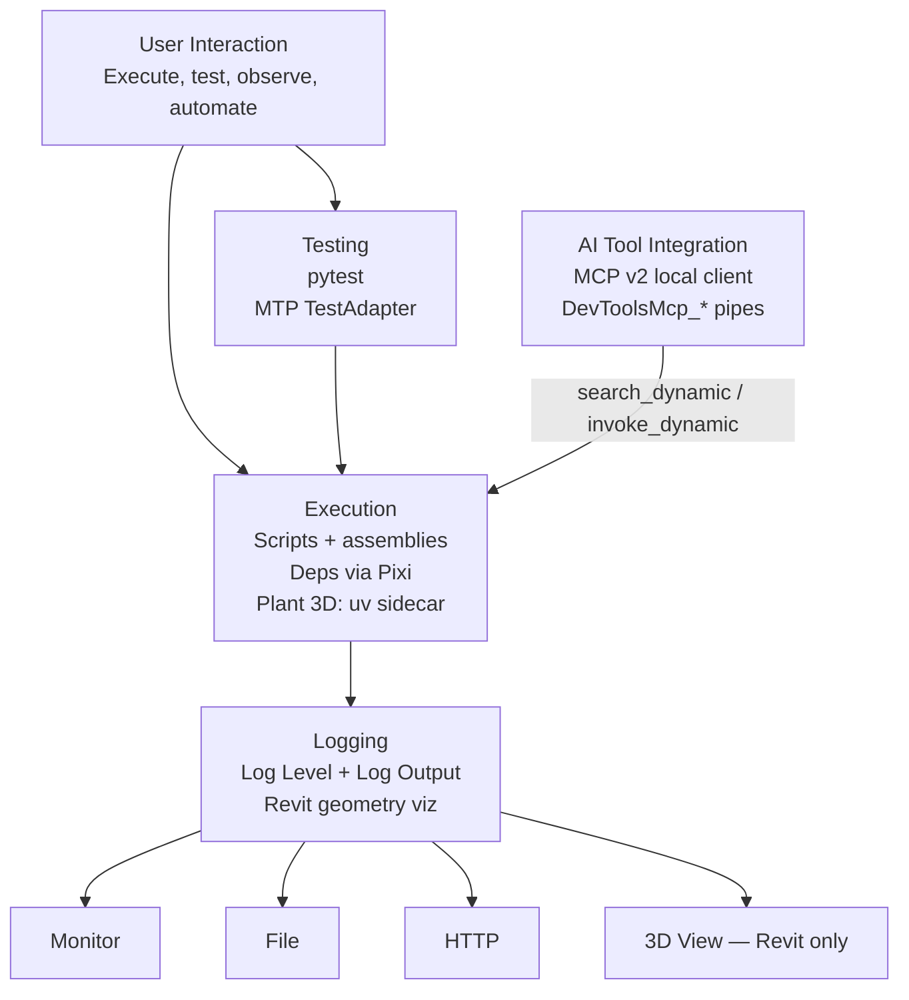

# RevitDevTool Documentation

**Development platform for .NET-based CAD/BIM applications — currently supporting Autodesk Revit and AutoCAD-family hosts (2022–2027), designed to extend to any .NET-capable host.**


---

## Quick Start

**Essential shortcuts for rapid development:**
- **Press `AD`** — re-run last script + show Trace Panel
- **Ctrl + Click** Trace Panel button — toggle panel visibility
- **F5 in VSCode** — attach debugger for CPython breakpoint debugging

**Basic workflow:**
```
1. Click script in Code Execution panel → First execution
2. Edit code in your IDE
3. Press AD → See updated results
4. Repeat steps 2-3 for rapid iteration
```

**Debugging workflow (CPython):**
```
1. Set breakpoints in VSCode
2. Press F5 → Attach to host Python (debugpy)
3. Execute script in RevitDevTool
4. Debugger pauses at breakpoints
5. Inspect variables, step through code
```

**Debugging workflow (.NET):** attach your IDE debugger to the host process for compiled add-ins and Roslyn C# / F# scripts. IronPython scripts have **no debugger** — use logging or convert to CPython for breakpoint debugging.

New install? See [Install And First Run](/docs/getting-started/Getting-Started-Install).

---

## Settings

Access RevitDevTool settings from the dockable panel to configure themes, logging, visualization, and code execution behavior:


---

## Core Modules

RevitDevTool is organized around four pillars. Each pillar is a first-class capability — not a sub-feature of another module.

### [Execution](/docs/execution/Execution-Overview)
**Multi-language code execution in the host context**

- CPython scripts (Pixi 3.14) + IronPython first-class
- PEP 723 dependency metadata — Pixi install (Plant 3D uses a uv sidecar at runtime; not a separate product)
- VSCode debugpy integration for CPython; .NET attach for assemblies and Roslyn scripts
- .NET hot-reload with FileWatcher
- C# / F# script execution via Roslyn
- Hierarchical tree organization

**Use when:** You need to run custom scripts or commands with automatic dependency installation.

**Learn more:** [Execution Overview](/docs/execution/Execution-Overview) | [Modern Python Scripting](/docs/execution/python/Execution-Python) | [Python Debugging](/docs/execution/python/Execution-PythonDebugging)

---

### [Testing](/docs/testing/Testing-Overview)
**Automated tests against live host processes**

- **pytest** — CPython and IronPython tests inside a live host
- **Host tests (MTP)** — NUnit `4.6.1` / TUnit `1.66.27` inside the host via `DevTools.TestAdapter` (NuGet `RevitDevTool.TestAdapter` `0.0.7`)
- Auto-discovery, suite leasing, IDE integration (VS Code, Cursor, PyCharm)
- `--host revit`, `--host autocad`, and other AutoCAD-family verticals

**Use when:** You need repeatable API tests that run inside a real Revit or AutoCAD-family instance.

**Learn more:** [Testing Overview](/docs/testing/Testing-Overview) | [pytest](/docs/testing/pytest) | [NUnit](/docs/testing/NUnit) | [TUnit](/docs/testing/TUnit)

---

### [MCP .NET](/docs/mcp/MCP-CSharp) and [MCP Python](/docs/mcp/MCP-Python)
**Connect local MCP v2 clients to a live host**

- Local MCP config points at `DevTools.Daemon.exe --stdio`
- Built-in tools: `list_host_instances`, `launch_host`, `read_file_info`, `search_dynamic`, `invoke_dynamic`
- Custom Python/C# toolsets registered in Settings → MCP
- Works with any local client that supports **MCP v2** (from 28 July 2026): Cursor, Claude Desktop, VS Code Copilot, ChatGPT Desktop, …

**Use when:** You want an AI assistant to interact with live Revit or AutoCAD-family instances.

**Learn more:** [MCP .NET](/docs/mcp/MCP-CSharp) | [MCP Python](/docs/mcp/MCP-Python)

---

### [Logging](/docs/logging/Logging-Overview)
**Logging, trace output, and Revit geometry visualization**

- **Three log sinks:** Monitor (Trace Panel), file, and HTTP
- Syntax highlighting, color keywords, pretty JSON, Python stack traces
- **Revit-only geometry visualization** — DirectContext3D transient rendering (curves, faces, solids, meshes)
- Host context enrichment (version, document, user info)

**Use when:** You need structured output, remote log streaming, or temporary 3D geometry without creating model elements.

**Learn more:** [Log Level](/docs/logging/Logging-Overview) | [Log Output](/docs/logging/Observability-Http) | [Geometry Visualization](/docs/logging/Visualization-Overview)

---

## How Modules Work Together




---

## Common Tasks

| I want to... | Go to... |
|-------------|----------|
| Execute a Python script | [Modern Python Scripting](/docs/execution/python/Execution-Python) |
| Auto-install dependencies | [Modern Python Scripting](/docs/execution/python/Execution-Python) |
| Debug CPython with VSCode | [Python Debugging](/docs/execution/python/Execution-PythonDebugging) |
| Compare Python options | [Python Ecosystems](/docs/execution/python/Execution-PythonEcosystems) |
| Use AI to interact with Revit or AutoCAD-family | [MCP .NET](/docs/mcp/MCP-CSharp) or [MCP Python](/docs/mcp/MCP-Python) |
| Understand testing options | [Testing Overview](/docs/testing/Testing-Overview) |
| Run pytest against a live host | [pytest](/docs/testing/pytest) |
| Run NUnit tests in a live host | [NUnit](/docs/testing/NUnit) |
| See trace output with colors | [Log Level](/docs/logging/Logging-Overview) |
| Stream logs over HTTP | [Log Output](/docs/logging/Observability-Http) |
| Visualize geometry in 3D | [Geometry Visualization](/docs/logging/Visualization-Overview) |
| Generate type stubs | [Stub Generation](/docs/execution/python/Execution-StubGeneration) |
| Understand .NET execution | [Run .NET Add-ins](/docs/execution/dotnet-assembly/Execution-Assembly) |
| Use pyRevit folder structure | [IronPython — pyRevit Folder Compatibility](/docs/execution/ironpython/Execution-VsPyRevit) |
| Run scripts in AutoCAD-family | [AutoCAD Features](/docs/hosts/Hosts-AutoCAD) |
| See supported hosts and versions | [Revit](/docs/hosts/Hosts-Revit) or [AutoCAD](/docs/hosts/Hosts-AutoCAD) |

## Links

- **Main Repository:** [RevitDevTool](https://github.com/trgiangv/RevitDevTool)
- **Issues:** [Report bugs or request features](https://github.com/trgiangv/RevitDevTool/issues)
- **Discussions:** [Ask questions](https://github.com/trgiangv/RevitDevTool/discussions)

---

## License

MIT License — See [LICENSE](https://github.com/trgiangv/RevitDevTool/blob/main/LICENSE) in main repository.
