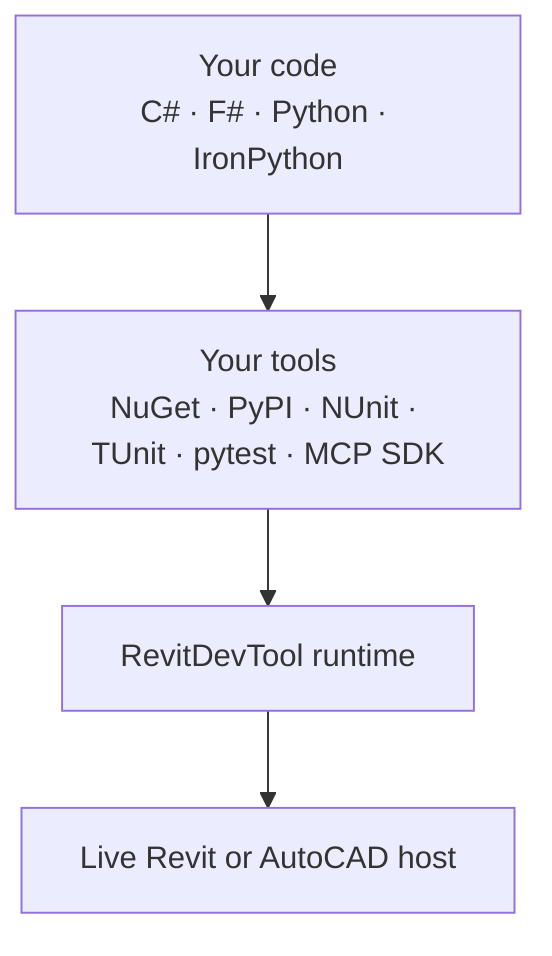

# Overview

RevitDevTool brings standard development ecosystems into live Autodesk CAD/BIM hosts without replacing them.

Use the languages, package managers, test frameworks, and AI protocols you already know:

It is a developer platform for execution, debugging, testing, visualization, and host integration across Revit and AutoCAD-family applications.

## Choose a path

- [Install RevitDevTool](getting-started/installation)
- [Resolve Python dependencies inline](execution/Python-Dependencies)
- [Run tests inside a live host](testing/Testing-Overview)
- [Explore MEP-oriented examples](https://github.com/trgiangv/RevitDevTool/tree/develop/samples)
